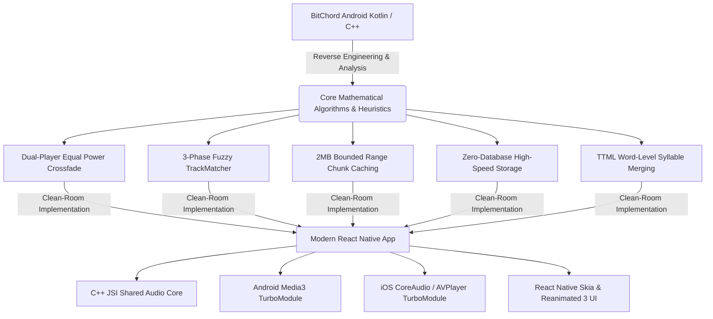
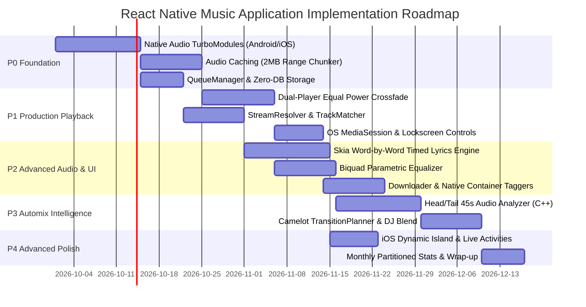

# 00. EXECUTIVE SUMMARY & BLUEPRINT

**Project:** BitChord Deep Reverse-Engineering & React Native Porting Blueprint  
**Target:** Clean-room, high-performance cross-platform React Native (New Architecture / TurboModules / JSI) mobile audio application  
**Codebase Analyzed:** [BitChord (Android)](https://github.com/kushagrasinghx/BitChord)  
**Deliverables Directory:** `BITCHORD_RE/`

---

## 1. Executive Summary

BitChord is a high-performance, open-source Android music player engineered around Google Media3/ExoPlayer, Jetpack Compose, native C++ DSP signal processing, and multi-source streaming scrapers. It addresses real-world streaming challenges that plague typical audio applications: playback stalls, duplicate audio frame seams during crossfade, catalog mismatches (e.g., matching a studio track to a 10-minute live concert recording), YouTube CDN throttling, and UI frame drops.

However, BitChord is an Android-only application written in Kotlin with deep dependencies on Android-specific HALs (`PrecisionAudioSink`), Linux ALSA nodes, Android MediaSession, and ExoPlayer internals. Furthermore, the repository is licensed under **GPLv3** (with native DSP components under **AGPLv3**).

This investigation delivers a complete reverse-engineering and architectural blueprint. Rather than attempting a blind port or violating copyleft licensing, we extract BitChord’s mathematical formulas, state machine architectures, heuristics, and production failure-mode lessons to design a state-of-the-art, clean-room React Native audio application.



---

## 2. The 20 Most Valuable Things to Take from BitChord

Ranked by a composite of **Technical Value**, **Difficulty**, **React Native Compatibility**, **Expected User Impact**, and **Implementation Risk**:

| Rank | Innovation / Pattern | Source File | Technical Value | Difficulty | RN Compatibility | User Impact | Implementation Risk | Core Takeaway / Architecture |
| :---: | :--- | :--- | :---: | :---: | :---: | :---: | :---: | :--- |
| **1** | **Symmetric Dual-Player Peer Handoff** | `CrossfadeController.kt` | Very High | High | High | Transformative | Medium | Eliminates the 9ms–41ms audio duplicate seam bug by prerolling the standby player and swapping primary session roles at $t=0$. |
| **2** | **Equal-Power Crossfade Math ($\sin^2+\cos^2=1$)** | `CrossfadeController.kt` | High | Medium | Very High | High | Low | Trigonometric attenuation curves maintain perceived acoustic energy throughout transitions, avoiding the midpoint volume dip. |
| **3** | **3-Phase Fuzzy TrackMatcher** | `TrackMatcher.kt` | Very High | Medium | Very High | Critical | Low | Normalizes titles, strictly enforces version marker symmetry (remix, acoustic, live), and gates duration ($\le 3$s) to prevent catalog mismatches. |
| **4** | **2MB Bounded Range Chunk Caching** | `AudioCache.kt` | Very High | High | High | Critical | Medium | Bypasses YouTube CDN bitrate pacing by issuing 2MB HTTP `Range` requests, enabling line-rate broadband caching in $\sim 300$ms. |
| **5** | **Zero-Database Persistence Architecture** | `ListeningStats.kt` | High | Low | Very High | High | Very Low | Completely eliminates SQLite/Room for playback sessions and stats. Uses MMKV and monthly partitioned JSON files to eliminate schema migrations. |
| **6** | **Two-Tier Priority Queue Coordinator** | `QueueCoordinator.kt` | High | Medium | Very High | High | Low | Overlays a transient user-enqueued "Play Next" tier over a permanent standard queue while preserving original un-shuffled history. |
| **7** | **Head/Tail 45s Analysis Optimization** | `TrackAnalyzer.kt` | Very High | Medium | High | High | Low | Decodes only the first 45s and last 45s of audio for BPM and beat grid extraction, cutting CPU cycles and battery drain by over 70%. |
| **8** | **TTML Syllable-to-Word Span Merging** | `TtmlParser.kt` | High | Medium | Very High | Very High | Low | Merges complex XML syllable elements into fluid word-level timed spans with duet agent identification (`v1` vs `v2`). |
| **9** | **Decoupled Multi-Source Waterfall** | `StreamResolver.kt` | High | Medium | Very High | High | Low | Decouples song discovery metadata from physical stream delivery, cascading through Lossless $\to$ 320k AAC $\to$ YouTube. |
| **10** | **Canonical Cache Keying** | `AudioCache.kt` | High | Low | Very High | High | Low | Keys cache entries on static URNs (`bitchord://watch?v={id}`) rather than ephemeral CDN URLs containing expiring authorization tokens. |
| **11** | **Camelot Harmonic Transition Planner** | `TransitionPlanner.kt` | Medium | Medium | Very High | High | Low | Selects transition styles (`GAPLESS`, `EQUAL_POWER`, `DJ_BLEND`, `DJ_FILTER`) based on BPM delta and Camelot musical wheel compatibility. |
| **12** | **DJ Blend Bass Frequency Swap** | `TransitionPlanner.kt` | High | High | Medium | High | Medium | Swaps low-frequency bands ($<250\text{Hz}$) at 70% transition progress using parametric Biquad filters to avoid low-end acoustic muddiness. |
| **13** | **Isolated Playhead Progress Ticking** | `PlaybackService.kt` | High | Medium | Very High | Critical | Low | Decouples high-frequency playhead progress updates from root UI state. Maps to Reanimated `SharedValue` in React Native. |
| **14** | **16-Provider Lyrics Waterfall** | `LyricsRepository.kt` | Medium | Low | Very High | High | Low | Concurrently queries multiple lyrics backends (Spotify, Musixmatch, Apple Music, NetEase) with a strict cancellation timeout. |
| **15** | **Musixmatch HMAC-SHA256 Token Routine**| `MusixmatchProvider.kt` | Medium | Low | Very High | Medium | Very Low | Reusable crypto routine allowing dynamic access to Musixmatch’s comprehensive synchronized lyrics database. |
| **16** | **Audio Focus & Becoming Noisy Discipline**| `PlaybackService.kt` | High | Medium | High | High | Low | Ensures audio focus is granted exclusively to the active session player, preventing system audio ducking during crossfades. |
| **17** | **Container-Native File Metadata Tagging** | `tagger/` | Medium | Medium | High | Medium | Low | Writes Vorbis comments, ID3 tags, and MP4 atoms with embedded cover art and lyrics directly into downloaded files. |
| **18** | **Dynamic Free-Space Disk Evictor** | `DynamicLruCacheEvictor.kt`| Medium | Low | Very High | Medium | Low | Evicts oldest audio chunks based on total device free space rather than arbitrary static limits. |
| **19** | **Source Circuit-Breaker Health Tracking**| `SourceRegistry.kt` | Medium | Low | Very High | High | Low | Tracks HTTP failure rates per stream source, temporarily disabling broken providers to prevent playback startup lag. |
| **20** | **JioSaavn Encrypted 320kbps AAC Decryption**| `SaavnClient.kt` | Medium | Low | Very High | High | Very Low | Extracts CD-quality 320kbps AAC audio streams using static DES-ECB key decryption. |

---

## 3. DO NOT COPY (Anti-Patterns & Architectural Hazards)

The following components from BitChord appear attractive on the surface but must **NOT** be copied into the React Native application:

1. **DO NOT Embed QuickJS Inside React Native:**
   - *Why:* React Native already runs an optimized JavaScript runtime (**Hermes**). Embedding QuickJS as an Android C++ shared library adds 15MB+ of memory overhead, increases APK size, and creates potential thread deadlock issues. Scrapers should run in a Hermes worker context or be offloaded to cloud workers.
2. **DO NOT Copy BitChord’s Native C++ DSP Code Directly:**
   - *Why:* The DSP code in `native/analyzer/` is licensed under **AGPLv3** (inherited from Orchard). Copying this code into a proprietary app forces the entire application to be open-sourced under AGPLv3. Reimplement spectral flux and onset detection in clean-room C++ using public-domain algorithms (e.g., KissFFT).
3. **DO NOT Use BitChord’s `PrecisionAudioSink` Linux ALSA Direct Probing:**
   - *Why:* Directly querying `/dev/snd/pcmC*` nodes requires root access or specific Linux permissions that fail on many OEM Android devices (Samsung OneUI, Xiaomi MIUI) and are 100% impossible on iOS. Use standard AAudio/Oboe on Android and CoreAudio on iOS.
4. **DO NOT Emit High-Frequency (60Hz) Playhead Events Across the React Native Bridge:**
   - *Why:* BitChord passes progress via Kotlin `StateFlow` directly to Jetpack Compose on the main thread. Emitting 60Hz progress ticks over the React Native bridge causes garbage collection thrashing and UI frame drops. Use a Reanimated `SharedValue`.
5. **DO NOT Rely on Device-Side YouTube Cipher Solving as a Single Source of Truth:**
   - *Why:* When YouTube updates its player deciphering scripts, mobile apps without over-the-air update mechanisms break permanently. Use a remote server worker or cloud scraper with dynamic OTA rule fetching.

---

## 4. Phased Implementation Roadmap



### Phase P0: Native Foundation & Core Engine
- **Objective:** Establish low-latency native audio nodes, caching, and state persistence.
- **Key Deliverables:**
  - JSI Native Audio TurboModule with dual player instances (`ExoPlayer` on Android, `AVAudioEngine` on iOS).
  - 2MB HTTP Range Chunking Cache (`SimpleCache` on Android, `AVAssetResourceLoaderDelegate` on iOS).
  - High-speed MMKV storage and Zustand stores for playback state and settings.
  - Two-tier `QueueManager` (Priority tier + Standard tier + Shuffle preservation).

### Phase P1: Production Playback & Resilience
- **Objective:** Flawless gapless playback, equal-power crossfade, and multi-source streaming.
- **Key Deliverables:**
  - Dual-player symmetric peer handoff state machine with equal-power $\sin^2+\cos^2=1$ volume curves.
  - Asynchronous `StreamResolver` waterfall (Lossless $\to$ 320k AAC $\to$ YouTube InnerTube).
  - Clean-room TypeScript `TrackMatcher` with version marker symmetry and duration gating.
  - Full OS MediaSession, Android MediaStyle notifications, and iOS `MPRemoteCommandCenter`.

### Phase P2: Advanced Audio & Skia Lyrics
- **Objective:** Rich visual rendering and high-fidelity sound manipulation.
- **Key Deliverables:**
  - High-performance React Native Skia lyrics engine rendering fluid word-by-word TTML glows at 120fps.
  - 10-band parametric equalizer using C++ Biquad IIR filters in the audio pipeline.
  - Background downloader with native container taggers (`FlacTagger`, `Mp4Tagger`).

### Phase P3: Automix Intelligence
- **Objective:** DJ-grade automated transitions between songs.
- **Key Deliverables:**
  - C++ Audio Analyzer decoding only head/tail 45s segments for BPM and beat grid detection.
  - Domain `TransitionPlanner` implementing Camelot wheel compatibility scoring and 4 transition styles (`GAPLESS`, `EQUAL_POWER`, `DJ_BLEND` bass swap, `DJ_FILTER`).

### Phase P4: Advanced Features & Mobile Polish
- **Objective:** Platform-specific delights and user engagement.
- **Key Deliverables:**
  - iOS 16+ Dynamic Island and Live Activity visualizer via Swift `ActivityKit`.
  - Zero-database monthly partitioned listening statistics (`ListeningStats`).
  - Android Auto / Apple CarPlay media tree integration.

---

## 5. Complete Deliverables Directory Index

All 20 comprehensive reverse-engineering documents and supporting evidence files are located in `BITCHORD_RE/`:

```
BITCHORD_RE/
├── 00_STATUS.md                      # Active investigation tracker & sign-off
├── 00_EXECUTIVE_SUMMARY.md           # Master executive blueprint, top 20, roadmap
├── 01_REPOSITORY_MAP.md              # Full repository BOM, modules, dependencies
├── 02_ARCHITECTURE.md                # System architecture & 7 Mermaid diagrams
├── 03_PLAYBACK.md                    # Core playback lifecycle & Media3 integration
├── 04_CROSSFADE.md                   # Dual-player crossfade engine & volume math
├── 05_STREAM_RESOLUTION.md           # Multi-source waterfall & TrackMatcher heuristic
├── 06_CACHE.md                       # 2MB range chunking & dynamic LRU eviction
├── 07_AUTOMIX.md                     # Automix pipeline, Camelot scoring & transition styles
├── 08_AUDIO_ANALYSIS.md              # Head/tail 45s DSP analysis & neural models
├── 09_LYRICS.md                      # 16-provider waterfall & TTML syllable merging
├── 10_SOURCES.md                     # Pluggable source contracts & health tracking
├── 11_DOWNLOADS.md                   # Multi-worker download queue & container taggers
├── 12_BACKGROUND_PLAYBACK.md         # Android ForegroundService vs iOS AVAudioSession
├── 13_DATABASE_STATE.md              # Zero-database storage paradigm & monthly JSON stats
├── 14_NATIVE_ANDROID.md              # Android HAL, ALSA probing, USB DAC, Media3
├── 15_NATIVE_IOS_MAPPING.md          # Comprehensive iOS AVFoundation translation matrix
├── 16_GIT_HISTORY.md                 # Git archeology explaining "why" systems exist
├── 17_FEATURE_MATRIX.md              # Feature-by-feature portability classification
├── 18_REUSABLE_CODE.md               # File-by-file audit of reusable assets (Cat A, B, C)
├── 19_REACT_NATIVE_ARCHITECTURE.md   # Final React Native target architecture & JSI spec
├── 20_UNKNOWN_UNVERIFIED.md          # Confidence audit & React Native platform gap analysis
└── evidence/
    ├── architecture.md               # Verified architectural evidence
    ├── audio-analysis.md             # Verified DSP & ONNX analysis evidence
    ├── automix.md                    # Verified Automix planning evidence
    ├── cache.md                      # Verified caching evidence
    ├── crossfade.md                  # Verified crossfade & dual-player evidence
    ├── data.md                       # Verified data & zero-database evidence
    ├── lyrics.md                     # Verified lyrics waterfall & parser evidence
    ├── playback.md                   # Verified playback service & queue evidence
    ├── sources.md                    # Verified streaming sources evidence
    └── streaming.md                  # Verified stream resolution & matching evidence
```
