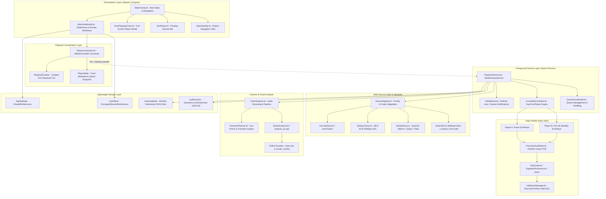
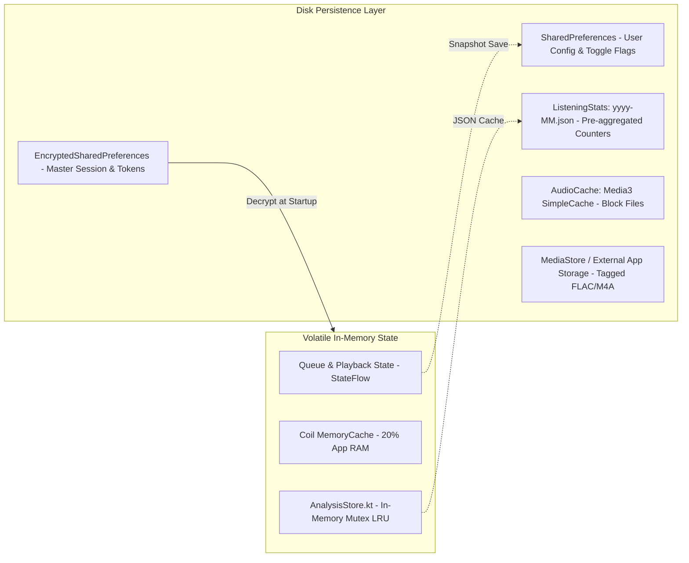
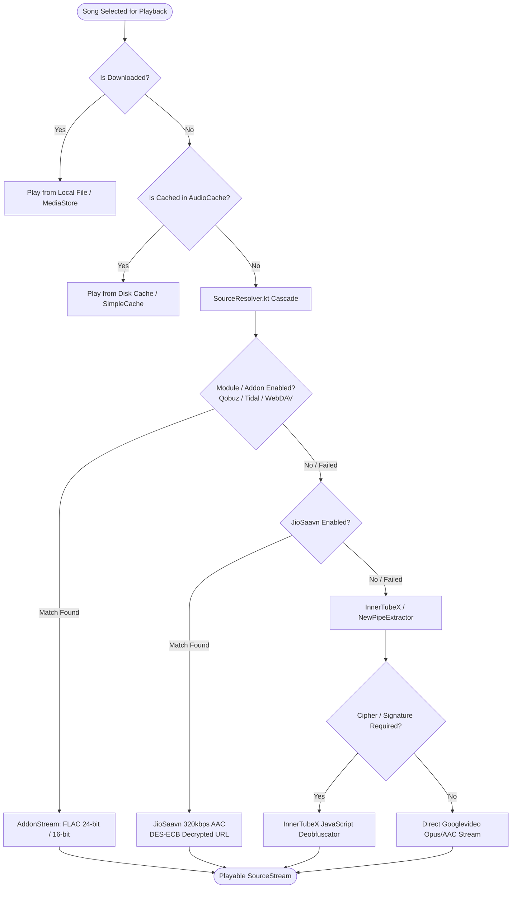
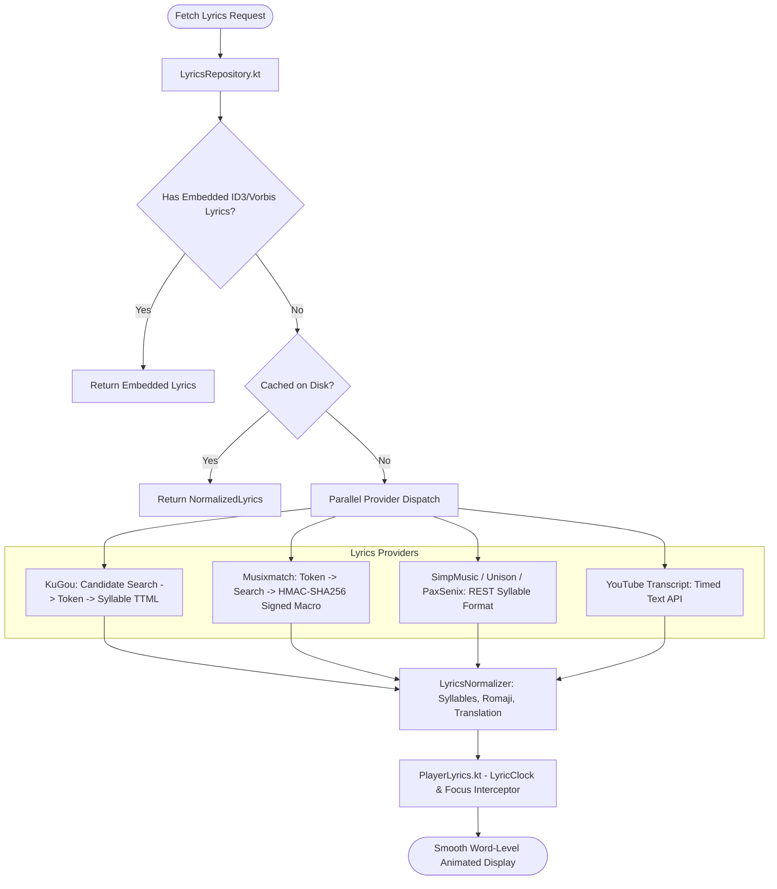
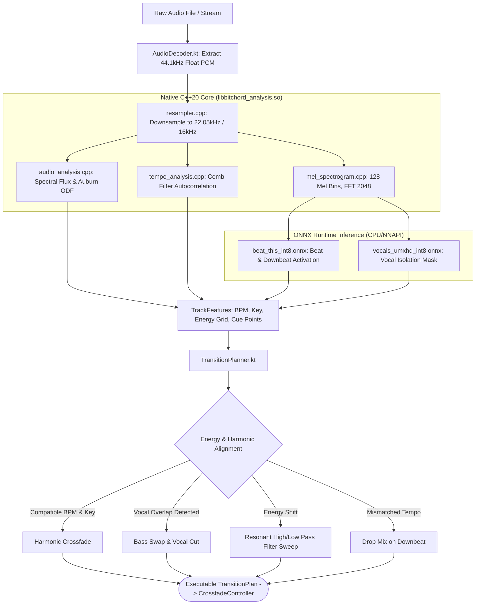

# 02 — Architecture Reconstruction

## Executive Architectural Summary

BitChord is architected as an **audio-first, single-process, reactive Android application**. Rather than adhering to conventional Clean Architecture boilerplate with excessive abstractions and dependency injection frameworks (Dagger/Hilt/Koin), BitChord adopts a pragmatic, high-performance architecture driven by:
1. **Explicit Singleton Lifecycle Management:** Subsystems are initialized sequentially and concurrently during `Application.onCreate()`.
2. **State-Driven Presentation:** Jetpack Compose with a single activity (`MainActivity.kt`) managing view states directly via Kotlin Coroutines `StateFlow` and Compose state snapshots.
3. **Decoupled Playback Layer:** An AndroidX `MediaLibraryService` (`PlaybackService.kt`) hosting twin `ExoPlayer` instances (`CrossfadeController.kt`) with an in-house float32 audio pipeline (`PrecisionAudioSink.kt`) and C++20 DSP analysis engines.
4. **Zero-Database Persistence:** No SQLite/Room overhead. Storage relies on `EncryptedSharedPreferences`, standard `SharedPreferences`, and monthly partitioned JSON aggregate files.

---

## 1. Overall System Architecture



---

## 2. Playback Architecture

BitChord completely abandons the single-player playback paradigm in favor of a synchronized **Dual-Player Peer Architecture** managed by `CrossfadeController.kt`.

```mermaid
sequenceDiagram
    autonumber
    participant UI as NowPlayingScreen / MainViewModel
    participant PC as PlayerConnection
    participant PS as PlaybackService
    participant CC as CrossfadeController
    participant P_Act as Player A (Active)
    participant P_Stb as Player B (Standby)
    participant Sink as PrecisionAudioSink

    UI->>PC: User taps song / next
    PC->>PS: MediaController.play() / customCommand
    PS->>CC: handleHandoff(targetTrack)
    Note over CC,P_Stb: Standby player prepared in advance
    CC->>P_Stb: prepare() with ResolvingDataSource
    CC->>P_Stb: setVolume(0.0f)
    CC->>P_Stb: play() (Pre-rolls buffer silently)
    
    rect rgb(20, 30, 45)
        Note over CC,Sink: Transition Window Triggered (Outro Cue reached)
        CC->>PS: updateNotificationAndSession(targetTrack)
        loop Equal-Power Curve (0 to crossfadeMs)
            CC->>P_Act: setVolume(cos(theta))
            CC->>P_Stb: setVolume(sin(theta))
        end
        CC->>P_Act: stop() & clearMediaItems()
    end
    Note over CC: Swap Roles: Player B is now Active, Player A is Standby
```



---

## 3. Data Architecture

The data architecture rejects relational tables (Room/SQLite) in favor of high-throughput, low-overhead memory models serialized into human-readable, portable formats.



---

## 4. Source Resolution Architecture

BitChord decouples catalog discovery (YouTube Music) from physical stream resolution, allowing dynamic quality fallback and lossless upgrading.



---

## 5. Lyrics Architecture



---

## 6. Automix Architecture



---

## 7. Native / JNI Architecture

```mermaid
graph TD
    subgraph Kotlin_JVM ["Kotlin Application Layer"]
        TS[TrackAnalyzer.kt]
        SJ[SmartAnalysisJni.kt]
    end

    subgraph JNI_Bridge ["JNI Native Bridge (app/src/main/cpp)"]
        AJNI[analysis_jni.cpp - JNI Export Functions]
        MJNI[mel_jni.cpp - DirectBuffer Memory Pass-through]
        VJNI[vocal_jni.cpp - Float Buffer Marshalling]
    end

    subgraph Native_C20 ["Native C++20 Shared Library (libbitchord_analysis.so)"]
        AA[audio_analysis.cpp - Signal Processing Core]
        MSPEC[mel_spectrogram.cpp - Windowing & Filterbank]
        RS[resampler.cpp - Polyphase Interpolation]
        TA_CPP[tempo_analysis.cpp - Comb Filtering & Periodic Grid]
    end

    subgraph External_Libs ["External Prebuilts"]
        ORT[libonnxruntime.so (v1.28.0)]
    end

    TS --> SJ
    SJ -->|GetDirectBufferAddress| AJNI
    SJ -->|JNIEnv Call| MJNI
    SJ -->|JNIEnv Call| VJNI
    AJNI --> AA
    MJNI --> MSPEC
    VJNI --> AA
    AA --> RS
    AA --> TA_CPP
    AA --> ORT
```

---

## 8. Detailed Subsystem Analysis

### 8.1 Application Entry Point & Dependency Injection
- **Entry File:** `BitChordApplication.kt`
- **Class:** `BitChordApplication`
- **Pattern:** Manual Service Locator / Companion Object initialization.
- **Verification:** Verified that zero automated DI frameworks exist in Gradle dependencies or source annotations.
- **Startup Concurrency:** Startup initialization is split between the main thread and a dedicated `startup-init` background thread. The background thread pre-initializes cryptographic key stores (`SourceRegistry`, `InnerTubeXResolver`) and `CanvasCache` so that the main UI is never stalled during cold startup.

### 8.2 Navigation & UI Presentation
- **Pattern:** Single-Activity Compose application with custom state machine.
- **Tabs:** 4 Primary Tabs (`TAB_HOME = 0`, `TAB_EXPLORE = 1`, `TAB_SEARCH = 2`, `TAB_LIBRARY = 3`).
- **Overlays:** Managed via Compose state variables (`showNowPlaying`, `showSettings`, `showReplay`, `showListenTogether`, `showEqualizer`).
- **Performance Lesson:** The playhead tick (`PlaybackPosition.positionMs`) is explicitly decoupled from `PlayerState`. If `positionMs` had been placed in `PlayerState`, ticking twice a second would cause the entire Compose tree (and expensive background blur shaders) to recompose constantly.

### 8.3 Persistence & Storage
- **No SQLite/Room Database:** BitChord deliberately avoids SQL databases.
- **User Settings:** Android `SharedPreferences` via `AppSettings.kt`.
- **Secrets/Tokens:** Android KeyStore-backed `EncryptedSharedPreferences` via `AuthStore.kt`.
- **Listening History:** Aggregated monthly JSON files (`ListeningStats.kt`) preventing database growth and vacuuming overhead.
- **Audio Cache:** Media3 `SimpleCache` with a custom `DynamicLruCacheEvictor.kt` (capped at 1GB).

---

## 9. React Native Porting Blueprint

| BitChord Component | BitChord Implementation | React Native Equivalent | Architectural Layer |
| :--- | :--- | :--- | :--- |
| **Dependency Injection** | Manual `object` singletons in `BitChordApplication.kt` | TypeScript Service Singletons / Modular Context Providers | React Native JS / TS |
| **Navigation** | Monolithic state variable switching in `MainActivity.kt` | `@react-navigation/bottom-tabs` + Stack Navigators | React Native JS |
| **Now Playing Sheet** | Full-screen modal overlay in Compose | `@gorhom/bottom-sheet` or `react-native-reanimated` sheet | React Native JS / UI |
| **Playhead Tick** | Decoupled `PlaybackPosition` (2Hz tick) | `useSharedValue` in Reanimated / isolated event emitter | UI Thread / JS |
| **Playback Service** | Media3 `MediaLibraryService` (`PlaybackService.kt`) | Custom Native Android/iOS Audio Modules via JSI / TurboModules | Native (Kotlin / Swift) |
| **Dual-Player Engine** | `CrossfadeController.kt` (Twin ExoPlayers) | Native C++ / Platform Player Controller (ExoPlayer + AVQueuePlayer) | Native (Kotlin / Swift) |
| **Audio Processing** | `PrecisionAudioSink.kt` (Float32 PCM) | Native Audio Track Sink with custom DSP chain | Native (Android / iOS) |
| **Smart Analysis & DSP** | C++20 `bitchord_analysis` + ONNX Runtime JNI | C++ TurboModule (JSI) sharing the exact C++ source | Cross-Platform C++ |
| **Persistence** | SharedPreferences + Monthly JSON | `react-native-mmkv` + File System (Nitro / Expo-FS) | React Native JS / Native |
| **Network Client** | OkHttp singleton (`Http.kt`) with Brotli/gzip | Native `fetch` with Axios/Ky or custom OkHttp/NSURLSession client | React Native JS / Native |
