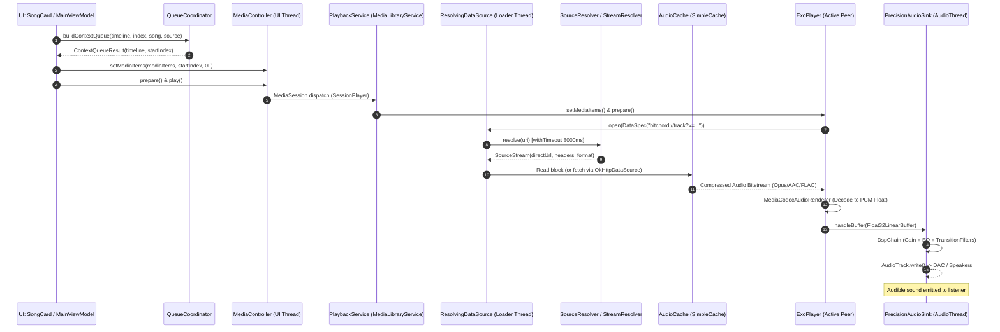
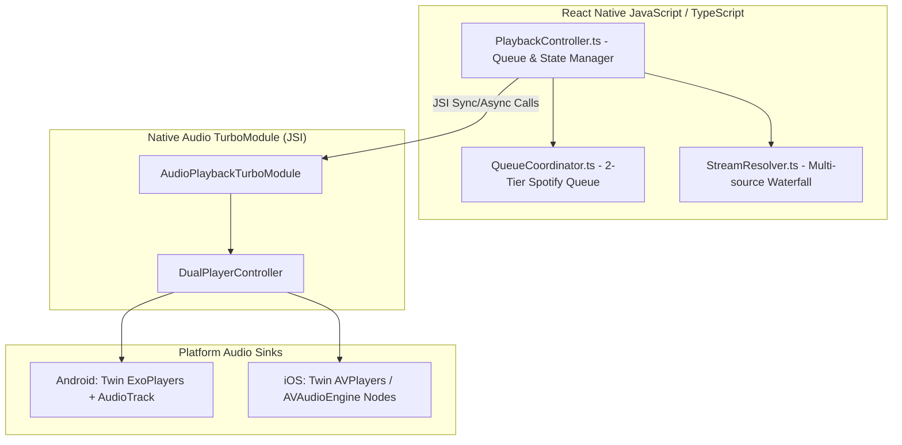

# 03 — Playback Core & Lifecycle Architecture

## Executive Overview: How BitChord Gets from "User Presses Play" to Audible Playback

When a user taps a song in BitChord, playback is not an instantaneous single-function call to `MediaPlayer.start()`. It is a deterministic, multi-stage pipeline:
1. **User Interaction:** `MainViewModel.playSong()` converts the tapped `Song` into a synthetic `MediaItem` carrying a custom URI scheme (`bitchord://track?v={videoId}` or `bitchord://source?...`).
2. **IPC / Controller Command:** The UI's `MediaController` communicates with `PlaybackService` (MediaLibraryService) via `MediaController.setMediaItems()` and `prepare()`.
3. **Queue Construction:** `QueueCoordinator.buildContextQueue()` creates an interleaved two-tier timeline (`[Preceding Context] + [Selected Track] + [Preserved USER_QUEUE] + [Following Context]`).
4. **Lazy Stream Resolution:** Media3 passes the synthetic URI to `ResolvingDataSource`. On ExoPlayer's background loader thread, `ResolvingDataSource.Resolver` invokes `SourceResolver.resolve()` or `StreamResolver.resolve()` to obtain a direct CDN stream URL (Googlevideo, JioSaavn, Qobuz) and required HTTP authentication headers.
5. **Caching Layer:** `AudioCache` (wrapping Media3 `SimpleCache` with `DynamicLruCacheEvictor`) checks if audio blocks exist on disk; if present, bytes stream directly from flash storage without hitting the network.
6. **Audio Sink & Floating-Point Pipeline:** ExoPlayer decodes compressed audio into 32-bit linear floating-point PCM samples (`PrecisionAudioSink.kt`), passes them through `DspChain` (volume normalization, graphic equalizer, spatializer), and delivers them to an Android `AudioTrack` configured for direct bit-perfect output or system floating-point output.
7. **Transition & Crossfade Engine:** As the current track nears its outro cue point, `CrossfadeController.kt` loads the next track into the standby `spare` ExoPlayer peer, pre-rolls buffers silently, executes an equal-power volume crossfade, and swaps player roles (`adoptPlayer()`) seamlessly without audio glitching.

---

## 1. End-to-End Lifecycle: User Tap to Audible Playback

---

## 2. Step-by-Step Technical Lifecycle Matrix

### Step 1: User Selects Track & Queue Synthesis
- **File:** `BitChord/app/src/main/java/com/music/bitchord/ui/MainViewModel.kt`
- **Class:** `MainViewModel`
- **Function:** `playContext(songs: List<Song>, selectedIndex: Int, source: QueueSource)`
- **Thread:** Main (UI) Coroutine Thread (`viewModelScope`)
- **Inputs:** List of songs, clicked index, queue origin (`QueueSource`).
- **Outputs:** Interleaved `ContextQueueResult` submitted to `rememberMediaController()`.
- **Invariants:** Existing user-queued tracks (`QueueTier.USER_QUEUE`) are preserved and positioned immediately following the selected track.

### Step 2: Inter-Process / Controller Transmission
- **File:** `BitChord/app/src/main/java/com/music/bitchord/playback/PlayerConnection.kt`
- **Class:** `PlayerConnection`
- **Function:** `MediaController.setMediaItems(items, startIndex, 0L)`
- **Thread:** Main Thread -> Binder IPC -> Service Looper
- **Inputs:** `List<MediaItem>` with custom extras (`queueTier`, `queueEntryId`, `originalVersion`).
- **Error Handling:** If `MediaController` is disconnected, command is queued or re-attempted on session reconnect.

### Step 3: Lazy Stream Resolution via ResolvingDataSource
- **File:** `BitChord/app/src/main/java/com/music/bitchord/playback/PlaybackService.kt`
- **Class:** `PlaybackService`
- **Function:** `streamResolver` closure (lines 1204–1259)
- **Thread:** ExoPlayer Background Loader Thread (`ExoPlayer:Loader:Generic`)
- **Inputs:** Synthetic `DataSpec` with URI `bitchord://track?v={videoId}` or `bitchord://source?...`.
- **Processing:**
  - Evaluates `SourceRegistry` priority: checks high-res addons (Qobuz/Tidal) -> JioSaavn (320k AAC) -> InnerTubeX -> NewPipe.
  - Executes network resolution inside `runBlocking` wrapped in `withTimeout(8000ms)`.
- **Outputs:** Rewritten `DataSpec` pointing to direct stream URL with required HTTP request headers (`User-Agent`, `Authorization`, `Range`, `Referer`).
- **Error Handling:** Throws `IOException` if stream resolution times out or returns null, prompting ExoPlayer to trigger `Player.Listener.onPlayerError()`.

### Step 4: Audio Caching & Network Ingestion
- **File:** `BitChord/app/src/main/java/com/music/bitchord/playback/AudioCache.kt`
- **Class:** `AudioCache`
- **Function:** `buildMediaSourceFactory()` & `ChunkedDataSource`
- **Thread:** ExoPlayer Loader Thread
- **Cache Policy:** Media3 `CacheDataSource` backed by `SimpleCache` with a custom `DynamicLruCacheEvictor` (1 GB ceiling).
- **Behavior:**
  - If bytes are cached: read locally from cache block files.
  - If uncached: stream through `OkHttpDataSource` while simultaneously committing read bytes to the cache directory.

### Step 5: Audio Decoding & Precision Floating-Point Output
- **File:** `BitChord/app/src/main/java/com/music/bitchord/playback/audio/PrecisionAudioSink.kt`
- **Class:** `PrecisionAudioSink`
- **Function:** `handleBuffer(buffer: ByteBuffer, presentationTimeUs: Long, encodedAccessUnitCount: Int)`
- **Thread:** Media3 Audio Sink / AudioTrack Thread
- **Inputs:** IEEE 754 32-bit linear PCM float buffers decoded by `MediaCodec`.
- **Processing:**
  1. `DspChain`: Volume normalization (YouTube loudness adjustment via ReplayGain metadata).
  2. `EqualizerProcessor`: Graphic/parametric EQ filter bank.
  3. `SpatialAudioProcessor`: Channel mixing or crossfeed.
  4. Direct DAC output check: Probes `DirectAudioProbe.isDirectPlaybackSupported()` to bypass system mixer for external USB DACs.
- **Outputs:** Buffer written to Android `AudioTrack`.

### Step 6: Next-Track Preload & Standby Preparation
- **File:** `BitChord/app/src/main/java/com/music/bitchord/playback/CrossfadeController.kt`
- **Class:** `CrossfadeController`
- **Function:** `poll()` / `armStandbyPlayer()`
- **Thread:** Main Looper Coroutine Scope
- **Trigger:** When current track remaining duration drops below pre-roll threshold (typically $T_{remain} \le \text{crossfadeMs} + 15000\text{ms}$).
- **Actions:**
  - Standby player (`spare`) loads the next media item from `QueueCoordinator`.
  - Sets standby volume to `0.0f`.
  - Calls `spare.prepare()` and `spare.play()` so the incoming audio stream connects, decodes, and pre-rolls into memory silently.

### Step 7: Transition Execution & Role Swapping
- **File:** `BitChord/app/src/main/java/com/music/bitchord/playback/PlaybackService.kt`
- **Class:** `PlaybackService`
- **Function:** `adoptPlayer(outgoing: ExoPlayer, incoming: ExoPlayer)`
- **Trigger:** `CrossfadeController` hits the outro cue point or configured transition point.
- **Actions:**
  1. Swaps MediaSession ownership to the incoming player.
  2. Decrements outgoing volume along $\cos(\theta)$ curve; increments incoming volume along $\sin(\theta)$ curve.
  3. At completion of fade, calls `outgoing.stop()` and `outgoing.clearMediaItems()`.
  4. The outgoing player becomes the new `spare`.

---

## 3. Playback State Synchronization & Error Handling

### States in Media3 vs UI PlayerState
| Media3 Player State | BitChord `PlayerState` | UI Presentation |
| :--- | :--- | :--- |
| `STATE_IDLE` | `isPlaying = false`, `isLoading = false` | Stopped / Empty Queue |
| `STATE_BUFFERING` | `isLoading = true` | Progress Spinner / Shimmer |
| `STATE_READY` (`playWhenReady = true`) | `isPlaying = true`, `isLoading = false` | Playhead Running, Waveform Active |
| `STATE_READY` (`playWhenReady = false`) | `isPlaying = false`, `isLoading = false` | Paused State |
| `STATE_ENDED` | Transitions to next track or triggers AutoPlay | Queue Refill or Stop |

### Error & Retry Recovery Matrix
1. **Network Timeout during Resolution:** If `SourceResolver` times out (8000ms), fallback to direct YouTube InnerTube stream is attempted.
2. **CDN 403 Forbidden / Expired Signature:** Stream URL expires; `PlaybackFallback` invalidates cached stream URL and forces a fresh resolution.
3. **Standby Player Decoder Failure:** If the standby player fails to initialize its audio decoder before the transition point, crossfade is gracefully downgraded to a standard gapless transition on the active player.

---

## 4. React Native Adaptation Blueprint

### Key Differences & Solutions for React Native:
1. **Thread Separation:** The JS thread must never handle raw audio buffers or high-frequency progress updates. Playback progress must be emitted over native events or written directly into a Reanimated `SharedValue`.
2. **Dual-Player Engine:** Must be implemented in native code (Kotlin on Android, Swift on iOS) wrapping two native players, exposing a unified interface to React Native (`play()`, `pause()`, `skipToNext()`, `setQueue()`).
3. **Queue Invariants:** `QueueCoordinator.kt` should be ported 1:1 to TypeScript, running directly in the JS realm since queue manipulation is pure business logic.
