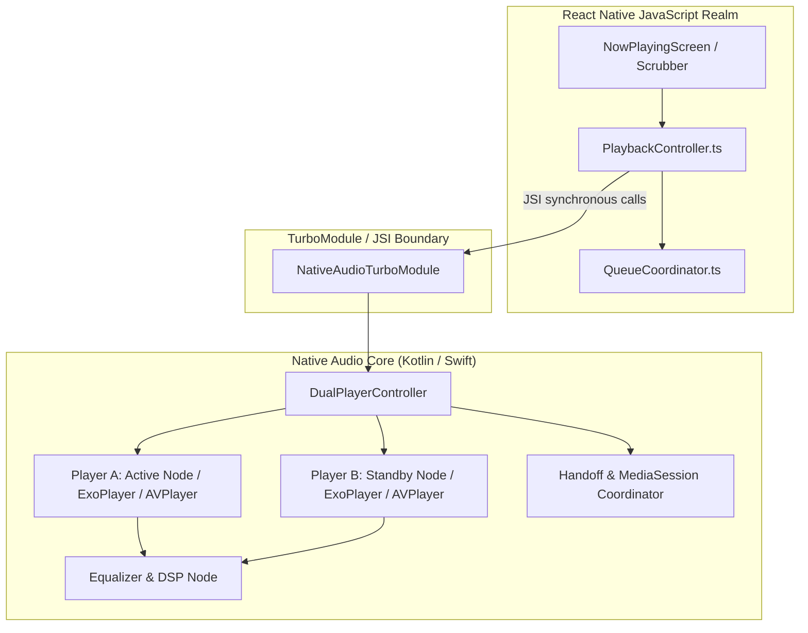

# 04 — Crossfade & Gapless Transition Architecture

## Executive Summary: Reverse-Engineering `CrossfadeController`

BitChord's crossfade engine is a masterclass in mobile audio engineering. While naive music players attempt to implement crossfade by rapidly ramping the software volume of a single player or seeking between tracks, BitChord recognizes that **a true crossfade mathematically and structurally requires two concurrent audio decoders**.

BitChord solves the historic 9ms–41ms audio seam bug (where duplicate audio is heard at the boundary of a track skip) by loading the **incoming track** on the standby player, pre-rolling its audio pipeline silently, and executing a **role-swapping handoff** at the exact instant the crossfade begins.

---

## 1. Technical Mechanics: The Twin-Player Engine

### 1.1 Are Two Players Used?
**Yes.** Verified in `PlaybackService.kt` (lines 532–540) and `CrossfadeController.kt` (lines 50–75).
- `player` (Active Peer): Backs Android's `MediaSession`, holds system audio focus, binds to the foreground notification, and outputs audible sound.
- `spare` (Standby Peer): Symmetric `ExoPlayer` instance. Idle between transitions; armed with the incoming track before a transition begins.

### 1.2 When is the Second Player Created?
Both players are instantiated upfront during `PlaybackService.onCreate()` within `createPlayers()`. They are persistent peers that swap roles throughout the lifetime of the application.

### 1.3 When is the Standby Player Prepared?
The standby player is prepared during **`Phase.ARMING`**.
- The controller continuously evaluates current playhead position via `considerAutoTransition()` or `considerSmartTransition()`.
- **Arming Trigger:** When the remaining duration of the active track drops below:
  $$T_{\text{remain}} \le T_{\text{fade}} + T_{\text{lead\_margin}} \quad (\text{where } T_{\text{lead\_margin}} = 12000\text{ms})$$
- The standby player loads the queue positioned on the next index (`currentIndex + 1`), sets its volume to `0.0f`, and calls `standby.prepare()` and `standby.play()`.

### 1.4 When Does It Start Rendering Sound?
The standby player begins playing silently immediately upon being armed to fill its native audio buffers and initialize the hardware `MediaCodec` decoder. When the active playhead reaches the fade trigger timestamp ($T_{\text{trigger}} = \text{TrackDuration} - T_{\text{fade}}$ or Automix Outro Cue), the transition enters **`Phase.FADING`**:
- `onHandoff(outgoing, incoming)` is called immediately at $t=0$.
- The standby player's volume begins rising according to the equal-power sine curve.

### 1.5 Volume Curve Mathematics
BitChord rejects linear volume curves because human loudness perception is logarithmic and linear fading causes a noticeable ~3dB volume drop at the midpoint ($p=0.5$). Instead, it uses **equal-power trigonometric curves**:
$$\text{Gain}_{\text{incoming}}(p) = \sin\left(p \cdot \frac{\pi}{2}\right), \quad p \in [0, 1]$$
$$\text{Gain}_{\text{outgoing}}(p) = \cos\left(p \cdot \frac{\pi}{2}\right), \quad p \in [0, 1]$$
Since $\sin^2(\theta) + \cos^2(\theta) = 1$, total acoustic power output remains constant ($1.0$) across the entire blend.

### 1.6 Synchronization Mechanism & Timing
Volume automation is driven by wall-clock time using `SystemClock.elapsedRealtime()`.
- A coroutine loop ticks every $20\text{ms}$ (`TICK_MS = 20L`).
- Progress is calculated as:
  $$p = \frac{t_{\text{current}} - t_{\text{fade\_start}}}{T_{\text{fade\_duration}}}$$
- At each tick, new volume gains and DSP filter cutoffs are written to the respective player and audio processors.

### 1.7 Cleanup & Role Swapping
When $p \ge 1.0$, the transition finishes:
- `retire(outgoing)` is called on the outgoing player.
- Outgoing player volume is reset to `1.0f`, its media items are cleared (`clearMediaItems()`), and it is put into `stop()` mode.
- The outgoing player is now officially the idle `spare`, ready for the next arming cycle.

### 1.8 Error & Failure Handling (`bail()`)
If any of the following occur during arming or fading:
- Standby player decoder error (`PlaybackException`)
- User seeks playhead (`onPositionDiscontinuity`)
- User taps Next / Previous (`onSkipRequested`)
- Stream resolution timeout
The controller invokes `bail()`:
- Standby player is stopped immediately and reset.
- Active player volume is restored to full `1.0f`.
- The system gracefully drops back to standard single-player playback without crashing or producing silence.

---

## 2. Platform-Independent Pseudocode: Dual-Player Crossfade

```typescript
// Platform-Independent Pseudocode for Dual-Player Crossfade
enum TransitionPhase {
  IDLE,
  ARMING,
  FADING,
  BAILING
}

class CrossfadeEngine {
  private activePlayer: AudioPlayer;
  private standbyPlayer: AudioPlayer;
  private phase: TransitionPhase = TransitionPhase.IDLE;
  private fadeDurationMs: number = 6000;
  private fadeStartTime: number = 0;

  // Called periodically by audio clock loop (every 20ms)
  public onClockTick(): void {
    const activePos = this.activePlayer.getCurrentPosition();
    const activeDur = this.activePlayer.getDuration();
    const remainMs = activeDur - activePos;

    switch (this.phase) {
      case TransitionPhase.IDLE:
        // Arm standby player 12s before fade start
        if (remainMs <= this.fadeDurationMs + 12000) {
          this.armStandbyPlayer();
        }
        break;

      case TransitionPhase.ARMING:
        // Verify standby is buffered and ready
        if (this.standbyPlayer.isReady() && remainMs <= this.fadeDurationMs) {
          this.startCrossfade();
        } else if (remainMs <= 500 && !this.standbyPlayer.isReady()) {
          // Next track failed to buffer in time; abort crossfade
          this.bail("Standby buffer timeout");
        }
        break;

      case TransitionPhase.FADING:
        const elapsed = Date.now() - this.fadeStartTime;
        const progress = Math.min(1.0, elapsed / this.fadeDurationMs);

        // Equal-Power Trigonometric Law: sin^2 + cos^2 = 1
        const incomingGain = Math.sin(progress * (Math.PI / 2.0));
        const outgoingGain = Math.cos(progress * (Math.PI / 2.0));

        this.activePlayer.setVolume(incomingGain);   // Active now holds incoming track!
        this.standbyPlayer.setVolume(outgoingGain);  // Standby now holds outgoing track!

        if (progress >= 1.0) {
          this.completeCrossfade();
        }
        break;
    }
  }

  private armStandbyPlayer(): void {
    const nextTrack = queue.getNextTrack();
    if (!nextTrack) return;

    this.standbyPlayer.load(nextTrack.streamUrl, { startPositionMs: 0 });
    this.standbyPlayer.setVolume(0.0);
    this.standbyPlayer.play(); // Pre-rolls decoder silently
    this.phase = TransitionPhase.ARMING;
  }

  private startCrossfade(): void {
    // Immediate Role Swap at t = 0
    this.handoffSession(this.activePlayer, this.standbyPlayer);

    // Swap internal references
    const prevActive = this.activePlayer;
    this.activePlayer = this.standbyPlayer;
    this.standbyPlayer = prevActive;

    this.fadeStartTime = Date.now();
    this.phase = TransitionPhase.FADING;
  }

  private completeCrossfade(): void {
    // Retire outgoing player
    this.standbyPlayer.stop();
    this.standbyPlayer.clear();
    this.standbyPlayer.setVolume(1.0);
    this.phase = TransitionPhase.IDLE;
  }

  private bail(reason: string): void {
    this.standbyPlayer.stop();
    this.standbyPlayer.clear();
    this.activePlayer.setVolume(1.0);
    this.phase = TransitionPhase.IDLE;
  }
}
```

---

## 3. React Native Target Architecture



### Component Classification Matrix
| Component | Classification | Rationale |
| :--- | :--- | :--- |
| **`CrossfadeController.kt`** | `ALGORITHM PORT` | The state machine, arming window math, and $\sin/\cos$ curves must be extracted and implemented in native mobile audio code. |
| **`adoptPlayer()` Handoff** | `ARCHITECTURE PORT` | Immediate session reassignment ($t=0$) is a critical architectural pattern that must be recreated in iOS `MPNowPlayingInfoCenter` and Android `MediaSession`. |
| **`TransitionFilters`** | `REIMPLEMENT` | Audio filter cutoffs (biquad LPF/HPF) should be executed in native audio graphs (`AVAudioEngine` on iOS, custom `AudioProcessor` on Android). |
| **Queue Reconciliation** | `DIRECT PORT` | Queue timeline tracking during transitions is pure business logic, portable directly to TypeScript. |
