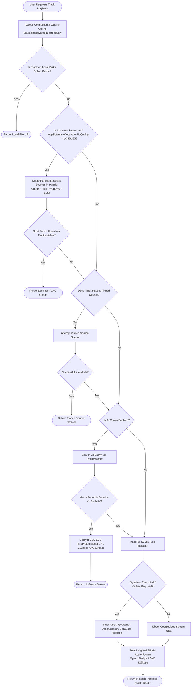

# 05 — Stream Resolution & Multi-Source Routing Architecture

## Executive Summary: Multi-Source Resolution Engine

One of BitChord's most sophisticated architectural triumphs is the complete decoupling of **music catalog discovery** from **audio stream delivery**. In BitChord, selecting a song on YouTube Music does not commit the player to an Opus or AAC transcode from Googlevideo CDN. Instead, the application cascades through a prioritized waterfall of registered audio providers—including high-resolution lossless sources (Qobuz, Tidal, local SMB/WebDAV shares), high-bitrate streaming services (JioSaavn 320kbps AAC), and InnerTubeX / NewPipe YouTube extractors.

This document reverse-engineers the end-to-end resolution pipeline, the `TrackMatcher` heuristic that prevents incorrect song substitutions, and provides a production-grade React Native architecture.

---

## 1. The End-to-End Resolution Pipeline



---

## 2. Deep Component Dissection

### 2.1 `SourceResolver.kt` (The Orchestrator)
- **Role:** Applies user quality ceilings, coordinates concurrent provider queries, and manages fallback ladders.
- **Key Method:** `suspend fun resolve(configId: String, trackId: String, target: TrackMatcher.Target): SourceStream?`
- **Quality Adaptation:**
  - `StreamRequest.Lossless`: Demands bit-exact uncompressed audio (FLAC 16-bit or 24-bit).
  - `StreamRequest.Best`: Takes the highest bitrate lossy or lossless format available.
  - `StreamRequest.Capped(maxKbps)`: Clamps stream format to protect mobile data plans.
- **Failover Invariant:** If a primary or lossless source fails mid-flight, `SourceResolver` catches the exception, logs the event via `TrackLog`, and transparently steps down to the next provider in line without skipping the track or crashing playback.

### 2.2 `TrackMatcher.kt` (The Identity Arbiter)
- **Problem:** Cross-service matching easily leads to "playing the wrong recording under the right title" (e.g. matching a studio track to an acoustic cover, live concert, or 10-hour slowed loop).
- **Three-Part Title Deconstruction:**
  1. `words` (Core Title): Must match verbatim or with normalized punctuation.
  2. `versions` (Take Modifiers): Words indicating alternative takes ("remix", "live", "acoustic", "instrumental", "slowed", "reverb"). **Rule:** Symmetrical agreement is mandatory. A candidate with "(Live)" cannot match a query without "(Live)", and vice-versa.
  3. `context` (Packaging Metadata): Bracketed strings like `From "Movie Name"`, `Official Audio`, `Lyric Video`. Stripped before matching; used only as a tie-breaker.
- **Duration Gating:** Candidate audio duration must be within $\pm 3$ seconds of the target track (extended to 12s for music videos with cinematic intros/outros).

### 2.3 `InnerTubeXResolver.kt` (YouTube Stream Extraction)
- **Cipher Deobfuscation:** YouTube periodically obfuscates audio stream URLs using dynamic JavaScript transformation functions. InnerTubeX runs a background QuickJS virtual machine and maintains a pre-warmed cipher cache to avoid the 8.7s cold deobfuscation penalty.
- **Proof-of-Origin (PoToken):** Intercepts BotGuard challenges via an off-screen WebView (`PoTokenGenerator.kt`) to bypass YouTube's 403 Forbidden throttling on data center and mobile IP ranges.

### 2.4 `JioSaavnSource.kt` (High-Bitrate Lossy Engine)
- Serves 320kbps AAC streams.
- **Decryption:** The audio stream URL returned by the API is encrypted using **DES-ECB with PKCS5 padding** using a static key (`"38346591"`). BitChord decrypts the ciphertext locally into an unauthenticated direct CDN MP4/AAC stream.

---

## 3. React Native Target Architecture & Interface

In React Native, stream resolution should be abstracted behind an asynchronous, extensible plugin interface.

```typescript
// React Native Stream Resolution Interface Specification

export interface TrackMetadata {
  id: string;
  title: string;
  artist: string;
  album?: string;
  durationSec?: number;
  isExplicit?: boolean;
  isVideo?: boolean;
}

export interface StreamFormat {
  codec: 'OPUS' | 'AAC' | 'FLAC' | 'ALAC' | 'MP3';
  bitrateKbps: number;
  sampleRateHz: number;
  bitDepth?: number;
  isLossless: boolean;
}

export interface ResolvedStream {
  url: string;
  headers: Record<string, string>;
  format: StreamFormat;
  sourceId: string;
  sourceName: string;
  expiresAtMs?: number;
}

export interface StreamResolverPlugin {
  readonly id: string;
  readonly displayName: string;
  readonly priority: number;
  readonly canServeLossless: boolean;

  isAvailable(): Promise<boolean>;
  matchAndStream(track: TrackMetadata, qualityCeiling: number): Promise<ResolvedStream | null>;
}

export class SourceRouter {
  private plugins: StreamResolverPlugin[] = [];

  public register(plugin: StreamResolverPlugin): void {
    this.plugins.push(plugin);
    this.plugins.sort((a, b) => b.priority - a.priority);
  }

  public async resolve(track: TrackMetadata, preferLossless: boolean): Promise<ResolvedStream> {
    // 1. If Lossless requested, query lossless plugins first
    if (preferLossless) {
      for (const plugin of this.plugins.filter(p => p.canServeLossless)) {
        try {
          const stream = await plugin.matchAndStream(track, Infinity);
          if (stream && stream.format.isLossless) {
            return stream;
          }
        } catch (e) {
          console.warn(`[SourceRouter] Lossless provider ${plugin.id} failed:`, e);
        }
      }
    }

    // 2. Cascade down general registered providers
    for (const plugin of this.plugins) {
      try {
        const stream = await plugin.matchAndStream(track, 320);
        if (stream) {
          return stream;
        }
      } catch (e) {
        console.warn(`[SourceRouter] Provider ${plugin.id} failed, trying fallback:`, e);
      }
    }

    throw new Error(`[SourceRouter] All providers failed to resolve stream for track: ${track.title}`);
  }
}
```

---

## 4. Architectural Boundary Assignment

| Subsystem Component | Target Runtime Realm | Justification |
| :--- | :--- | :--- |
| **`SourceRouter` & Provider Waterfall** | **React Native JS / TS** | Highly asynchronous, relies on JSON/REST APIs, non-blocking, benefits from rapid iteration. |
| **`TrackMatcher` (String Cleaning & Lev Dist)** | **React Native JS / TS** | String manipulation and regex parsing run cleanly and portably in V8/Hermes without native bindings. |
| **JioSaavn DES-ECB Decryption** | **React Native JS (CryptoJS)** | Lightweight crypto operation (<1ms per track) requiring no custom native bridges. |
| **YouTube Cipher Deobfuscation & PoToken** | **Remote Backend Service** | Running BotGuard WebViews and QuickJS cipher solvers on mobile devices drains battery and breaks frequently. Offloading to a cloud worker/microservice guarantees 99.9% uptime. |
| **Network Stream Ingestion & Headers** | **Native Android / iOS Audio Engine** | Native HTTP streaming layer (OkHttp / NSURLSession) must handle byte streaming, custom headers (`Range`, `User-Agent`), and buffering directly into audio decoders. |
