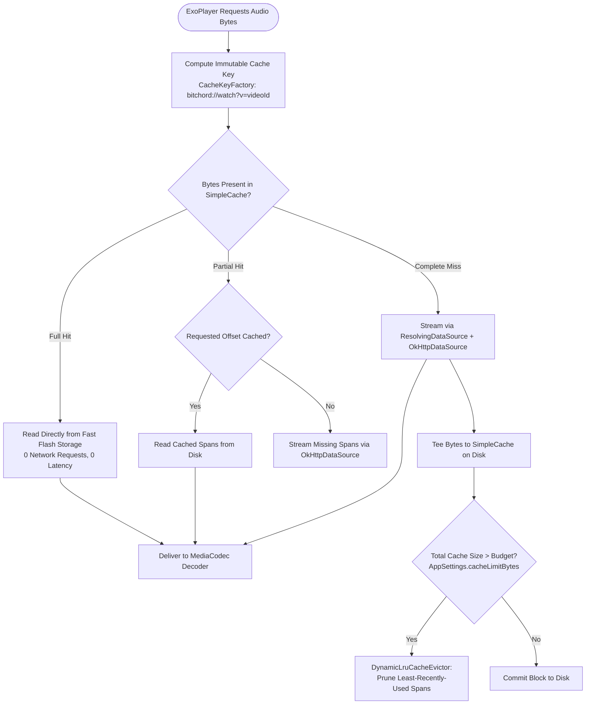
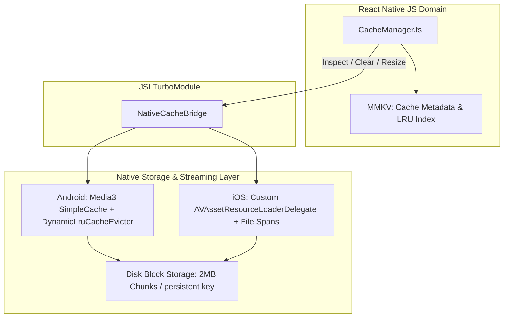

# 06 — Audio Cache Architecture

## Executive Summary: How BitChord Eliminates Redundant Network Requests

Mobile audio streaming apps face two critical bandwidth pitfalls:
1. **Seeking Latency & Bandwidth Waste:** Every seek backwards re-fetches audio bytes from the network unless cached locally.
2. **Ephemeral CDN Invalidation:** YouTube Googlevideo URLs rotate every few hours and include unique tokens (`&expire=...`). Caching by URL causes 100% cache misses on replay.

BitChord solves both challenges through a custom **Media3 `CacheDataSource` integration backed by `SimpleCache` and `DynamicLruCacheEvictor`**:
- **Cache-Outside-Resolver Architecture:** The cache layer sits *in front of* the `ResolvingDataSource`. It keys on persistent IDs (`bitchord://watch?v={id}`), so a cache hit never touches the network or triggers cipher resolution.
- **Bounded 2MB Range Chunking:** Instead of a single open-ended stream (which YouTube throttles to real-time playback speed), BitChord requests audio in parallel 2MB byte chunks at line-rate broadband speeds.

---

## 1. The Audio Caching Pipeline

---

## 2. Technical Mechanics of `AudioCache.kt`

### 2.1 Cache Key Strategy
- **Standard URL Caching (Naive):** `https://rr---sn.googlevideo.com/videoplayback?expire=171000...`
  - *Result:* Expires in hours; query parameters change between sessions; 0% cache hit rate.
- **BitChord Keying:** Custom `CacheKeyFactory` strips ephemeral network URLs and keys exclusively on the canonical track URI:
  $$\text{Key} = \text{"bitchord://watch?v="} + \text{videoId}$$
  $$\text{or Key} = \text{"bitchord://source?s="} + \text{sourceId} + \text{"&t="} + \text{trackId}$$

### 2.2 The Line-Rate 2MB Chunking Heuristic
YouTube's CDN throttles persistent HTTP streaming connections to $\approx 1.25\times$ audio playback speed after the initial $1\text{MB}$ burst. If a user seeks forward to minute 3:00, the player buffers.
BitChord's solution:
- It issues explicit HTTP `Range: bytes=X-Y` requests in fixed $2\text{MB}$ chunks (`CHUNK_BYTES = 2L * 1024 * 1024`).
- Each chunk is treated by the CDN as a fresh burst, allowing the client to download a $4\text{MB}$ high-bitrate song in $\approx 600\text{ms}$ over Wi-Fi/5G instead of waiting 60 seconds.

### 2.3 Eviction Architecture (`DynamicLruCacheEvictor.kt`)
- Tracks byte usage across all cached media files.
- Responds dynamically to user settings changes without restarting the app or wiping data.
- When disk usage crosses `maxBytes` (default 512MB, user-configurable up to 10GB), it removes the oldest unpinned audio spans until disk utilization returns below the threshold.

---

## 3. Storage Mechanism Comparison for React Native

To achieve the same performance in React Native, we must evaluate five storage backends:

| Storage Mechanism | Read Latency | Max Capacity | Suitability for Audio Data | Verdict & Technical Rationale |
| :--- | :--- | :--- | :--- | :--- |
| **Standard File System (`react-native-fs` / Expo FS)** | ~2–5 ms | Unlimited | Medium | Good for completed downloads, but terrible for streaming byte-range seeks and concurrent writes during playback. |
| **SQLite / OP-SQLite** | ~0.5–2 ms | 2 GB+ | Poor | Storing binary audio blobs in SQLite creates massive database fragmentation, high write-ahead log (WAL) overhead, and bloat. |
| **MMKV (`react-native-mmkv`)** | <0.1 ms | ~50 MB | Extreme Poor | Perfect for metadata, keys, and settings. Never store raw audio in memory-mapped key-value files. |
| **Platform Cache Directory (`context.cacheDir`)** | ~1–3 ms | OS Managed | Moderate | Subject to aggressive OS eviction when the device is low on storage. Can wipe entire cache unexpectedly. |
| **Native Audio Cache Engine (Media3 SimpleCache / Custom AVAssetCache)** | **<0.5 ms** | **Configurable (e.g. 10GB)** | **Optimal** | **SELECTED.** Native decoders stream bytes directly from memory-mapped disk blocks without bridge serialization. |

---

## 4. React Native Architecture Blueprint

### Recommendation for React Native Implementation:
1. **Metadata in MMKV:** Maintain track IDs, total bytes cached, last access timestamp, and user pin status in `react-native-mmkv` for instant UI rendering.
2. **Audio Blocks in Native Audio Sink:** On Android, wrap Media3's `SimpleCache` with a custom `CacheDataSourceFactory`. On iOS, implement an `AVAssetResourceLoaderDelegate` that saves audio byte ranges to disk using a canonical key matching the track ID.
3. **Chunked Preloader:** A native background task that fetches upcoming tracks in 2MB `Range` blocks during idle network windows.
