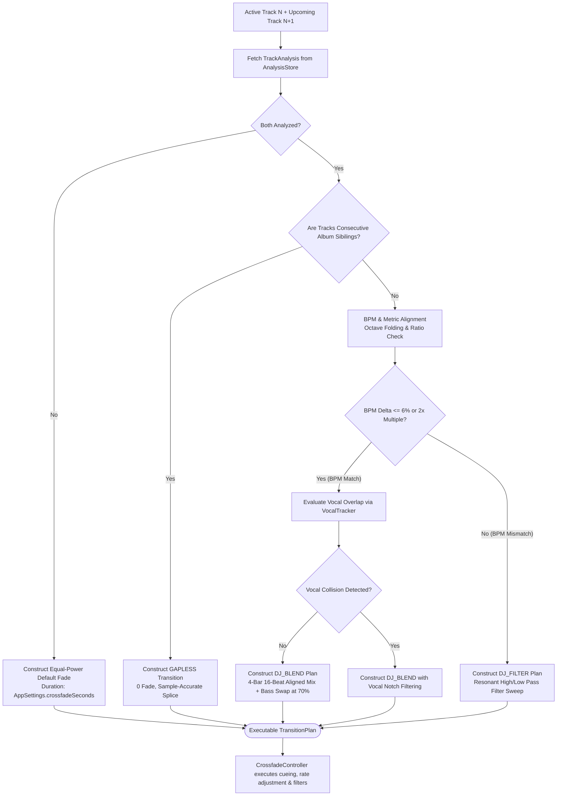

# 07 — Automix & Intelligent Transition Planning Architecture

## Executive Summary: DJ-Grade Transitions on Mobile

BitChord's Automix system elevates mobile music playback from passive sequential track listening into an automated, seamless DJ mix. By combining **offline DSP feature extraction**, **neural beat/vocal tracking**, and **dynamic transition planning**, BitChord constructs customized transition plans for every consecutive song pair.

This document reverse-engineers the decision trees, cue point heuristics, bass swap algorithms, and tempo-alignment pipelines, presenting an equivalent, legally safe React Native architecture.

---

## 1. The Complete Automix Pipeline



---

## 2. Technical Mechanics of `TransitionPlanner.kt`

### 2.1 Cue Point Calculation
Rather than blindly starting Track $N+1$ at timestamp `0.0s` (which often contains dead air or slow ambient intros), the planner identifies:
- **`incomingCueTime`:** The optimal downbeat or energy threshold where the incoming track's rhythm establishes itself.
- **`transitionStart`:** The outro marker of the outgoing track where the energy begins decaying toward silence.
- **`incomingPlaybackRate`:** Time-stretching factor to bring Track $N+1$ into tempo lock with Track $N$ (clamped to $[0.94, 1.06]$ to prevent audible pitch or timbre distortion).

### 2.2 Transition Styles & Execution Rules
1. **`GAPLESS`:**
   - **Condition:** Sequential album tracks (`sameAlbum = true`).
   - **Execution:** Zero-duration fade. Standby player cued to start instantaneously as active track samples end.
2. **`DJ_BLEND` (Beat-Matched Bass Swap):**
   - **Condition:** Tempi match within 6% (or octave multiple, e.g. 70 BPM to 140 BPM).
   - **Execution:** Overlap duration is locked to musical bars (typically 8 or 16 beats).
   - **Bass Swap:** Low frequencies ($<200\text{Hz}$) are kept on Track $N$ until progress reaches $70\%$ (`bassSwapFraction = 0.7`), then abruptly handed over to Track $N+1$.
3. **`DJ_FILTER` (Resonant Sweep):**
   - **Condition:** Tempi are mismatched (e.g. 95 BPM rock track into 130 BPM house track).
   - **Execution:** Outgoing track undergoes a low-pass filter sweep (20kHz down to 300Hz), while the incoming track fades in with an opening high-pass filter, providing a clean tonal transition without tempo clash.
4. **`EQUAL_POWER` (Safety Fallback):**
   - **Condition:** Spoken word content, missing analysis data, or live tracks.
   - **Execution:** Smooth $\sin / \cos$ volume crossfade.

---

## 3. Harmonic Mixing (Camelot Wheel Integration)

BitChord evaluates harmonic compatibility by mapping detected pitch classes to the Camelot system:
```text
Compatible Key Steps:
- Same Key (e.g. 8B -> 8B)
- Adjacent Key on Circle of Fifths (e.g. 8B -> 7B or 9B: +/- 1 Step)
- Relative Major / Minor (e.g. 8B -> 8A)
```
If two tracks are harmonically compatible, the planner extends the overlap duration from 8 beats to 16 beats, allowing a lush harmonic bed. If keys clash, the blend duration is compressed to minimize dissonance.

---

## 4. React Native Target Architecture

```typescript
// React Native Clean-Room Automix Planner Interface

export interface TransitionPlan {
  shouldStart: boolean;
  style: 'GAPLESS' | 'EQUAL_POWER' | 'DJ_BLEND' | 'DJ_FILTER';
  fadeDurationMs: number;
  incomingCueTimeMs: number;
  timeStretchRate: number; // e.g. 1.02 for +2% tempo adjustment
  bassSwapProgress: number; // 0.70
  filterSweepAmount: number;
  reasons: string[];
}

export class AutomixPlanner {
  public plan(
    outgoing: TrackMetadata,
    outgoingAnalysis: TrackAnalysis | null,
    incoming: TrackMetadata,
    incomingAnalysis: TrackAnalysis | null
  ): TransitionPlan {
    // 1. Check album continuity
    if (this.isConsecutiveAlbum(outgoing, incoming)) {
      return {
        shouldStart: false,
        style: 'GAPLESS',
        fadeDurationMs: 0,
        incomingCueTimeMs: 0,
        timeStretchRate: 1.0,
        bassSwapProgress: 0.0,
        filterSweepAmount: 0.0,
        reasons: ['Album continuity'],
      };
    }

    // 2. Fallback if analysis is missing
    if (!outgoingAnalysis || !incomingAnalysis) {
      return {
        shouldStart: false,
        style: 'EQUAL_POWER',
        fadeDurationMs: 6000,
        incomingCueTimeMs: 0,
        timeStretchRate: 1.0,
        bassSwapProgress: 0.0,
        filterSweepAmount: 0.0,
        reasons: ['Missing analysis data'],
      };
    }

    // 3. Tempo Compatibility Analysis
    const tempoRatio = this.calculateTempoRatio(outgoingAnalysis.bpm, incomingAnalysis.bpm);
    const isTempoMatched = Math.abs(1.0 - tempoRatio) <= 0.06;

    if (isTempoMatched) {
      return {
        shouldStart: false,
        style: 'DJ_BLEND',
        fadeDurationMs: this.beatsToMs(16, outgoingAnalysis.bpm),
        incomingCueTimeMs: incomingAnalysis.downbeats[0] * 1000,
        timeStretchRate: tempoRatio,
        bassSwapProgress: 0.7,
        filterSweepAmount: 0.0,
        reasons: ['BPM matched within 6%', 'Beat alignment enabled'],
      };
    }

    // 4. Default to Filter Sweep for disparate BPMs
    return {
      shouldStart: false,
      style: 'DJ_FILTER',
      fadeDurationMs: 8000,
      incomingCueTimeMs: incomingAnalysis.firstBeatSec * 1000,
      timeStretchRate: 1.0,
      bassSwapProgress: 0.0,
      filterSweepAmount: 0.85,
      reasons: ['Tempo mismatch; resonant filter sweep engaged'],
    };
  }

  private isConsecutiveAlbum(a: TrackMetadata, b: TrackMetadata): boolean {
    return Boolean(a.album && a.album === b.album && a.artist === b.artist);
  }

  private calculateTempoRatio(outBpm: number, inBpm: number): number {
    let ratio = inBpm / outBpm;
    while (ratio < 0.75) ratio *= 2.0; // Fold octave
    while (ratio > 1.5) ratio /= 2.0;
    return ratio;
  }

  private beatsToMs(beats: number, bpm: number): number {
    return (beats / (bpm / 60)) * 1000;
  }
}
```

### React Native Boundary Strategy:
- **Decision Engine in TypeScript:** `AutomixPlanner.ts` runs directly on the JS/TS side. It requires only lightweight numerical computations ($<0.5\text{ms}$).
- **DSP Filter Automation in Native Core:** The calculated `TransitionPlan` is sent to the native dual-player controller via JSI. The native audio thread executes the actual volume curves, biquad filter cutoffs, and WSOLA time-stretching.
