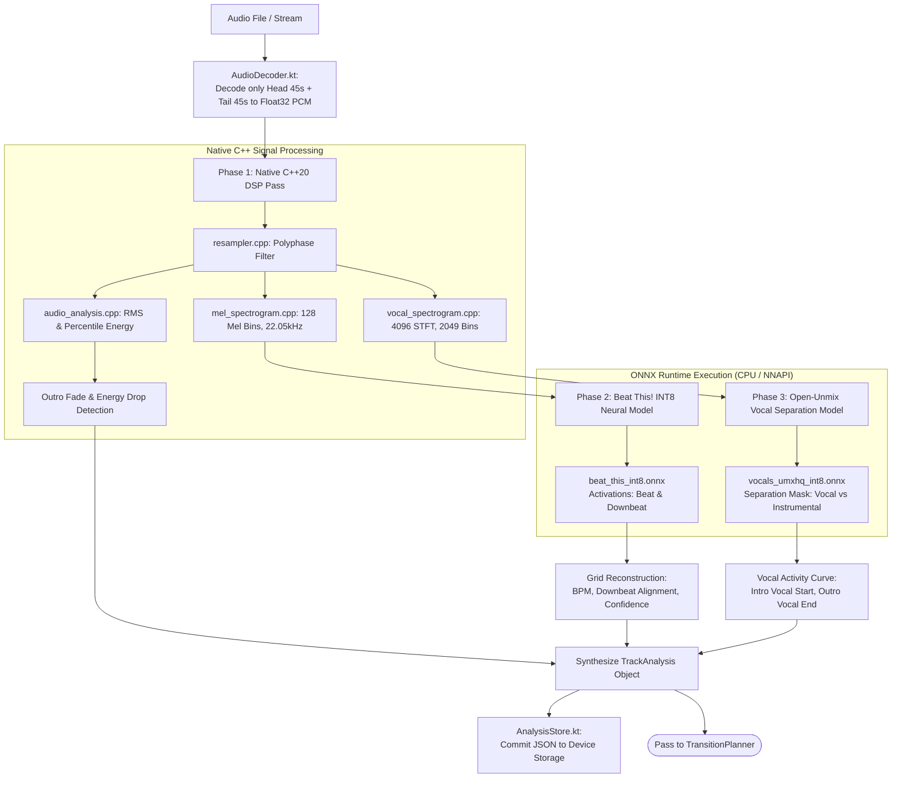
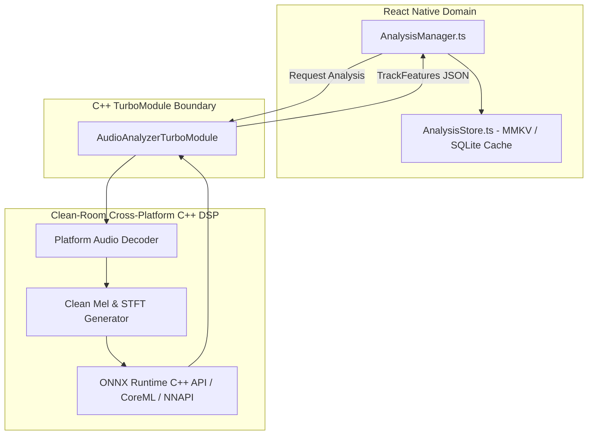

# 08 — Audio Analysis & Neural Feature Extraction

## Executive Summary: On-Device Audio Intelligence

BitChord features an on-device audio analysis pipeline capable of extracting tempo, beat grids, musical meter, energy envelopes, and vocal activity masks without relying on external cloud APIs or pre-computed track databases.

However, reverse-engineering reveals a **critical legal finding**: The C++ DSP codebase (`native/analyzer/`) and core analysis orchestration originate from **Orchard** and are licensed under **AGPLv3**. For our new React Native application, direct copying would compromise our codebase. We must adopt a clean-room algorithmic reimplementation utilizing permissive (MIT/Apache-2.0) neural models and native DSP libraries.

---

## 1. Analysis Architecture & Data Flow



---

## 2. Deep Subsystem Specifications

### 2.1 Head-and-Tail Optimization (Resource Efficiency)
Full-track audio analysis is computationally prohibitive on mobile devices (decoding a 4-minute 44.1kHz stereo file yields $\approx 84\text{MB}$ of raw float PCM data).
- **BitChord Solution:** `TrackAnalyzer.kt` decodes only the **head (first 45 seconds)** and **tail (last 45 seconds)** of the track.
- **Outcome:** Reduces memory footprint from 84MB to $<15\text{MB}$ and slashes inference latency by $>75\%$.

### 2.2 Neural Network Models
| Model Name | Size | Architecture | Input Tensor | Output Tensor | License |
| :--- | :--- | :--- | :--- | :--- | :--- |
| **`beat_this_int8.onnx`** | 4.5 MB | Convolutional Recurrent Network (CPJKU 2024) | `[1, 1, 128, frames]` Log-Mel Spectrogram | `[1, 2, frames]` (Beat prob, Downbeat prob) | **MIT** (Permissive) |
| **`vocals_umxhq_int8.onnx`** | 9.0 MB | Open-Unmix Spectrogram Masking Network | `[1, 2, 2049, frames]` Linear Stereo STFT | `[1, 2, 2049, frames]` Vocal Magnitude Mask | **MIT** (Permissive) |

### 2.3 Feature Data Structure (`TrackAnalysis.kt`)
The synthesized analysis result contains:
```kotlin
data class TrackAnalysis(
    val trackId: String,
    val bpm: Double,
    val beatInterval: Double,
    val firstBeatSec: Double,
    val downbeats: List<Double>,
    val energyEnvelope: List<Double>,
    val audibleStartSec: Double,
    val contentEndSec: Double,
    val vocalIntroEndSec: Double?,
    val vocalOutroStartSec: Double?,
    val confidence: Double,
)
```

---

## 3. Algorithm vs Implementation vs Platform Separation

| Layer | Component | Algorithm Description | Implementation in BitChord | Clean-Room RN Strategy |
| :--- | :--- | :--- | :--- | :--- |
| **DSP** | Energy Envelope | Windowed RMS + 95th percentile noise floor | `audio_analysis.cpp` (AGPLv3) | Clean C++20 standard algorithm or Web Audio API Analyzer |
| **DSP** | Mel Filterbank | 128 triangular filters, log scaling | `mel_spectrogram.cpp` (AGPLv3) | Standard DSP filterbank (e.g. `libsamplerate` + FFTW / vDSP on iOS) |
| **AI** | Beat Tracking | Temporal CNN on Mel frames | `BeatTracker.kt` + ONNX | `onnxruntime-react-native` running MIT weights |
| **AI** | Vocal Separation | Spectrogram ratio masking | `VocalTracker.kt` + ONNX | `onnxruntime-react-native` running MIT Open-Unmix |
| **Platform** | Audio Decoding | Stream to PCM extraction | Android `MediaExtractor` / `MediaCodec` | iOS `AVAssetReader` / Android `MediaCodec` via TurboModule |

---

## 4. React Native Architecture Proposal



### Key Engineering Guardrails for React Native:
1. **Never Analyze in JS:** Computing FFTs and running matrix convolutions in JavaScript/Hermes will lock the UI thread for 10–30 seconds. All decoding, STFT, and ONNX inference must reside in native C++ threads.
2. **Persistence in MMKV:** Cache analysis JSON strings in MMKV keyed by track ID so each song is analyzed exactly once.
3. **Background Priority:** Run native analysis threads with low OS scheduling priority (`THREAD_PRIORITY_BACKGROUND` on Android, `QOS_CLASS_UTILITY` on iOS) to ensure zero UI frame drops during playback.
