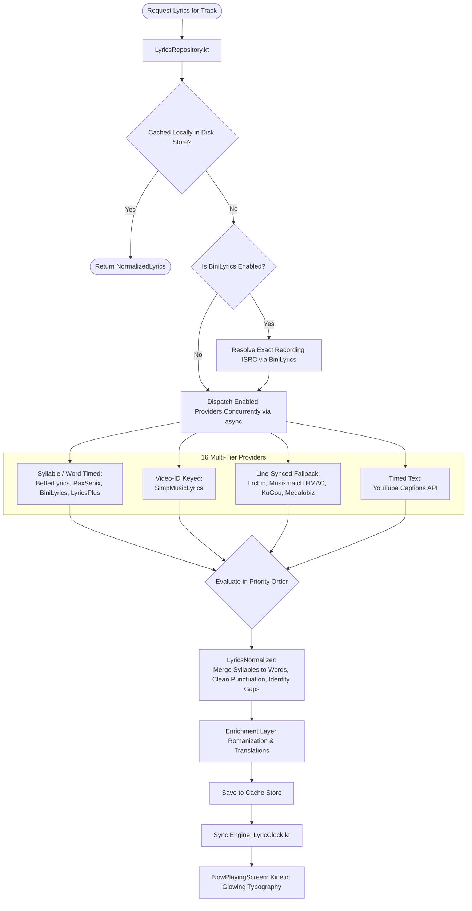
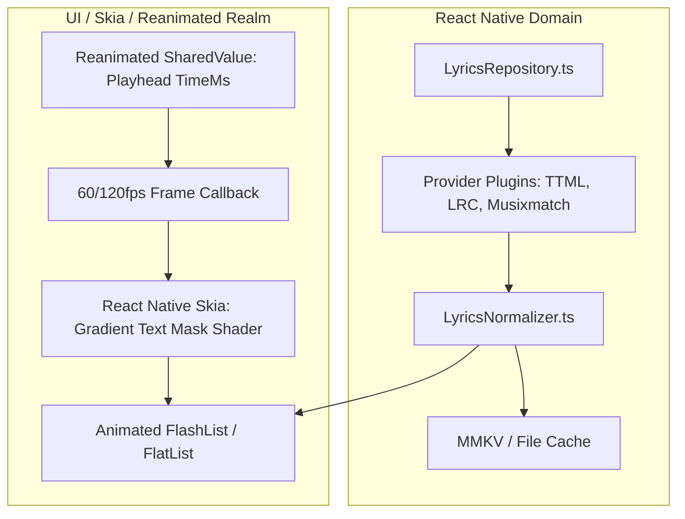

# 09 — Lyrics Engine & Real-Time Typography Architecture

## Executive Summary: Multi-Provider Synchronized Lyrics

BitChord delivers Apple Music-grade karaoke typography by aggregating lyrics across **16 concurrent providers**, supporting **word-level and syllable-level TTML timing**, **duet alignment**, **backing vocal isolation**, **automated Romaji/Pinyin romanization**, and **instant machine translation**.

This document reverse-engineers the normalization pipeline, the synchronization clock, and maps the complete system to a high-performance React Native architecture powered by `react-native-reanimated` and Skia.

---

## 1. End-to-End Lyrics Architecture



---

## 2. Deep Provider & Parser Specifications

### 2.1 Apple Music TTML Parser (`TtmlLyrics.kt`)
- **Format:** XML Timed Text Markup Language (TTML).
- **Syllable Merging:**
  Apple Music represents karaoke words as fractional syllable spans:
  ```xml
  <p begin="00:14.20" end="00:18.50" ttm:agent="v1">
    <span begin="00:14.20" end="00:14.80">Ne</span>
    <span begin="00:14.80" end="00:15.30">ver </span>
    <span begin="00:15.30" end="00:16.10">mind</span>
  </p>
  ```
  BitChord parses syllable spans, merges them into whole words (`"Never"`, `[1420ms, 1530ms]`), and calculates character bounding offsets to drive smooth shader gradients.
- **Duets:** Inspects `ttm:agent="v1"` vs `ttm:agent="v2"`. Maps `v1` to `LyricAlignment.Start` (left-aligned) and `v2` to `LyricAlignment.End` (right-aligned).
- **Background Vocals:** Spans bracketed in parentheses `(...)` are detached into secondary child `LyricLine` nodes rendered below the primary vocal.

### 2.2 Musixmatch Reverse-Engineering (`Musixmatch.kt`)
- **API Endpoint:** `https://apic-desktop.musixmatch.com/ws/1.1/macro.subtitles.get`
- **HMAC Signature:** Musixmatch requires an HMAC-SHA256 signature calculated over the query URL and timestamp using a hardcoded secret key embedded in the desktop client.
- **Output:** Returns rich sync line timestamps or word-level JSON arrays.

### 2.3 KuGou Mobile API (`KuGou.kt`)
- Excellent coverage for East Asian and international tracks.
- 3-step handshake:
  1. Candidate search by title, artist, and duration.
  2. Access token acquisition for chosen candidate hash.
  3. Base64-decoded XOR decryption of the binary `.krc` lyrics file into synchronized text.

---

## 3. Real-Time Synchronization Engine (`LyricClock.kt`)

Synchronizing lyrics against audio in high-refresh displays (90Hz / 120Hz) requires sub-frame accuracy:
- **Audio Clock Interpolation:** The playhead position is polled from the native player at 2Hz. Between ticks, `LyricClock` uses `SystemClock.elapsedRealtime()` to extrapolate the exact millisecond playhead offset at 60/120fps.
- **Active Word Sweep:** For the current line, word progress is computed as:
  $$p_{\text{word}} = \frac{t_{\text{clock}} - \text{word.startMs}}{\text{word.endMs} - \text{word.startMs}} \in [0, 1]$$
- **Auto-Scroll Behavior:** Smoothly scrolls the active line to the vertical center of the viewport with a gentle spring curve, pausing auto-scroll if user touch interaction is detected.

---

## 4. React Native Architecture & UI Implementation



### Component Portability Breakdown:
| Component | Classification | RN Implementation Recommendation |
| :--- | :--- | :--- |
| **`LyricsRepository.kt`** | `DIRECT PORT` | Pure TypeScript. Implement concurrent `Promise.allSettled()` with priority waterfall. |
| **`TtmlLyrics.kt`** | `DIRECT PORT` | Pure TypeScript XML DOM parser (using `fast-xml-parser`). Merge syllable spans into words. |
| **`LyricClock.kt`** | `ALGORITHM PORT` | Implement via `useFrameCallback` in `react-native-reanimated` driven by a `SharedValue`. |
| **Text Sweep Animation** | `REIMPLEMENT` | Use **React Native Skia** shader masks (`Skia.Shader.MakeLinearGradient`) or clipped animated text layers to achieve buttery-smooth progressive word highlighting at 120fps. |
| **Romanization** | `REIMPLEMENT` | Use JavaScript `kuroshiro` (Japanese), `pinyin` (Chinese), or native Intl API. |
