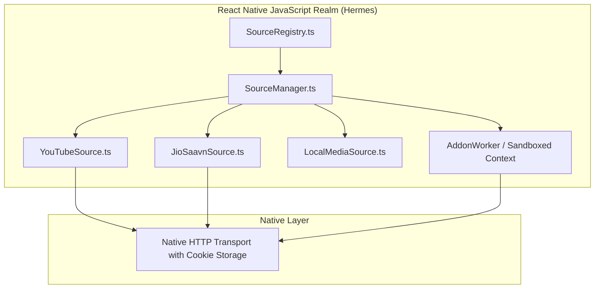

# 10 — Music Sources & Addon Plugin Architecture

## Executive Summary: Pluggable Music Provider Ecosystem

BitChord provides a flexible music delivery layer where multiple streaming and local sources coexist peacefully. Rather than being hardcoded to YouTube, BitChord features a modular **Source Provider API** capable of:
1. Native streaming providers (InnerTubeX, JioSaavn).
2. Local network shares (SMB v2/v3 via `SMBJ`, WebDAV).
3. Dynamic third-party JavaScript extensions running in a sandboxed VM pool (`QuickJsExecutor.kt`).

This document details the provider lifecycle, source health monitoring, and maps the architecture to React Native.

---

## 1. Provider Registration & Resolution Hierarchy

```mermaid
graph TD
    subgraph Registry ["SourceRegistry.kt (User Prioritized)"]
        Rank1[Priority 1: Local SMB / WebDAV Share (Lossless FLAC)]
        Rank2[Priority 2: Qobuz / Tidal JavaScript Addon Module]
        Rank3[Priority 3: JioSaavn (320kbps AAC)]
        Rank4[Priority 4: YouTube Music (Opus 160kbps)]
    end

    subgraph Health_Monitor ["Circuit Breaker & Health Tracking"]
        HC[SourceHealth.kt: Failure Counters & Exponential Backoff]
    end

    subgraph Module_Sandbox ["Addon Execution Sandbox"]
        QJS[QuickJsExecutor: Pool of 12 Resident Engines]
        HostBindings[Host OkHttp Client + Crypto Bridge]
    end

    Rank1 --> HC
    Rank2 --> HC
    Rank3 --> HC
    Rank4 --> HC

    Rank2 --> QJS
    QJS --> HostBindings
```

---

## 2. Technical Provider Interface (`MusicSource.kt`)

Every source implements a unified contract:
```kotlin
interface MusicSource {
    val configId: String
    val displayName: String
    val kind: SourceKind
    val isAvailable: Boolean

    suspend fun search(query: String, filter: SearchFilter): List<SearchResult>
    suspend fun stream(trackId: String, request: StreamRequest): SourceStream?
    suspend fun album(albumId: String): DetailPage?
    suspend fun artist(artistId: String): DetailPage?
}
```

### 2.1 The QuickJS Addon Sandbox (`QuickJsExecutor.kt`)
To execute user-written JavaScript plugins without crashing the host app:
- **Engine Pool:** Keeps up to 12 modules resident (`MAX_MODULES = 12`), with 3 parallel interpreter instances per module (`ENGINES_PER_MODULE = 3`).
- **Memory Safety:** QuickJS engines do not share memory. If a third-party plugin crashes or throws an out-of-memory error, only that isolated instance is destroyed; the host audio player continues uninterrupted.
- **Injected Host APIs:**
  - `__host_http_get(url, headers)`: Routed through the app's shared OkHttp client.
  - `__host_http_post(url, body, headers)`
  - `__host_log(message)`

---

## 3. Circuit Breaker & Health Tracking Pattern

To prevent a failing server (e.g. an offline home WebDAV share) from locking up the playback queue:
- **Consecutive Error Counting:** Tracks failures within a 60-second sliding window.
- **Exponential Backoff:** After 3 consecutive failures, the source is temporarily flagged as `DEGRADED` for 30 seconds. During this window, `SourceResolver` skips the source immediately without incurring network latency.
- **Self-Healing:** Periodic lightweight ping requests test for recovery; once successful, the source is restored to `HEALTHY`.

---

## 4. React Native Target Architecture

In React Native, embedding QuickJS inside Android C++ is completely unnecessary because React Native runs on JavaScript (Hermes).



### React Native Addon Plugin Specification:
```typescript
// Plugin contract for React Native Addons
export interface MusicSourcePlugin {
  readonly id: string;
  readonly name: string;
  readonly version: string;
  readonly canServeLossless: boolean;

  search(query: string): Promise<TrackMetadata[]>;
  getStreamUrl(trackId: string, preferredQuality: number): Promise<ResolvedStream | null>;
  getAlbum?(albumId: string): Promise<AlbumDetail | null>;
}
```

### Key React Native Advantages:
1. **Zero Interpreter Overhead:** Plugins run directly in the V8/Hermes engine.
2. **Simplified Sandboxing:** Plugins can be executed within an isolated web worker or a frozen global scope (`createIsolatedContext()`), preventing access to `AsyncStorage`, native bridges, or file system APIs.
3. **Over-The-Air (OTA) Plugin Updates:** Users can install, update, and toggle plugin sources dynamically via GitHub URLs or community repositories.
