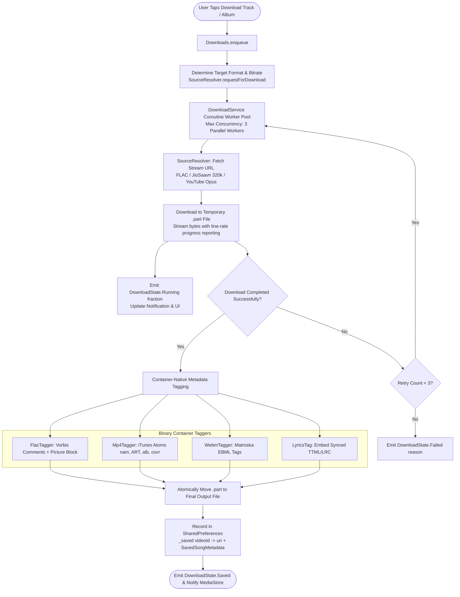
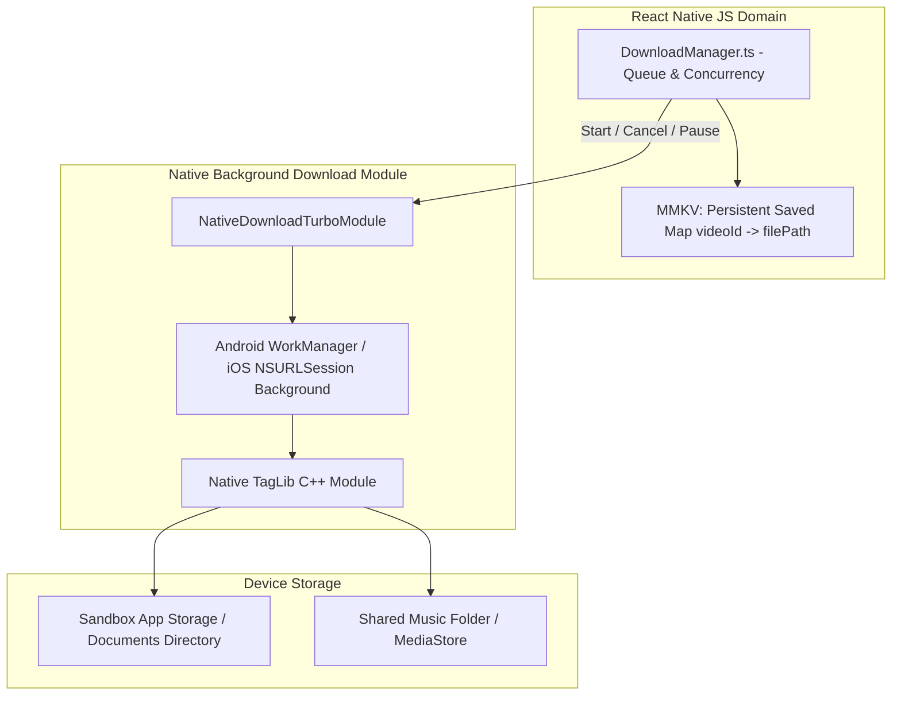

# 11 — Download & Offline Storage Architecture

## Executive Summary: BitChord's Download System

BitChord treats downloads not as encrypted proprietary cache blobs, but as **first-class, tagged, DRM-free audio files** stored in user-accessible storage (or external app storage) with embedded album artwork, Vorbis comments / ID3v2 tags, and synchronized lyrics.

The download architecture decouples in-memory volatile job queues (`_active: Map<String, DownloadState>`) from persistent disk records (`_saved: Map<String, String>` videoId to URI), ensuring that interrupted background downloads never leave corrupted states on restart.

---

## 1. End-to-End Download Pipeline

---

## 2. Technical Mechanics of `Downloads.kt` & `DownloadService.kt`

### 2.1 State Separation: Active vs Saved
- **Active State (`_active: StateFlow<Map<String, DownloadState>>`):**
  - Volatile, in-memory state.
  - States: `Queued`, `Running(fraction: Float)`, `Failed(reason: String)`.
  - Empty on cold start. Interrupted downloads are cleared cleanly without leaving stale spinners.
- **Saved State (`_saved: StateFlow<Map<String, String>>`):**
  - Persistent record saved in `SharedPreferences` serialized as JSON.
  - Maps `videoId` $\to$ file URI.
  - Allows instantaneous "is track downloaded?" lookups for the UI without scanning Android's slow `MediaStore` per list row.

### 2.2 Concurrency & Worker Management
- Managed via Kotlin Coroutines `Semaphore` and worker pool (`MAX_CONCURRENT_DOWNLOADS = 3`).
- Prevents network saturation while downloading large 100-track playlists.
- Cancellation is immediate: tapping cancel on a downloading row cancels the underlying coroutine `Job`, deletes the `.part` file, and cleans memory state.

### 2.3 Binary Metadata Taggers
BitChord avoids external bulky Java tagging libraries like Jaudiotagger by writing container-specific taggers in pure Kotlin:
- **`FlacTagger.kt`:** Rewrites FLAC metadata blocks (STREAMINFO, VORBIS_COMMENT, PICTURE). Embeds 800x800 JPEG artwork and Vorbis tags (`TITLE`, `ARTIST`, `ALBUM`, `DATE`).
- **`Mp4Tagger.kt`:** Traverses MP4 box hierarchies (`moov -> udta -> meta -> ilst`) and injects standard iTunes atoms (`©nam`, `©ART`, `©alb`, `covr`).
- **`LyricsTag.kt`:** Injects syllable-accurate TTML or line-synced LRC text directly into the file so third-party music players can display synced lyrics offline.

---

## 3. React Native Architecture & Mapping

### React Native Implementation Strategy:
1. **Queue Management in JS / TS:** Keep the download queue and retry logic in TypeScript (`DownloadManager.ts`).
2. **Background Execution:** Use iOS `URLSessionConfiguration.background` and Android `WorkManager` / Foreground Service so downloads continue even if the app is killed.
3. **Audio Tagging:** Compile the industry-standard C++ library **TagLib** via React Native JSI / TurboModule to tag MP4, FLAC, and MP3 files at native speed (<20ms per file).
4. **Offline Playback:** When a downloaded song is selected, the player bypasses `SourceResolver` and feeds the local `file://` URI directly to the native audio player.
