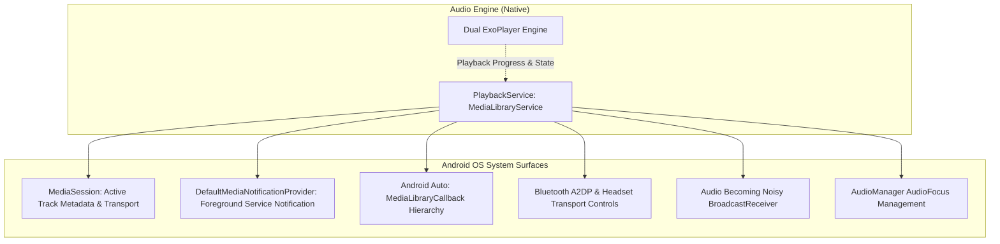
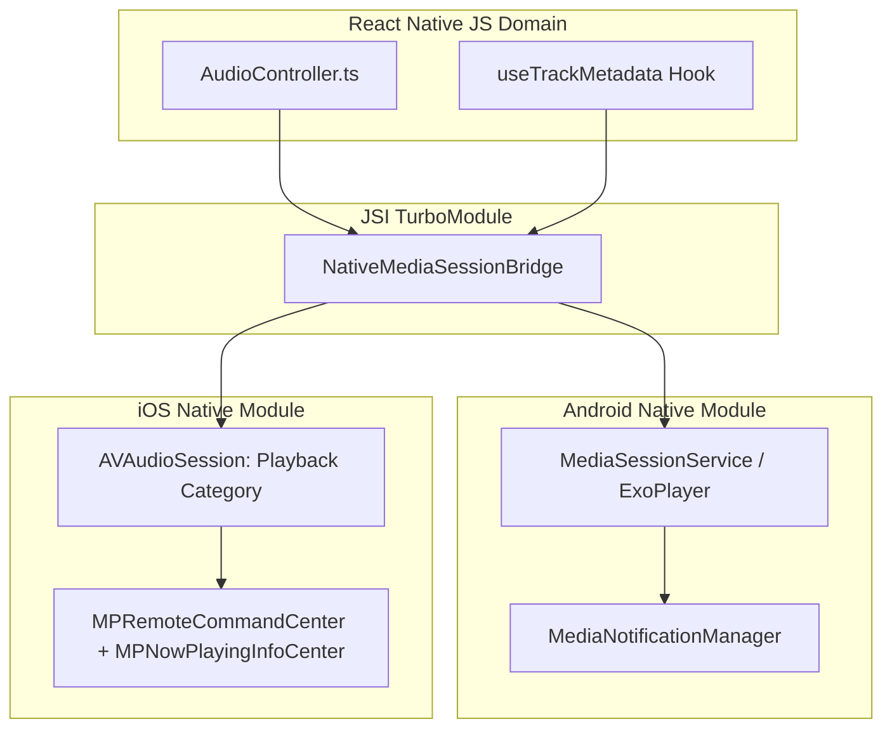

# 12 — Background Playback & System Media Integration

## Executive Summary: Continuous Background Audio

Audio playback on mobile devices must survive aggressive OS memory killers, screen-off states, deep battery sleep (Doze mode on Android, Low Power Mode on iOS), and seamlessly integrate with hardware accessories (Bluetooth headphones, steering wheel controls, lock screens, and in-car infotainment).

This document analyzes how BitChord implements background persistence and media controls via **AndroidX Media3**, separating cross-platform media concepts from Android-specific implementations and providing the direct iOS / React Native equivalents.

---

## 1. System Integration Architecture

---

## 2. Technical Mechanisms in BitChord

### 2.1 MediaSession & Foreground Service
- **Service Type:** Extends `androidx.media3.session.MediaLibraryService`.
- **Foreground Notification:** Published via `DefaultMediaNotificationProvider`. Contains album artwork (loaded from Coil), track title, artist, play/pause, skip next/prev, and custom session actions (`Favorite` and `Shuffle`).
- **Process Model:** Shares the primary application process (`com.music.bitchord`). When the UI activity is swiped away from the Recent Apps list, `PlaybackService` remains alive as an active foreground service, ensuring uninterrupted music.

### 2.2 Headset & Becoming Noisy Interception
- When headphones (3.5mm jack or Bluetooth) are disconnected while playing, Android broadcasts `AudioManager.ACTION_AUDIO_BECOMING_NOISY`.
- BitChord registers `setHandleAudioBecomingNoisy(true)` exclusively on the **active player**. When triggered, playback pauses instantly, preventing embarrassing audio blasts through device loudspeakers.

### 2.3 Audio Focus Rules
- Uses `AudioAttributes.Builder().setContentType(C.AUDIO_CONTENT_TYPE_MUSIC).setUsage(C.USAGE_MEDIA).build()`.
- **Crucial Rule:** As discovered in Stage 2, **only the active player requests audio focus**. The standby player must never request focus during its silent pre-roll; doing so would cause the Android audio server (`AudioFlinger`) to cut the outgoing track prematurely.

### 2.4 Android Auto Integration
- `PlaybackService` implements `MediaLibrarySession.Callback`.
- Exposes root browsable hierarchy (`onGetLibraryRoot`, `onGetChildren`) allowing car dashboard displays to navigate the user's Queue, Playlists, and Downloads.

---

## 3. Cross-Platform vs Platform-Specific Mapping

| Feature | Cross-Platform Concept | Android Implementation (BitChord) | iOS Native Equivalent | React Native Bridge Layer |
| :--- | :--- | :--- | :--- | :--- |
| **Media Metadata** | Active track title, artist, artwork | `MediaSession.setPlayer()` + `MediaMetadata` | `MPNowPlayingInfoCenter.default().nowPlayingInfo` | Native TurboModule emitting track info to OS |
| **Lock Screen Controls** | Play, Pause, Next, Prev, Scrubber | `MediaSession` transport controls | `MPRemoteCommandCenter.shared()` | Event handlers registered on native remote commands |
| **Service Lifecycle** | Background audio persistence | Android Foreground Service + Ongoing Notification | `AVAudioSessionCategoryPlayback` in Info.plist | Native service configuration |
| **Headphone Unplug** | Pause on disconnect | `ACTION_AUDIO_BECOMING_NOISY` | `AVAudioSession.routeChangeNotification` (`oldDeviceUnavailable`) | Native audio route observer |
| **Audio Focus** | Pause / duck on phone calls | `AudioManager.requestAudioFocus()` | `AVAudioSession.interruptionNotification` | Native audio session interrupt observer |
| **In-Car Dashboards** | Browseable library hierarchy | Android Auto `MediaLibraryService` | Apple CarPlay `CPTemplateApplicationSceneDelegate` | Native CarPlay / Auto template provider |

---

## 4. React Native Architecture Blueprint

### React Native Guidelines:
1. **Never rely purely on JavaScript for lock screen controls:** Remote command handlers (`play`, `pause`, `next`) must be bound in native code (Kotlin/Swift) so they respond instantly even when the JS engine is paused or throttled by iOS power management.
2. **Handle Interruption Notifications in Native Core:** Audio route changes and phone call interruptions should immediately pause the native audio node, followed by emitting an event to JS to update UI state.
