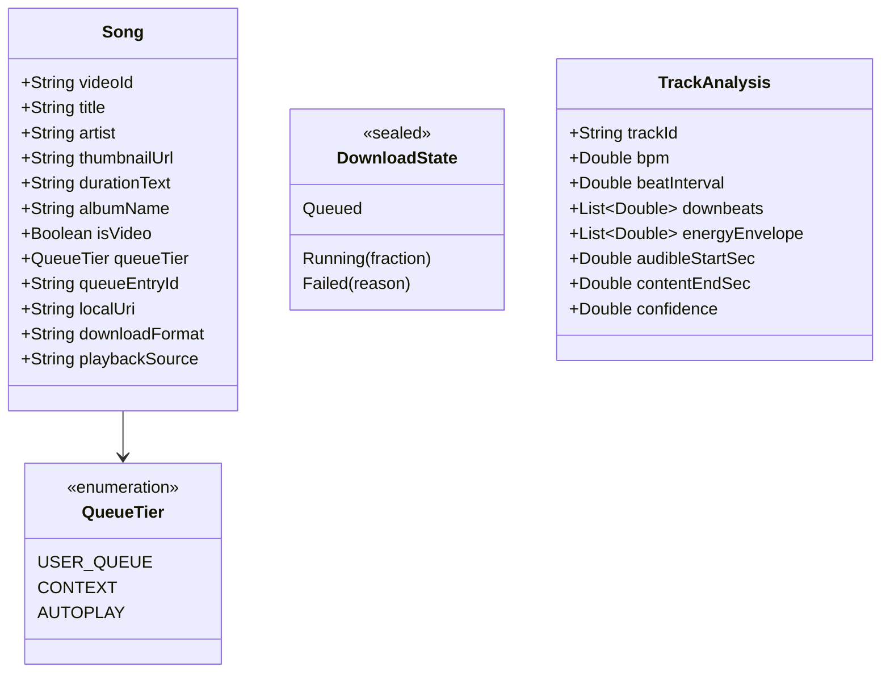
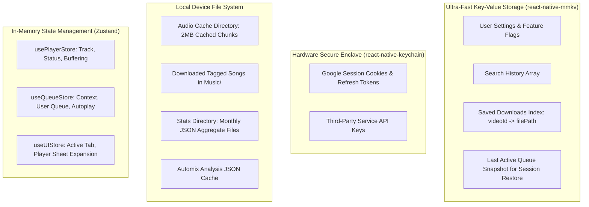

# 13 — Data Models & State Persistence Architecture

## Executive Summary: The Zero-Database Paradigm

A remarkable design decision in BitChord is its **complete absence of a relational database (Room / SQLite)**. While conventional mobile apps use heavy SQLite databases for playlists, history, and downloads, BitChord proves that an audio streaming application can achieve superior speed and lower memory usage by using:
1. **Memory-Mapped Key-Value Storage:** Android `SharedPreferences` for flags and configuration.
2. **Hardware-Backed Encryption:** Android Keystore `EncryptedSharedPreferences` for session cookies.
3. **Partitioned JSON Aggregate Buckets:** Pre-aggregated monthly files (`yyyy-MM.json`) for listening history.
4. **File-System Binary Media:** Direct storage of tagged media files in Android's `Music/` folder without maintaining database duplicates.

---

## 1. Domain Entities & State Models

---

## 2. Persistence Layer Distribution

| Data Domain | BitChord Implementation | Storage Location | Eviction / Retention Policy |
| :--- | :--- | :--- | :--- |
| **User Settings** | `AppSettings.kt` | `SharedPreferences` | Permanent until app uninstall or clear data. |
| **Auth & Cookies** | `AuthStore.kt` | `EncryptedSharedPreferences` | Encrypted with Android Keystore master key. |
| **Search History** | `SearchHistory.kt` | JSON string in `SharedPreferences` | Capped at 50 most recent queries. |
| **Listening History** | `ListeningStats.kt` | Monthly JSON (`filesDir/stats/yyyy-MM.json`) | Retained indefinitely; pre-aggregated on write. |
| **Saved Downloads** | `Downloads.kt` | JSON map in `SharedPreferences` | Verified against filesystem on each query. |
| **Audio Cache** | `AudioCache.kt` | Media3 `SimpleCache` block files | Dynamic LRU eviction capped at user limit (512MB–10GB). |
| **Automix Analysis** | `AnalysisStore.kt` | Disk JSON files (`cacheDir/analysis/`) | LRU cache holding analyzed track features. |

---

## 3. React Native State & Storage Blueprint

In React Native, we can adapt this lean storage philosophy while utilizing modern high-performance libraries like **MMKV** and **OP-SQLite**:

### Architectural Mapping Matrix: What Lives Where

| Subsystem Component | Recommended RN Technology | Justification |
| :--- | :--- | :--- |
| **UI State (Tabs, Modals)** | **Zustand / React Context** | Transient UI state; does not require disk persistence. |
| **Playback Queue** | **Zustand + MMKV** | In-memory execution with automatic debounced snapshots saved to MMKV for instant session restore. |
| **Playhead Progress** | **Reanimated `SharedValue`** | Isolates 60Hz tick from React component tree to avoid re-renders. |
| **Settings & Preferences** | **`react-native-mmkv`** | Synchronous, $<0.1\text{ms}$ read times; eliminates async waterfall on app startup. |
| **Auth Tokens / Secrets** | **`react-native-keychain`** | Hardware-backed Keychain (iOS) and Keystore (Android) security. |
| **Listening Statistics** | **Local JSON Files (Monthly)** | Follows BitChord's proven aggregate design; prevents database bloat. |
| **Local Music Library** | **OP-SQLite (Optional)** | Only if indexing $>10,000$ local tracks from device storage for instant complex search/sorting. |
| **Audio Cache Spans** | **Native Platform Audio Cache** | Managed directly by native audio player engine (Media3 / AVAsset). |
