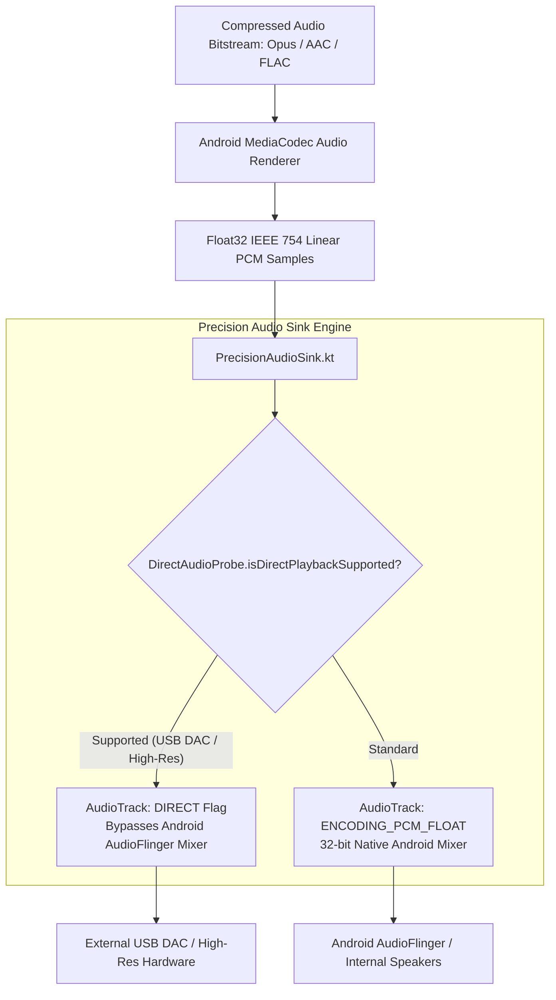

# 14 — Native Android Platform Architecture

## Executive Summary: Android-Specific Technologies

BitChord pushes the boundaries of Android audio engineering. Rather than treating Android audio as an opaque media player black box, BitChord directly interacts with the lowest layers of the Android audio subsystem:
1. **Float32 IEEE 754 Audio Pipeline:** Bypassing 16-bit integer quantization truncation (`PrecisionAudioSink.kt`).
2. **Direct Bit-Perfect USB Output:** Probing UAC1/UAC2 audio descriptors to stream bit-perfect MQA/DSD/FLAC directly to external USB DACs (`UsbDirectManager.kt`).
3. **Bluetooth A2DP Telemetry:** Probing real-time negotiated Bluetooth codecs (LDAC, aptX HD, AAC) via hidden framework reflection (`BluetoothAudioTracker.kt`).
4. **Android 15+ Compatibility:** Native shared libraries compiled with strict 16KB ELF page alignment (`-Wl,-z,max-page-size=16384`).

---

## 1. High-Resolution Audio Stack (`PrecisionAudioSink.kt`)



### 1.1 Why Float32 Output Matters
Standard Android music players output 16-bit signed integer PCM (`ENCODING_PCM_16BIT`). When software volume normalization, equalizers, and crossfade volume curves are applied, 16-bit integer arithmetic introduces **quantization distortion** and dynamic range truncation. BitChord forces `AudioFormat.ENCODING_PCM_FLOAT` throughout the entire DSP chain, ensuring a dynamic range of $>1500\text{dB}$ and mathematically zero clipping before the final DAC conversion.

---

## 2. Direct USB DAC Integration (`UsbDirectManager.kt`)

BitChord audits connected USB peripherals to identify USB Audio Class devices:
- **Descriptor Parsing:** Parses USB interface descriptors looking for `USB_CLASS_AUDIO` (`0x01`) and `USB_SUBCLASS_AUDIOSTREAMING` (`0x02`).
- **Protocol Detection:** Identifies UAC1 (`0x00`), UAC2 (`0x20`), and UAC3 (`0x30`).
- **Direct Playback Flag:** When a compliant DAC is detected and the user enables Direct USB mode, the app constructs an `AudioTrack` with `FLAG_DIRECT_OUTPUT`, bypassing Android's 48kHz resampler completely.

---

## 3. Bluetooth A2DP Codec Probing (`BluetoothAudioTracker.kt`)

Android hides the active Bluetooth codec from public SDK APIs. BitChord uses targeted Java reflection on `android.bluetooth.BluetoothCodecConfig` and `BluetoothCodecStatus`:
- Queries the active `BluetoothA2dp` profile proxy.
- Extracts `getCodecType()`:
  - `SOURCE_CODEC_TYPE_LDAC` ($990\text{kbps}, 96\text{kHz}/24\text{bit}$)
  - `SOURCE_CODEC_TYPE_APTX_HD`
  - `SOURCE_CODEC_TYPE_APTX`
  - `SOURCE_CODEC_TYPE_AAC`
  - `SOURCE_CODEC_TYPE_SBC`
- Displays the real-time codec badge and bitrate in the Now Playing UI, giving audiophiles instant verification of their Bluetooth stream quality.

---

## 4. Native C++20 Build Configuration & 16KB Page Alignment

With Google requiring **16KB page size support** for all Android 15 (API 35+) devices, BitChord configures `app/build.gradle.kts` and `CMakeLists.txt` with strict linker flags:
```kotlin
externalNativeBuild {
    cmake {
        cppFlags("-std=c++20", "-O3", "-fvisibility=hidden")
        arguments(
            "-DANDROID_STL=c++_static",
            "-DCMAKE_SHARED_LINKER_FLAGS=-Wl,-z,max-page-size=16384",
        )
    }
}
```
Failure to include `-Wl,-z,max-page-size=16384` causes native `.so` shared libraries to crash with `PAGE_FAULT` on modern devices (e.g. Pixel 8, Pixel 9, Galaxy S24 running Android 15+).

---

## 5. React Native Implementation Strategy for Android

1. **JSI Audio Output Module:** Wrap `PrecisionAudioSink` and `UsbDirectManager` in a React Native TurboModule written in Kotlin.
2. **ExoPlayer Twin Engine:** Use AndroidX Media3 `1.11.0+` inside the native Android directory of the React Native project (`android/app/src/main/java/...`).
3. **16KB Alignment:** Ensure `android/app/build.gradle` passes `-Wl,-z,max-page-size=16384` to CMake when compiling native C++ JSI bindings.
