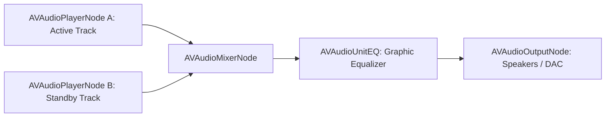

# 15 — Native iOS Architectural Mapping

## Executive Summary: Bridging Android Innovations to iOS

A common trap when analyzing an Android-first music codebase is attempting to force Android paradigms onto iOS. iOS enforces strict audio lifecycle rules, sandboxed background execution, and unique multimedia frameworks (`AVFoundation`, `CoreAudio`, `MediaPlayer`, `CarPlay`).

This document maps every Android-specific technology identified in BitChord to its exact, high-performance **native iOS equivalent**, ensuring our React Native application operates as a premier citizen on both platforms.

---

## 1. Comprehensive Platform Feature Mapping Matrix

| BitChord Android Subsystem | BitChord Android Implementation | Direct iOS Native Equivalent | Architectural Notes & Caveats |
| :--- | :--- | :--- | :--- |
| **Media Player Engine** | Media3 `ExoPlayer` | `AVPlayer` / `AVQueuePlayer` or `AVAudioEngine` | For dual-player crossfade, use two synchronized `AVPlayer` instances or an `AVAudioEngine` node graph with two `AVAudioPlayerNode` sources. |
| **Media Session & Controls** | `androidx.media3.session.MediaSession` | `MPNowPlayingInfoCenter` + `MPRemoteCommandCenter` | In iOS, remote command handlers must be registered with `MPRemoteCommandCenter.shared()`. |
| **Now Playing Notification** | `DefaultMediaNotificationProvider` | iOS Lock Screen Media Player + **Live Activities / Dynamic Island** | Implement `ActivityKit` Live Activities to display rich animated waveforms and lyrics directly on iOS Lock Screen and Dynamic Island! |
| **Audio Pipeline** | `PrecisionAudioSink.kt` (Float32 PCM) | `AVAudioEngine` with 32-bit Float Processing Format | CoreAudio natively operates in 32-bit linear floating-point PCM (`kAudioFormatFlagsNativeFloatPacked`). Zero quantization distortion. |
| **Audio Routing & DAC** | `UsbDirectManager.kt` + `AudioTrack` direct | `AVAudioSession.currentRoute` + CoreAudio | iOS automatically supports USB Audio Class 2 DACs up to 192kHz/24-bit without driver installation. |
| **Bluetooth Telemetry** | Java reflection on `BluetoothA2dp` | `AVAudioSessionPortDescription.selectedDataSource` | iOS strictly restricts Bluetooth to AAC ($256\text{kbps}$) and SBC. LDAC and aptX are not supported by Apple hardware. |
| **Audio Focus** | `AudioManager.requestAudioFocus()` | `AVAudioSession.setCategory(.playback)` + `AVAudioSession.interruptionNotification` | Observe `AVAudioSession.interruptionNotification` to pause playback on incoming phone calls or Siri activations. |
| **Headphone Disconnect** | `ACTION_AUDIO_BECOMING_NOISY` | `AVAudioSession.routeChangeNotification` | Inspect `AVAudioSessionRouteChangeReason.oldDeviceUnavailable` to pause when AirPods are removed or disconnected. |
| **In-Car Automotive** | Android Auto `MediaLibraryService` | Apple CarPlay `CPTemplateApplicationSceneDelegate` | Use `CPListTemplate` and `CPNowPlayingTemplate` from Apple's `CarPlay` framework. |
| **DSP Signal Processing** | `native/analyzer/` C++20 | Apple **Accelerate.framework** (`vDSP`) or C++20 | Apple's `vDSP` (Vector DSP) provides vectorized FFT, convolution, and windowing running on Apple Silicon NEON cores at ultra-low power. |
| **Neural AI Models** | `ai.onnxruntime:onnxruntime-android` | **CoreML** or `onnxruntime-c` (iOS) | Models can be executed via ONNX Runtime or converted to Apple CoreML format to leverage the Apple Neural Engine (ANE). |
| **Secure Token Storage** | `EncryptedSharedPreferences` | **iOS Keychain Services** (`SecItemAdd`, `SecItemCopyMatching`) | Hardware-backed encryption via the Apple Secure Enclave. |

---

## 2. Dual-Player Engine on iOS (`AVAudioEngine` vs Twin `AVPlayer`)

In iOS, there are two viable paths to implement BitChord's twin-player crossfade:

### Option A: Twin `AVPlayer` Instances (Recommended for Streaming)
- Maintain `playerA = AVPlayer()` and `playerB = AVPlayer()`.
- Load Track $N+1$ into `playerB` with `playerB.volume = 0.0`.
- At crossfade trigger, execute volume automation via `CADisplayLink` or CoreAudio volume parameter automation.
- Update `MPNowPlayingInfoCenter.default().nowPlayingInfo` at $t=0$ of the fade.

### Option B: `AVAudioEngine` Node Graph (Recommended for Local Files & DSP)

`AVAudioEngine` allows sample-accurate scheduling of audio buffers and native hardware DSP filtering, but requires buffering remote audio into memory before playback.

---

## 3. Dynamic Island & Live Activities (Unique iOS Innovation)

While Android uses a persistent foreground notification, iOS provides **Dynamic Island** and **Live Activities** (`ActivityKit`):
- We can display:
  - Active track artwork and glowing animated sound wave.
  - Next track preview banner as Automix approaches.
  - Interactive play/pause and skip controls directly on the lock screen widget.
- Managed by emitting state events from the React Native JS layer to a Swift `ActivityKit` module.
