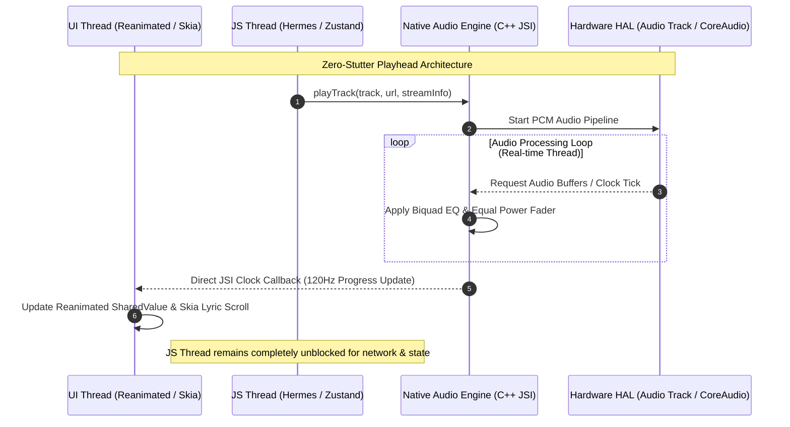
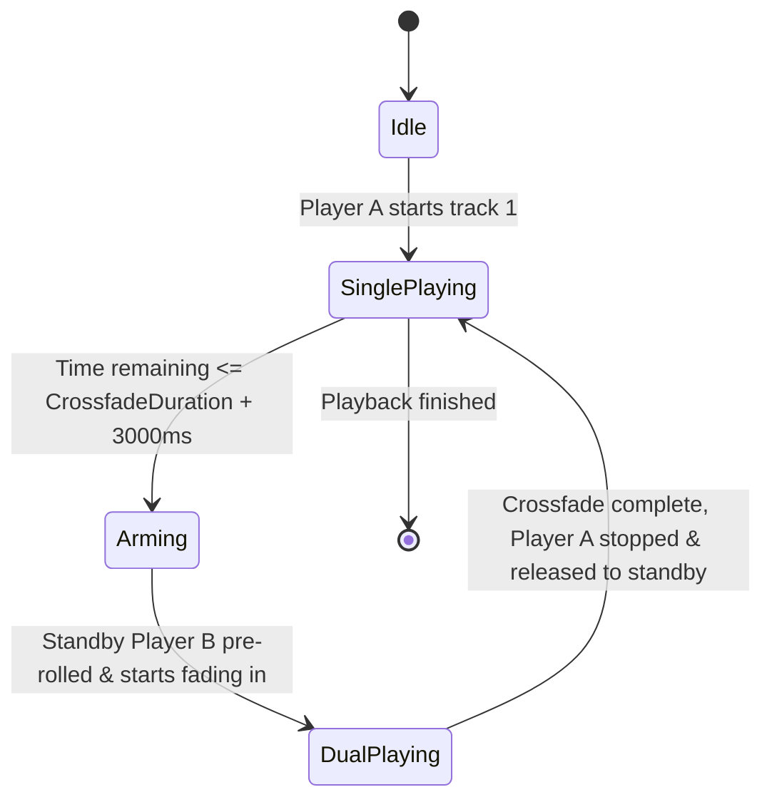
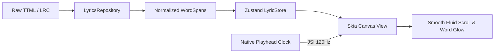

# 19. REACT NATIVE TARGET ARCHITECTURE

Based strictly on the verified architectural paradigms, algorithms, and production failure modes discovered in BitChord, this document specifies the complete, production-ready target architecture for a high-performance **React Native (New Architecture / TurboModules / JSI)** mobile audio application.

---

## 1. High-Level Target Hierarchy & Domain Boundaries

The application is structured into four distinct execution environments to isolate UI responsiveness, business rules, and low-latency audio processing:

```
┌────────────────────────────────────────────────────────────────────────┐
│                        REACT NATIVE APPLICATION                        │
├────────────────────────────────────────────────────────────────────────┤
│ 1. UI LAYER (React Native + Skia + Reanimated 3)                       │
│    ├── Player Screen (Full Player, Waveform, Fluid Progress)           │
│    ├── MiniPlayer & BottomSheet Controller                             │
│    ├── Word-by-Word Timed Lyrics Renderer (Skia Canvas @ 120fps)       │
│    ├── Queue Drawer & Reorder List                                     │
│    └── Library / Search / Settings                                     │
├────────────────────────────────────────────────────────────────────────┤
│ 2. STATE & EVENT LAYER (Zustand + MMKV Fast Storage)                   │
│    ├── PlaybackStore (Active track, state, volume, transient UI sync)  │
│    ├── QueueStore (Priority tier, standard tier, shuffle history)     │
│    ├── LyricStore (Active syllable spans, offset adjustment)           │
│    └── PlayheadProgress (Reanimated SharedValue, isolated from JS)    │
├────────────────────────────────────────────────────────────────────────┤
│ 3. DOMAIN LOGIC LAYER (Pure TypeScript / Platform-Independent)         │
│    ├── Playback                                                        │
│    │   ├── PlaybackController (Orchestrator, user intents)            │
│    │   ├── QueueManager (Two-tier queue logic, shuffle index)          │
│    │   ├── StreamResolver (Waterfall coordinator)                      │
│    │   ├── PreloadManager (Next track stream resolution & caching)     │
│    │   ├── TransitionManager (Crossfade & gapless scheduler)          │
│    │   └── CacheManager (Bounded range cache budget & evictions)       │
│    ├── Lyrics                                                          │
│    │   ├── ProviderRegistry (16-provider priority list)                │
│    │   ├── LyricsRepository (Waterfall fetcher, normalizer)            │
│    │   └── SyncEngine (Millisecond clock sync, span interpolator)     │
│    ├── Sources                                                         │
│    │   ├── SourceRegistry (Pluggable stream modules)                   │
│    │   ├── SourceResolver (Candidate selector)                         │
│    │   └── TrackMatcher (Title deconstruction, version parity)         │
│    ├── Analysis                                                        │
│    │   ├── TrackAnalyzer (DSP feature extraction interface)            │
│    │   ├── AnalysisStore (Cached BPM, key, beat grids)                 │
│    │   └── TransitionPlanner (Harmonic scoring, transition styling)    │
│    ├── Downloads (Multi-worker queue, container taggers)               │
│    ├── Library (Playlists, favorites, local tracks)                    │
│    └── Statistics (Monthly partitioned JSON aggregates)                │
├────────────────────────────────────────────────────────────────────────┤
│ 4. NATIVE ENGINE LAYER (JSI / C++ / TurboModules)                      │
│    ├── Shared C++ Core (Crossfade math, Biquad DSP EQ, AudioRingBuffer)│
│    ├── Android Native (Kotlin TurboModule)                             │
│    │   ├── Dual Media3 ExoPlayer Instances (Player A & Player B)       │
│    │   ├── MediaLibraryService & NotificationManager                   │
│    │   ├── SimpleCache (2MB Range Chunker)                             │
│    │   └── AudioFocus & BecomingNoisy Handlers                         │
│    └── iOS Native (Swift TurboModule)                                  │
│        ├── Dual AVPlayer / AVAudioEngine Mixer Nodes                   │
│        ├── MPRemoteCommandCenter & MPNowPlayingInfoCenter              │
│        ├── AVAssetResourceLoaderDelegate (Disk Range Cache)            │
│        └── AVAudioSession (Interruption & Route Change Handlers)       │
└────────────────────────────────────────────────────────────────────────┘
```

---

## 2. Threading Model & Performance Boundaries

To prevent audio glitches, frame drops, and background termination, operations are partitioned across four hardware threads:



### 2.1 The Four Execution Boundaries
1. **JavaScript Thread (Hermes Runtime):**
   - Handles network I/O, REST APIs, JSON parsing, Zustand store updates, stream waterfall resolution, and business decisions.
   - **Crucial Rule:** The JS thread *never* receives high-frequency playhead progress events (e.g., 60Hz ticks). Ticking the JS thread causes GC pressure and frame stutter.
2. **UI Thread (Main / MainRunLoop):**
   - Drives gesture animations, modal transitions, and navigation.
   - Progress bar position is bound to a `Reanimated.SharedValue<number>` updated directly via native JSI events.
3. **Background Worker Thread:**
   - Executes background downloads, audio analysis (FFT/DSP), and tag writing.
4. **Native Real-Time Audio Thread (CoreAudio / AAudio Oboe):**
   - Renders 44.1kHz / 48kHz Float32 PCM samples with sub-5ms buffer sizes.
   - Runs crossfade volume attenuation ($\sin^2(\theta) + \cos^2(\theta) = 1$) and parametric EQ filters without touching the garbage-collected heap.

---

## 3. Playback Subsystem Specification

### 3.1 Dual-Player Symmetric Peer Handoff
Directly adapting BitChord's `CrossfadeController.kt`, the React Native audio engine instantiates two native player nodes: `PlayerNodeA` and `PlayerNodeB`.



- **Player Roles:** Symmetric peers. Neither player is "primary" or "secondary" permanently. Whichever player holds the currently audible track is the *Active Session Player*.
- **Arming Window Calculation:**
  $$\text{ArmingThreshold} = \text{TrackDuration} - (\text{CrossfadeDuration} + 3000\text{ms})$$
- **Volume Crossfade Attenuation:**
  $$V_{\text{out}}(t) = \cos\left(\frac{\pi}{2} \cdot \frac{t}{T}\right), \quad V_{\text{in}}(t) = \sin\left(\frac{\pi}{2} \cdot \frac{t}{T}\right)$$
  $$\text{Energy Conservation: } V_{\text{out}}^2(t) + V_{\text{in}}^2(t) = \cos^2 + \sin^2 = 1.0$$
- **Handoff Event ($t=0$):**
  At the exact millisecond the transition begins, the native engine dispatches a JSI `onHandoff` event to the JS layer, updating the active track metadata, album art, and OS MediaSession without interrupting the audio buffer.

---

## 4. Streaming Resolution & Track Matching

### 4.1 Resolution Waterfall
The `StreamResolver` in React Native orchestrates source fallback cleanly using TypeScript async/await:

```typescript
// src/domain/streaming/StreamResolver.ts

export interface ResolvedStream {
  streamUrl: string;
  sourceId: string;
  bitrate: number;
  format: 'opus' | 'aac' | 'flac';
  expiresAt: number;
  headers?: Record<string, string>;
}

export class StreamResolver {
  constructor(
    private readonly cacheManager: CacheManager,
    private readonly providers: StreamProvider[]
  ) {}

  async resolve(track: Track): Promise<ResolvedStream> {
    // 1. Check local offline cache
    const cached = await this.cacheManager.getCachedStream(track.id);
    if (cached) return cached;

    // 2. Cascade through registered providers in priority order
    for (const provider of this.providers) {
      if (!provider.isHealthy()) continue;
      try {
        const stream = await provider.resolveStream(track);
        if (stream) return stream;
      } catch (err) {
        provider.recordFailure();
        console.warn(`[StreamResolver] Provider ${provider.id} failed:`, err);
      }
    }

    throw new Error(`Failed to resolve playable stream for ${track.id}`);
  }
}
```

### 4.2 TrackMatcher Implementation
Direct clean-room port of BitChord's 3-phase matching heuristic in TypeScript:
1. **Title Token Normalization:** Strip punctuation, lowercase, extract core words.
2. **Version Marker Symmetry:**
   ```typescript
   const VERSION_MARKERS = ['remix', 'live', 'acoustic', 'instrumental', 'clean', 'radio edit'];
   // If candidate contains a version marker absent in target, reject with 0 score.
   ```
3. **Duration Gating:**
   $$\Delta \text{duration} = |T_{\text{target}} - T_{\text{candidate}}| \le 3000\text{ms}$$

---

## 5. High-Performance Audio Cache

To replicate BitChord's `AudioCache.kt` and `DynamicLruCacheEvictor.kt`:

### 5.1 Canonical Key Mapping
Ephemeral CDN URLs (e.g., YouTube googlevideo URLs with expiring `expire=17277...` tokens) are mapped to static canonical keys:
$$\text{CacheKey} = \text{SHA256}(\text{"track:"} + \text{track.id})$$

### 5.2 2MB Bounded Range Chunking
- **Android:** Handled natively via Media3 `CacheDataSource.Factory` wrapping `SimpleCache`. Set fragment size to `2 * 1024 * 1024` bytes.
- **iOS:** Handled natively via Swift `AVAssetResourceLoaderDelegate`. When `AVPlayer` requests byte ranges, the delegate intercepts the request, serves cached 2MB slices from disk, and fetches missing ranges from the network asynchronously.

---

## 6. Real-Time Lyrics Engine (React Native Skia)

Instead of relying on heavy Compose/React DOM rerenders, lyrics rendering is offloaded to a high-speed GPU canvas via **React Native Skia**:



- **Syllable-Level Glowing:** As the millisecond clock progresses across a `WordSpan [startMs, endMs]`, Skia computes an interpolation factor $\alpha \in [0.0, 1.0]$ and renders a gradient sweep across the glyph path.
- **Memory Footprint:** Zero garbage collection in the render loop; all paths and text layouts are pre-calculated upon song load.

---

## 7. State Management & Zero-Database Storage

Eliminating SQLite entirely in favor of BitChord's high-speed JSON + MMKV architecture:

| Data Type | Storage Engine | Read Latency | Eviction / Persistence Strategy |
| :--- | :--- | :--- | :--- |
| **Player State & Queue** | MMKV (Binary) | $<0.1\text{ms}$ | Flushed atomically on every track change or pause. |
| **User Settings & Auth** | MMKV (Key-Value)| $<0.05\text{ms}$ | Static local preferences. |
| **Listening History & Stats** | Monthly Partitioned JSON | $\sim 1\text{ms}$ | `${FS.DocumentDir}/stats/YYYY_MM.json`, appended on 30s listen thresholds. |
| **Lyrics Cache** | Filesystem (LRC/TTML)| $\sim 0.5\text{ms}$ | Stored in `${FS.CachesDir}/lyrics/{trackId}.json`. |
| **Audio Stream Cache** | Native Media Cache | Native line-rate| Managed by 2MB range chunker with dynamic LRU disk budget. |

---

## 8. Native TurboModule Interfaces (Spec)

### 8.1 TypeScript Specification (JSI TurboModule)
```typescript
// src/native/spec/NativeAudioEngine.ts

import type { TurboModule } from 'react-native';
import { TurboModuleRegistry } from 'react-native';

export interface PlaybackOptions {
  volume: number;
  crossfadeDurationMs: number;
  equalizerBands?: number[];
}

export interface Spec extends TurboModule {
  // Player control
  prepare(playerIndex: number, url: string, headers: Object): Promise<boolean>;
  play(playerIndex: number): void;
  pause(playerIndex: number): void;
  seekTo(playerIndex: number, positionMs: number): void;
  setVolume(playerIndex: number, volume: number): void;
  stop(playerIndex: number): void;

  // Crossfade trigger
  executeCrossfade(
    fadeOutPlayer: number,
    fadeInPlayer: number,
    durationMs: number
  ): Promise<boolean>;

  // Equalizer
  setEqualizerBand(bandIndex: number, gainDb: number): void;
  setEqualizerEnabled(enabled: boolean): void;

  // OS Media Session
  updateNowPlaying(metadata: {
    title: string;
    artist: string;
    album: string;
    durationMs: number;
    artworkUri?: string;
  }): void;
}

export default TurboModuleRegistry.getEnforcing<Spec>('NativeAudioEngine');
```
