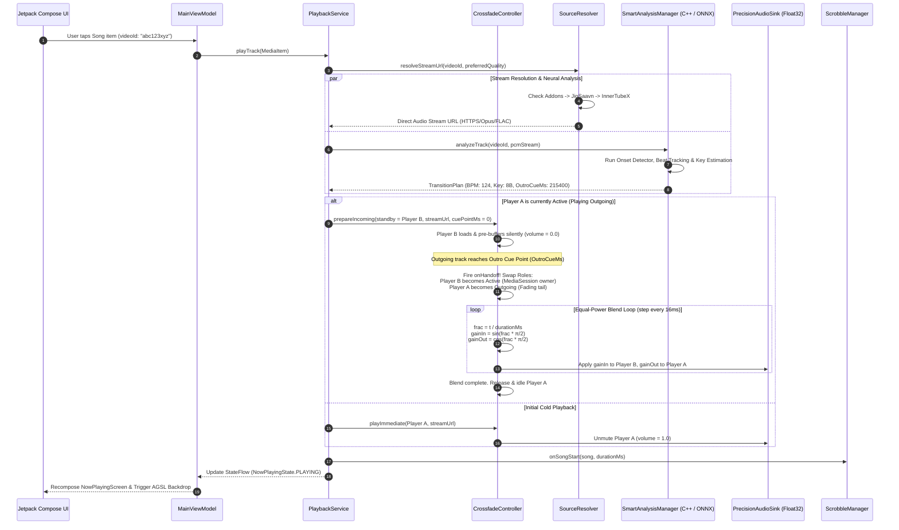
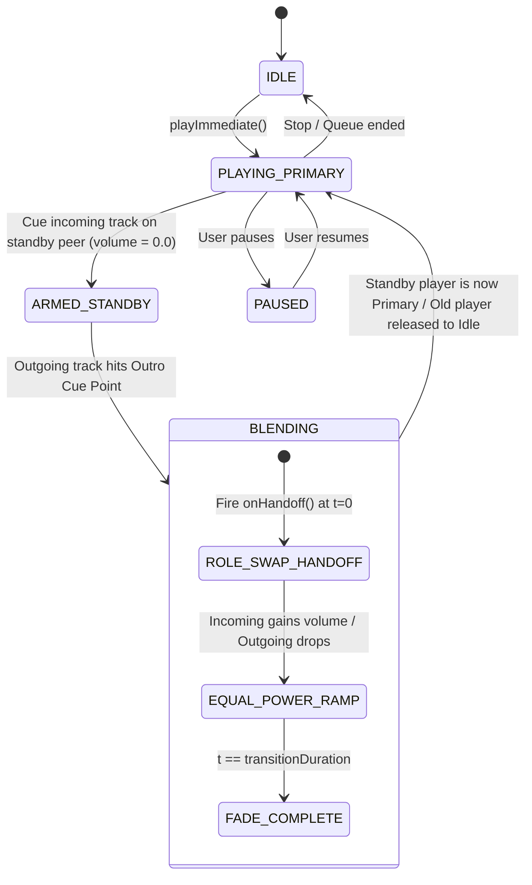

# BitChord Architecture, Clean System Design & Playback Engine Specification

This specification provides the comprehensive reverse-engineered architectural design of [BitChord](file:///c:/Users/nikhil/Desktop/projects/music-mobile/BitChord) — an advanced, high-fidelity music streaming client for Android built on Jetpack Compose, Media3/ExoPlayer, custom C++ native DSP, AGSL runtime shaders, and a dual-player peer crossfade engine.

---

## 1. System Overview & Core Philosophy

BitChord addresses and eliminates the major latency, fidelity, and architectural compromises found in standard mobile streaming clients:

1. **Precision 32-Bit Floating Point Audio Pipeline**:
   Standard Android playback stacks downsample or truncate audio streams to 16-bit integer PCM, introducing quantization distortion. BitChord operates an IEEE 754 32-bit floating-point audio graph within a custom `PrecisionAudioSink`, negotiating direct hardware bit-perfect routing (`AudioTrack.isDirectPlaybackSupported`) to bypass the Android OS `AudioFlinger` resampler for external USB DACs and high-res HALs.
2. **True Symmetric Dual-ExoPlayer Peer Architecture**:
   Conventional music players implement crossfade by ramping down volume on a single decoder, creating a hollow silence gap, or by running the outgoing tail on a secondary player (which introduces a 9–41ms audio duplication artifact). BitChord operates two identical ExoPlayer peers (`Player A` and `Player B`). The standby player pre-buffers the **incoming** track at its designated cue point, and a seamless **role swap handoff** occurs at the exact first audible note using an equal-power $\sin^2(\theta) + \cos^2(\theta) = 1$ gain curve.
3. **Decoupled Catalog & Multi-Tier Stream Resolution**:
   Song discovery, search, and playlist curation leverage YouTube Music, while the physical media stream is dynamically routed across Lossless Add-ons (Qobuz/Tidal), JioSaavn 320kbps AAC (with DES-ECB decryption), InnerTube multi-client streams with BotGuard Proof-of-Origin (PO) tokens, and local NAS storage (WebDAV & SMB2/3).
4. **On-Device Neural Automix & DJ Transitions**:
   A native C++ DSP engine combined with quantized ONNX models (`beat_this_int8.onnx` and `vocals_umxhq_int8.onnx`) detects musical downbeats, phrase boundaries, and Camelot harmonic keys to execute 4 DJ transition strategies (Harmonic Crossfade, Bass Swap, Filter Sweep, and Drop Mix).
5. **Real-Time Group Sync via WebSockets & NTP**:
   "Listen Together" synchronized group listening operates through an external Go hub, maintaining sub-5ms clock synchronization via continuous NTP ping/pong packet exchanges and micro-pitch $\pm 1\%$ drift compensation.

---

## 2. Clean Architecture Layer Hierarchy

BitChord strictly follows Clean Architecture and unidirectional data flow (UDF / MVI):

```mermaid
graph TB
    subgraph UI_Presentation [Presentation Layer (Jetpack Compose & MVI)]
        MainActivity["MainActivity<br/>(Insets, Edge-to-Edge, Navigation)"]
        NowPlaying["NowPlayingScreen<br/>(Visualizers, Controls, Lyrics, Canvas)"]
        ViewModels["MainViewModel / PlayerViewModel<br/>(StateFlow, SharedFlow, MVI Reducers)"]
        LiquidGlass["LiquidGlass / AGSL Shaders<br/>(Lens Distortion, Kyant0 Backdrop)"]
    end

    subgraph Domain_Layer [Domain & Interactors Layer]
        ResolveStreamUseCase["ResolveStreamUseCase"]
        CrossfadeUseCase["CrossfadeUseCase"]
        AutomixPlannerUseCase["AutomixPlannerUseCase"]
        SyncRoomUseCase["SyncRoomUseCase"]
    end

    subgraph Service_Core [Core Playback & DSP Service]
        PlaybackService["PlaybackService<br/>(MediaLibraryService, Foreground)"]
        CrossfadeController["CrossfadeController<br/>(Dual ExoPlayer Peer Engine)"]
        PrecisionAudioSink["PrecisionAudioSink<br/>(Float32 AudioBlock Graph)"]
        DspChain["DspChain<br/>(Biquad EQ, Peak Limiter, Dither)"]
    end

    subgraph Data_Layer [Data & Repositories Layer]
        SourceResolver["SourceResolver<br/>(Add-ons -> JioSaavn -> InnerTube)"]
        LyricsRepository["LyricsRepository<br/>(TTML, Musixmatch, LRCLIB, KuGou)"]
        ListenTogetherClient["ListenTogetherClient<br/>(Go WebSocket Hub, NTP Clock)"]
        LocalMediaRepo["LocalMediaRepository & WebDav/Smb"]
        Database["Room Database & SimpleCache LRU"]
    end

    subgraph Native_ML [Native DSP & Machine Learning]
        SmartAnalysisJni["SmartAnalysisJni (C++ JNI Wrapper)"]
        NativeDsp["libnative_audio_dsp.so<br/>(Aubio, Mel Filterbanks, WSOLA)"]
        OnnxRuntime["ONNX Runtime Engine<br/>(beat_this_int8.onnx, umxhq_int8.onnx)"]
    end

    MainActivity --> ViewModels
    NowPlaying --> ViewModels
    ViewModels --> Domain_Layer
    Domain_Layer --> Service_Core
    Service_Core --> Data_Layer
    Service_Core --> Native_ML
    Data_Layer --> Database
```

### Layer Responsibilities & Contracts:
- **Presentation Layer**: Exposes immutable `UiState` via Kotlin `StateFlow`. Dispatches user actions as `UiIntent`. Emits one-shot events (e.g. navigation, error toasts) via `SharedFlow` (`UiEffect`).
- **Domain Layer**: Pure Kotlin business interactors independent of Android OS UI frameworks.
- **Service Core**: Extends AndroidX Media3 `MediaLibraryService`. Houses audio decoders, foreground notifications, audio focus policies, and native DSP pipelines.
- **Data Layer**: Combines remote network clients (OkHttp, Ktor), embedded QuickJS engine, SQLite/Room persistence, and Media3 cache providers.
- **Native ML Layer**: High-performance C++20 and ONNX runtime executing on dedicated background worker threads.

---

## 3. End-to-End Playback Sequence Diagram

The following sequence illustrates the lifecycle of a track request: from user click to stream resolution, neural analysis, pre-buffering, crossfade blending, and scrobbling.



---

## 4. Dual-Player Peer State Machine (`CrossfadeController.kt`)

Rather than treating one player as the master and the other as a slave, both players are symmetric peers. At any instant, exactly one peer is the **Active Player** (owning the `MediaSession`, foreground notification, and audio focus), while the other peer is the **Standby Player**.



### Complete State Machine Transition Table

| Current State | Event Trigger | Next State | Action / Volume Target |
|---|---|---|---|
| `IDLE` | `playImmediate(song)` | `PLAYING_PRIMARY` | Load active player, volume = 1.0, start playback. |
| `PLAYING_PRIMARY` | `prepareIncoming(nextSong)` | `ARMED_STANDBY` | Load standby player with `nextSong`, seek to intro cue, volume = 0.0, pre-roll buffer. |
| `ARMED_STANDBY` | Outgoing position $\ge$ Outro Cue | `BLENDING` | Execute `onHandoff()`: swap active/standby references, attach `MediaSession` to new primary. |
| `BLENDING` | 16ms animation tick | `BLENDING` | $V_{\text{in}} = \sin(\frac{\pi}{2} \cdot f)$, $V_{\text{out}} = \cos(\frac{\pi}{2} \cdot f)$. |
| `BLENDING` | Blend duration expires | `PLAYING_PRIMARY` | $V_{\text{in}} = 1.0$, $V_{\text{out}} = 0.0$. Stop and clear outgoing player. |
| `PLAYING_PRIMARY` | User seek / Skip | `PLAYING_PRIMARY` | Abort pending transitions, instant volume reset to 1.0. |

---

## 5. Threading Model & Real-Time Audio Graph Concurrency

To ensure zero audio glitching or dropouts during 120Hz Compose UI scrolling or heavy background network calls, tasks are strictly isolated across dedicated thread contexts:

```
┌────────────────────────────────────────────────────────────────────────┐
│ UI Thread (Main)                                                       │
│ ├── Jetpack Compose Recomposition Tree                                 │
│ ├── AGSL RuntimeShader Execution (Hardware GPU RenderThread)           │
│ └── Touch & Gesture Handling (Drag seeking, Volume, Queue)             │
└────────────────────────────────────┬───────────────────────────────────┘
                                     │ StateFlow / UiIntent
┌────────────────────────────────────▼───────────────────────────────────┐
│ Main Immediate Dispatcher (Dispatchers.Main.immediate)                 │
│ ├── CrossfadeController Volume Loop (16ms Choreographer cadence)       │
│ ├── MediaSession Notification Provider updates                         │
│ └── Navigation and Screen Route Transitions                            │
└────────────────────────────────────┬───────────────────────────────────┘
                                     │ MediaItem Commands
┌────────────────────────────────────▼───────────────────────────────────┐
│ ExoPlayer Playback Thread (Internal Android OS HandlerThread)          │
│ ├── MediaCodec Hardware Video/Audio Decoding                           │
│ ├── PrecisionAudioSink.handleBuffer() [ZERO HEAP ALLOCATION BUDGET]    │
│ ├── AudioBlock Float32 Processing & RBJ Biquad EQ Filtering            │
│ ├── TPDF Dithering & AudioTrack.write()                                │
│ └── OutputNegotiator Direct USB DAC HAL Routing                        │
└────────────────────────────────────────────────────────────────────────┘
          ▲                                           ▲
          │ Non-blocking SPSC Ring Buffer             │ Async JSON / Streams
┌─────────┴─────────────────────────────┐   ┌─────────┴──────────────────┐
│ Neural / DSP Pool (Dispatchers.Default)│   │ I/O Dispatcher (Dispatchers.IO)
│ ├── C++ Audio Analysis (Aubio/FFTW)   │   │ ├── InnerTubeX & PoToken Minting
│ ├── ONNX Runtime INT8 Model Inference │   │ ├── OkHttp Network Connection Pool
│ └── WSOLA Time-Stretching Calculations│   │ └── Lyrics & Canvas Cache IO
└───────────────────────────────────────┘   └────────────────────────────┘
```

### Audio Thread Memory Constraints:
- **No Memory Allocation**: The `PrecisionAudioSink.handleBuffer()` method runs inside the real-time audio thread. Calling `new`, allocating Kotlin objects, or resizing collections inside this callback is strictly prohibited to prevent GC pauses.
- **Cache-Line Aligned AudioBlock**: Internal sample blocks reuse a pre-allocated FloatArray buffer (`AudioBlock(channels = 2, maxFrames = 4096)`), aligned to 64-byte CPU cache lines.

---

## 6. Production Android MediaLibraryService Blueprint

The following complete Kotlin implementation demonstrates the core architecture of `PlaybackService`, setting up the MediaSession, dual ExoPlayers with custom `PrecisionAudioSink`, AudioFocus request policies, and becoming-noisy broadcast handling:

```kotlin
package com.music.bitchord.playback

import android.app.PendingIntent
import android.content.BroadcastReceiver
import android.content.Context
import android.content.Intent
import android.content.IntentFilter
import android.media.AudioAttributes as AndroidAudioAttributes
import android.media.AudioFocusRequest
import android.media.AudioManager
import android.os.Build
import android.os.Bundle
import androidx.media3.common.AudioAttributes
import androidx.media3.common.C
import androidx.media3.common.ForwardingPlayer
import androidx.media3.common.MediaItem
import androidx.media3.common.Player
import androidx.media3.common.util.UnstableApi
import androidx.media3.exoplayer.DefaultRenderersFactory
import androidx.media3.exoplayer.ExoPlayer
import androidx.media3.exoplayer.audio.AudioSink
import androidx.media3.session.MediaLibraryService
import androidx.media3.session.MediaSession
import com.music.bitchord.MainActivity
import com.music.bitchord.playback.audio.PrecisionAudioSink
import kotlinx.coroutines.CoroutineScope
import kotlinx.coroutines.Dispatchers
import kotlinx.coroutines.SupervisorJob
import kotlinx.coroutines.cancel

@UnstableApi
class PlaybackService : MediaLibraryService() {

    private val serviceScope = CoroutineScope(Dispatchers.Main.immediate + SupervisorJob())
    private lateinit var mediaLibrarySession: MediaLibrarySession
    
    private lateinit var playerA: ExoPlayer
    private lateinit var playerB: ExoPlayer
    private lateinit var crossfadeController: CrossfadeController
    private lateinit var sessionForwarder: SessionPlayerForwarder
    
    private lateinit var audioManager: AudioManager
    private var audioFocusRequest: AudioFocusRequest? = null

    private val noisyReceiver = object : BroadcastReceiver() {
        override fun onReceive(context: Context?, intent: Intent?) {
            if (intent?.action == AudioManager.ACTION_AUDIO_BECOMING_NOISY) {
                // Pause playback immediately when headphones/Bluetooth disconnect
                crossfadeController.activePlayer.pause()
            }
        }
    }

    override fun onCreate() {
        super.onCreate()
        audioManager = getSystemService(Context.AUDIO_SERVICE) as AudioManager

        // 1. Build symmetric ExoPlayer instances with PrecisionAudioSink
        playerA = buildPrecisionPlayer("PlayerA")
        playerB = buildPrecisionPlayer("PlayerB")

        // 2. Wrap active player in a forwarding delegate for MediaSession
        sessionForwarder = SessionPlayerForwarder(playerA)

        // 3. Initialize CrossfadeController
        crossfadeController = CrossfadeController(
            playerA = playerA,
            playerB = playerB,
            scope = serviceScope,
            onHandoff = { newActivePlayer ->
                sessionForwarder.setDelegate(newActivePlayer)
            }
        )

        // 4. Configure MediaLibrarySession
        val sessionActivityIntent = Intent(this, MainActivity::class.java).apply {
            flags = Intent.FLAG_ACTIVITY_SINGLE_TOP
        }
        val sessionPendingIntent = PendingIntent.getActivity(
            this,
            0,
            sessionActivityIntent,
            PendingIntent.FLAG_IMMUTABLE or PendingIntent.FLAG_UPDATE_CURRENT
        )

        mediaLibrarySession = MediaLibrarySession.Builder(this, sessionForwarder, LibraryCallback())
            .setSessionActivity(sessionPendingIntent)
            .build()

        // 5. Register Becoming Noisy Receiver
        registerReceiver(
            noisyReceiver,
            IntentFilter(AudioManager.ACTION_AUDIO_BECOMING_NOISY)
        )

        // 6. Request Audio Focus
        requestSystemAudioFocus()
    }

    private fun buildPrecisionPlayer(tag: String): ExoPlayer {
        val renderersFactory = object : DefaultRenderersFactory(this) {
            override fun buildAudioSink(
                context: Context,
                enableFloatOutput: Boolean,
                enableAudioTrackPlaybackParams: Boolean
            ): AudioSink {
                // Force IEEE 754 32-bit floating point audio sink
                return PrecisionAudioSink(
                    context = context,
                    enableFloat32 = true,
                    enableDirectPlayback = true
                )
            }
        }

        val audioAttributes = AudioAttributes.Builder()
            .setContentType(C.AUDIO_CONTENT_TYPE_MUSIC)
            .setUsage(C.USAGE_MEDIA)
            .build()

        return ExoPlayer.Builder(this, renderersFactory)
            .setAudioAttributes(audioAttributes, false) // Handle focus manually
            .setHandleAudioBecomingNoisy(false)
            .build()
    }

    private fun requestSystemAudioFocus() {
        val focusChangeListener = AudioManager.OnAudioFocusChangeListener { focusChange ->
            when (focusChange) {
                AudioManager.AUDIOFOCUS_LOSS -> {
                    crossfadeController.activePlayer.pause()
                }
                AudioManager.AUDIOFOCUS_LOSS_TRANSIENT -> {
                    crossfadeController.activePlayer.pause()
                }
                AudioManager.AUDIOFOCUS_LOSS_TRANSIENT_CAN_DUCK -> {
                    // Smoothly duck volume to 20% rather than pausing
                    crossfadeController.setDuckGain(0.2f)
                }
                AudioManager.AUDIOFOCUS_GAIN -> {
                    crossfadeController.setDuckGain(1.0f)
                    crossfadeController.activePlayer.play()
                }
            }
        }

        if (Build.VERSION.SDK_INT >= Build.VERSION_CODES.O) {
            val playbackAttributes = AndroidAudioAttributes.Builder()
                .setUsage(AndroidAudioAttributes.USAGE_MEDIA)
                .setContentType(AndroidAudioAttributes.CONTENT_TYPE_MUSIC)
                .build()

            val request = AudioFocusRequest.Builder(AudioManager.AUDIOFOCUS_GAIN)
                .setAudioAttributes(playbackAttributes)
                .setAcceptsDelayedFocusGain(true)
                .setOnAudioFocusChangeListener(focusChangeListener)
                .build()
            audioFocusRequest = request
            audioManager.requestAudioFocus(request)
        } else {
            @Suppress("DEPRECATION")
            audioManager.requestAudioFocus(
                focusChangeListener,
                AudioManager.STREAM_MUSIC,
                AudioManager.AUDIOFOCUS_GAIN
            )
        }
    }

    override fun onGetSession(controllerInfo: MediaSession.ControllerInfo): MediaLibrarySession? {
        return mediaLibrarySession
    }

    override fun onDestroy() {
        unregisterReceiver(noisyReceiver)
        serviceScope.cancel()
        mediaLibrarySession.release()
        playerA.release()
        playerB.release()
        super.onDestroy()
    }

    private inner class LibraryCallback : MediaLibrarySession.Callback {
        // Handle session commands, media items, search, and queue operations
    }

    /**
     * Dynamically swaps the underlying ExoPlayer without disconnecting MediaSession controllers.
     */
    private class SessionPlayerForwarder(initialPlayer: Player) : ForwardingPlayer(initialPlayer) {
        private var currentPlayer: Player = initialPlayer

        fun setDelegate(newPlayer: Player) {
            currentPlayer = newPlayer
            // Dispatch notification to MediaSession that player state changed
        }

        override fun getPlayer(): Player = currentPlayer
    }
}
```
