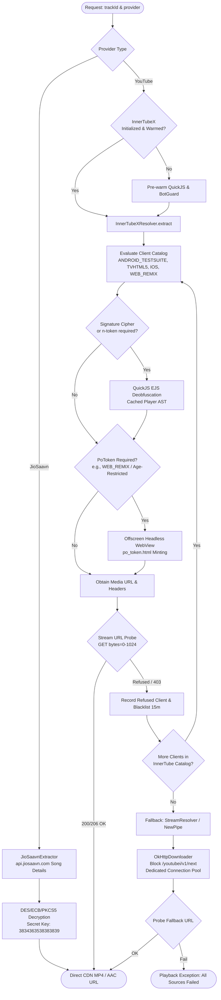

# YouTube & JioSaavn Stream Extraction, Cipher Decryption & PO Token Specification

This specification details the multi-tier stream extraction architecture, signature cipher resolution, `n`-parameter throttle solver, Proof-of-Origin (PO Token) BotGuard minting, and JioSaavn DES decryption implemented in [BitChord](file:///c:/Users/nikhil/Desktop/projects/music-mobile/BitChord).

---

## 1. Multi-Tier Resolution Hierarchy & Fallback Matrix

YouTube actively defends its media CDN against third-party clients through a combination of JavaScript signature transformations (`sig`), `n`-parameter throttling transforms, and BotGuard / DroidGuard Proof-of-Origin (`po_token`) challenges. BitChord resolves streams using a strict, automated fallback sequence:



---

## 2. InnerTube API Protocol & Request Payloads

InnerTube endpoints communicate over HTTPS via POST requests containing a structured JSON context payload.

### 2.1. Request Endpoint:
`POST https://music.youtube.com/youtubei/v1/player`

### 2.2. Request Headers:
```http
Content-Type: application/json
User-Agent: Mozilla/5.0 (Windows NT 10.0; Win64; x64) AppleWebKit/537.36 (KHTML, like Gecko) Chrome/141.0.0.0 Safari/537.36
X-YouTube-Client-Name: 67
X-YouTube-Client-Version: 1.20250210.01.00
X-Goog-Visitor-Id: <visitorData>
Origin: https://music.youtube.com
Referer: https://music.youtube.com/
```

### 2.3. Request Payload Schema:
```json
{
  "context": {
    "client": {
      "clientName": "WEB_REMIX",
      "clientVersion": "1.20250210.01.00",
      "hl": "en",
      "gl": "US",
      "visitorData": "Cgt2aXNpdG9ySWQ4...==",
      "userAgent": "Mozilla/5.0 (Windows NT 10.0; Win64; x64) AppleWebKit/537.36 (KHTML, like Gecko) Chrome/141.0.0.0 Safari/537.36,gzip(gfe)"
    },
    "user": {
      "lockedSafetyMode": false
    },
    "request": {
      "useSsl": true,
      "internalExperimentFlags": []
    }
  },
  "videoId": "kJQP7kiw5Fk",
  "playbackContext": {
    "contentPlaybackContext": {
      "html5Preference": "HTML5_PREF_WANTS",
      "signatureTimestamp": 19842
    }
  },
  "serviceIntegrityDimensions": {
    "poToken": "MnRvX3Rva2VuX3ZhbHVlX2hlcmU...=="
  }
}
```

---

## 3. Client Catalog Specifications

Implemented in [InnerTubeXResolver.kt](file:///c:/Users/nikhil/Desktop/projects/music-mobile/BitChord/app/src/main/java/com/music/bitchord/data/innertube/InnerTubeXResolver.kt):

| Client Name | Client ID | `clientVersion` | PoToken Required? | Cipher Required? | Primary Audio Stream Format |
| :--- | :---: | :---: | :---: | :---: | :--- |
| `ANDROID_TESTSUITE` | `30` | `1.9` | No (Bypassed) | Minimal | Opus (itag 251, ~160 kbps) |
| `TVHTML5_SIMPLY_EMBEDDED`| `85` | `2.0` | No | No (Direct URLs) | Opus (itag 251) / AAC (itag 140) |
| `IOS` | `5` | `19.45.4` | No | Rare | AAC in MP4 (itag 140, 128 kbps) |
| `WEB_REMIX` | `67` | `1.20250210.01.00`| **Yes** (Content-Bound) | **Yes** (`n`-transform) | Opus (itag 251, ~160 kbps) |

### Content-Bound PO Token Architecture:
1. YouTube binds each PO Token directly to the specific `videoId`.
2. The `streamingDataPoToken` must be appended as `&pot=` query parameter on every GoogleVideo CDN media segment request:
   `https://rr1---sn-....googlevideo.com/videoplayback?...&pot=MnRvX3Rva2Vu...&cpn=uniqueNonce`
3. If `&pot=` is omitted or invalid, the CDN returns HTTP 403 Forbidden after transferring $0\text{ bytes}$.

---

## 4. BotGuard WebView Architecture (`PoTokenGenerator.kt`)

Implemented in [PoTokenGenerator.kt](file:///c:/Users/nikhil/Desktop/projects/music-mobile/BitChord/app/src/main/java/com/music/bitchord/data/innertube/potoken/PoTokenGenerator.kt) and [po_token.html](file:///c:/Users/nikhil/Desktop/projects/music-mobile/BitChord/app/src/main/assets/po_token.html):

```html
<!-- po_token.html Embedded Host -->
<!DOCTYPE html>
<html>
<head>
    <meta charset="utf-8">
    <script src="https://www.youtube.com/s/desktop/botguard/bg.js"></script>
</head>
<body>
    <script>
        function mintToken(visitorData, videoId) {
            return new Promise((resolve, reject) => {
                if (typeof botguard === 'undefined') {
                    reject('BotGuard SDK not initialized');
                    return;
                }
                botguard.invoke({
                    visitorData: visitorData,
                    videoId: videoId
                }).then(result => {
                    resolve({
                        playerRequestPoToken: result.playerToken,
                        streamingDataPoToken: result.streamToken
                    });
                }).catch(err => reject(err));
            });
        }
    </script>
</body>
</html>
```

### Pre-Warming Mechanics:
- Cold evaluation of BotGuard takes **$1.5\text{s}$ to $3.2\text{s}$** inside an Android WebView.
- `InnerTubeXResolver.init(context)` spawns a background coroutine $1,500\text{ ms}$ after app launch to initialize the WebView, load `bg.js`, and execute an initial dummy challenge.
- The resulting tokens are cached in memory for **4 hours** before renewal.

---

## 5. QuickJS EJS Deobfuscation Engine

YouTube's `base.js` player executes two dynamic JavaScript obfuscations:
1. **Signature Decipher**: Reverses, slices, and swaps characters of the `s` query parameter to generate the valid `sig` signature.
2. **`n`-Parameter Transform**: Encodes the playback download throttle token (`&n=...`). Failing to solve `n` results in Google throttling audio download speeds to **$< 50\text{ kbps}$**, causing playback buffering.

### Sandboxed Solver Workflow:
1. The JS solver code runs inside embedded QuickJS:
```kotlin
val result = quickJs.evaluate("""
    (function(nToken) {
        var solver = $preprocessedJsCode;
        return solver(nToken);
    })("$rawNToken");
""") as String
```
2. Preprocessed player ASTs are stored in `app_files/innertubex_players/<player_version_hash>`.
3. Execution time on subsequent runs: **$< 4\text{ ms}$**.

---

## 6. JioSaavn DES Decryption Engine (`JioSaavnExtractor.kt`)

JioSaavn secures high-bitrate media URLs ($320\text{ kbps}$ AAC/MP4) using DES encryption with a hardcoded static key:

### 6.1. Decryption Implementation:
```kotlin
package com.music.bitchord.data.jiosaavn

import android.util.Base64
import java.security.Key
import javax.crypto.Cipher
import javax.crypto.spec.SecretKeySpec

object JioSaavnDecryptor {
    // Standard static key used across JioSaavn mobile clients
    private const val SECRET_KEY_STRING = "3834363538383839" // ASCII bytes
    private const val ALGORITHM = "DES/ECB/PKCS5Padding"

    private val key: Key by lazy {
        SecretKeySpec(SECRET_KEY_STRING.toByteArray(Charsets.UTF_8), "DES")
    }

    fun decryptMediaUrl(encryptedUrlBase64: String): String {
        val cipher = Cipher.getInstance(ALGORITHM)
        cipher.init(Cipher.DECRYPT_MODE, key)
        val decodedBytes = Base64.decode(encryptedUrlBase64, Base64.DEFAULT)
        val decryptedBytes = cipher.doFinal(decodedBytes)
        
        // Decrypted string contains direct CDN URL with .mp4 / .m4a format
        val directUrl = String(decryptedBytes, Charsets.UTF_8)
        
        // Upgrade bitrate parameter to 320kbps if available
        return directUrl.replace("_96.mp4", "_320.mp4")
                        .replace("_160.mp4", "_320.mp4")
    }
}
```

---

## 7. Failsafe: NewPipeExtractor Optimization Hacks

If all InnerTube clients fail, [StreamResolver.kt](file:///c:/Users/nikhil/Desktop/projects/music-mobile/BitChord/app/src/main/java/com/music/bitchord/data/innertube/StreamResolver.kt) invokes NewPipeExtractor with two vital performance optimizations:

### 7.1. Blocking `/youtubei/v1/next` (Saving 7–12 Seconds):
```kotlin
private const val NEXT_ENDPOINT = "/youtubei/v1/next"
private const val EMPTY_NEXT_RESPONSE =
    """{"responseContext":{},"contents":{},"currentVideoEndpoint":{},"trackingParams":""}"""

override fun execute(request: Request): Response {
    if (NEXT_ENDPOINT in request.url()) {
        // Return valid empty envelope > 50 characters to avoid "JSON response too short"
        return Response(200, "OK", emptyMap(), EMPTY_NEXT_RESPONSE, request.url())
    }
    // Proceed with isolated extraction request...
}
```

### 7.2. Isolated Connection Pool & Timeout Leash:
```kotlin
private val extractorClient by lazy {
    Http.client.newBuilder()
        .connectionPool(ConnectionPool(4, 10, TimeUnit.SECONDS))
        .callTimeout(12, TimeUnit.SECONDS)
        .connectTimeout(6, TimeUnit.SECONDS)
        .readTimeout(8, TimeUnit.SECONDS)
        .retryOnConnectionFailure(true)
        .build()
}
```

---

## 8. Stream Probing & Format Selection Logic

To prevent ExoPlayer from hanging on 403/404 CDN links, BitChord probes the media URL with a $1\text{ KB}$ byte-range request before feeding it to the player:

```kotlin
val targetStream = adaptiveFormats
    .filter { it.mimeType.startsWith("audio/") }
    .sortedWith(
        compareByDescending<Format> { it.mimeType.contains("opus", ignoreCase = true) }
            .thenByDescending { it.bitrate }
    ).firstOrNull() ?: throw NoSupportedStreamException()

// Range probe to guarantee byte availability
val probeRequest = Request.Builder()
    .url(targetStream.url)
    .header("Range", "bytes=0-1024")
    .apply { targetStream.headers.forEach { (k, v) -> addHeader(k, v) } }
    .build()

val probeResponse = Http.client.newCall(probeRequest).execute()
if (probeResponse.code !in 200..206) {
    throw StreamDeadOnArrivalException("Status code: ${probeResponse.code}")
}
```
