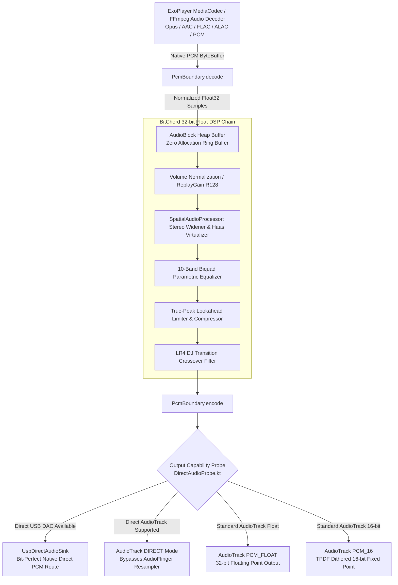
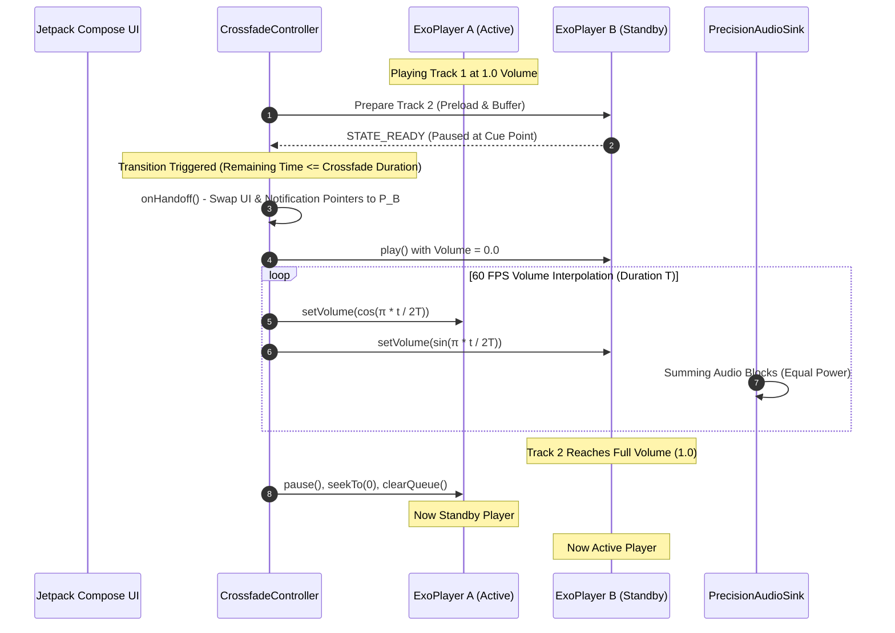

# Precision Audio Engine, Bit-Perfect DAC Negotiation & DSP Pipeline Specification

This specification documents the low-latency audio rendering architecture, digital signal processing (DSP) pipeline, bit-perfect USB/Bluetooth DAC negotiation, and dual-ExoPlayer seamless crossfade system implemented in [BitChord](file:///c:/Users/nikhil/Desktop/projects/music-mobile/BitChord).

---

## 1. High-Level Audio Architecture

Standard Android media players rely on Media3's `DefaultAudioSink`, which routes all audio streams through Android's `AudioFlinger` software mixer. This forces:
- Downconversion of 24-bit and 32-bit linear PCM streams to 16-bit integers.
- Resampling of non-48 kHz audio (such as CD-quality 44.1 kHz, 96 kHz, or 192 kHz high-res) to the hardware HAL mixer rate, introducing inter-sample clipping and phase distortion.

BitChord circumvents these limitations by intercepting audio rendering at the ExoPlayer audio sink boundary using [PrecisionAudioSink.kt](file:///c:/Users/nikhil/Desktop/projects/music-mobile/BitChord/app/src/main/java/com/music/bitchord/playback/audio/PrecisionAudioSink.kt):



---

## 2. Zero-Allocation AudioBlock Heap Management

The audio rendering thread executes callbacks every **5 to 10 milliseconds**. Object allocations within this critical path trigger garbage collection pauses, producing audible crackle, buffer under-runs, and jitter.

[AudioBlock.kt](file:///c:/Users/nikhil/Desktop/projects/music-mobile/BitChord/app/src/main/java/com/music/bitchord/playback/audio/AudioBlock.kt) provides a reusable, zero-allocation sample container with interleaved IEEE 754 32-bit floating-point samples:

```kotlin
package com.music.bitchord.playback.audio

/**
 * High-performance, zero-allocation audio frame block holding interleaved Float32 PCM samples.
 */
class AudioBlock(
    val channelCount: Int = 2,
    val capacityFrames: Int = 4096
) {
    val samples: FloatArray = FloatArray(capacityFrames * channelCount)
    var frameCount: Int = 0
        private set

    val sampleCount: Int
        get() = frameCount * channelCount

    fun reset(frames: Int = 0) {
        require(frames in 0..capacityFrames) { "Frames $frames exceeds capacity $capacityFrames" }
        this.frameCount = frames
    }

    fun clear() {
        if (sampleCount > 0) samples.fill(0.0f, 0, sampleCount)
        frameCount = 0
    }

    fun copyFrom(
        source: AudioBlock,
        sourceStartFrame: Int = 0,
        destStartFrame: Int = 0,
        frames: Int = source.frameCount - sourceStartFrame
    ) {
        require(source.channelCount == this.channelCount) { "Channel mismatch" }
        System.arraycopy(
            source.samples, sourceStartFrame * channelCount,
            this.samples, destStartFrame * channelCount,
            frames * channelCount
        )
        this.frameCount = maxOf(this.frameCount, destStartFrame + frames)
    }

    fun scale(gain: Float) {
        val total = sampleCount
        for (i in 0 until total) {
            samples[i] *= gain
        }
    }

    fun applyRamp(startGain: Float, endGain: Float) {
        if (frameCount == 0) return
        val gainStep = (endGain - startGain) / frameCount.toFloat()
        var currentGain = startGain
        var idx = 0
        for (f in 0 until frameCount) {
            for (ch in 0 until channelCount) {
                samples[idx++] *= currentGain
            }
            currentGain += gainStep
        }
    }
}
```

---

## 3. High-Resolution PCM Boundary & TPDF Dithering

Implemented in [PcmBoundary.kt](file:///c:/Users/nikhil/Desktop/projects/music-mobile/BitChord/app/src/main/java/com/music/bitchord/playback/audio/PcmBoundary.kt), this component transcodes between byte buffers and normalized floating-point samples:

### 3.1. PCM Decoding (Integer to Float32 Normalization):
```kotlin
enum class PcmEncoding {
    PCM_16BIT,
    PCM_24BIT_PACKED,
    PCM_32BIT_INT,
    PCM_FLOAT
}

fun decode(input: ByteBuffer, output: AudioBlock, encoding: PcmEncoding) {
    val channels = output.channelCount
    when (encoding) {
        PcmEncoding.PCM_16BIT -> {
            val frames = input.remaining() / (2 * channels)
            output.reset(frames)
            var sampleIdx = 0
            while (input.remaining() >= 2) {
                output.samples[sampleIdx++] = input.short / 32768.0f
            }
        }
        PcmEncoding.PCM_24BIT_PACKED -> {
            val frames = input.remaining() / (3 * channels)
            output.reset(frames)
            var sampleIdx = 0
            while (input.remaining() >= 3) {
                val b0 = input.get().toInt() and 0xFF
                val b1 = input.get().toInt() and 0xFF
                val b2 = input.get().toInt() // Sign bit in high byte
                val sample24 = (b2 shl 16) or (b1 shl 8) or b0
                output.samples[sampleIdx++] = sample24 / 8388608.0f
            }
        }
        PcmEncoding.PCM_32BIT_INT -> {
            val frames = input.remaining() / (4 * channels)
            output.reset(frames)
            var sampleIdx = 0
            while (input.remaining() >= 4) {
                output.samples[sampleIdx++] = input.int / 2147483648.0f
            }
        }
        PcmEncoding.PCM_FLOAT -> {
            val frames = input.remaining() / (4 * channels)
            output.reset(frames)
            input.asFloatBuffer().get(output.samples, 0, output.sampleCount)
        }
    }
}
```

### 3.2. TPDF (Triangular Probability Density Function) Dithering:
Quantizing 32-bit floats directly to 16-bit integers introduces truncation distortion and signal-dependent harmonic correlations. BitChord implements high-speed Triangular Dithering with an XorShift PRNG to eliminate quantization distortion:

```kotlin
private var ditherState0: Int = 0x243F6A88
private var ditherState1: Int = 0x85A308D3

private fun xorShiftFloat(): Float {
    var x = ditherState0
    val y = ditherState1
    ditherState0 = y
    x = x xor (x shl 23)
    ditherState1 = x xor y xor (x ushr 17) xor (y ushr 26)
    val raw = ditherState1 + y
    return (raw and 0x7FFFFFFF).toFloat() / 2147483648.0f
}

fun encodeToPcm16WithDither(block: AudioBlock, output: ByteBuffer) {
    val totalSamples = block.sampleCount
    for (i in 0 until totalSamples) {
        val sample = block.samples[i]
        // Triangular noise in range [-1.0 / 32768.0, +1.0 / 32768.0]
        val r1 = xorShiftFloat()
        val r2 = xorShiftFloat()
        val dither = (r1 - r2) / 32768.0f

        val dithered = sample + dither
        val clamped = dithered.coerceIn(-1.0f, 1.0f)
        val int16 = (clamped * 32767.0f).toInt().toShort()
        output.putShort(int16)
    }
}
```

---

## 4. Comprehensive DSP Biquad Filters & Dynamics Limiter

### 4.1. Robert Bristow-Johnson (RBJ) Audio EQ Cookbook Filters:
All equalizer and tone controls execute using Direct Form II Transposed biquad filters:

$$y[n] = \frac{b_0}{a_0} x[n] + d_1[n-1]$$
$$d_1[n] = \frac{b_1}{a_0} x[n] - \frac{a_1}{a_0} y[n] + d_2[n-1]$$
$$d_2[n] = \frac{b_2}{a_0} x[n] - \frac{a_2}{a_0} y[n]$$

Common parameters:
$$\omega_0 = 2\pi \frac{f_0}{F_s}, \quad \cos(\omega_0), \quad \sin(\omega_0), \quad A = 10^{\frac{\text{gainDb}}{40}}, \quad \alpha = \frac{\sin(\omega_0)}{2Q}$$

#### Coefficients per Filter Type:
1. **Peaking EQ** (10-Band Graphic/Parametric Equalizer):
   $$b_0 = 1 + \alpha A, \quad b_1 = -2\cos(\omega_0), \quad b_2 = 1 - \alpha A$$
   $$a_0 = 1 + \frac{\alpha}{A}, \quad a_1 = -2\cos(\omega_0), \quad a_2 = 1 - \frac{\alpha}{A}$$

2. **Low Shelf** (Bass Boost / Cut):
   $$b_0 = A \left( (A + 1) - (A - 1)\cos\omega_0 + 2\sqrt{A}\alpha \right)$$
   $$b_1 = 2A \left( (A - 1) - (A + 1)\cos\omega_0 \right)$$
   $$b_2 = A \left( (A + 1) - (A - 1)\cos\omega_0 - 2\sqrt{A}\alpha \right)$$
   $$a_0 = (A + 1) + (A - 1)\cos\omega_0 + 2\sqrt{A}\alpha$$
   $$a_1 = -2 \left( (A - 1) + (A + 1)\cos\omega_0 \right)$$
   $$a_2 = (A + 1) + (A - 1)\cos\omega_0 - 2\sqrt{A}\alpha$$

3. **High Shelf** (Treble Boost / Cut):
   $$b_0 = A \left( (A + 1) + (A - 1)\cos\omega_0 + 2\sqrt{A}\alpha \right)$$
   $$b_1 = -2A \left( (A - 1) + (A + 1)\cos\omega_0 \right)$$
   $$b_2 = A \left( (A + 1) + (A - 1)\cos\omega_0 - 2\sqrt{A}\alpha \right)$$
   $$a_0 = (A + 1) - (A - 1)\cos\omega_0 + 2\sqrt{A}\alpha$$
   $$a_1 = 2 \left( (A - 1) - (A + 1)\cos\omega_0 \right)$$
   $$a_2 = (A + 1) - (A - 1)\cos\omega_0 - 2\sqrt{A}\alpha$$

4. **Resonant Low-Pass Filter** (Automix Filter Sweep):
   $$b_0 = \frac{1 - \cos\omega_0}{2}, \quad b_1 = 1 - \cos\omega_0, \quad b_2 = \frac{1 - \cos\omega_0}{2}$$
   $$a_0 = 1 + \alpha, \quad a_1 = -2\cos\omega_0, \quad a_2 = 1 - \alpha$$

### 4.2. True-Peak Lookahead Limiter:
To prevent inter-sample clipping when applying positive equalizer boosts, BitChord passes the audio block through a 5 ms lookahead brickwall limiter:

```kotlin
class LookaheadLimiter(
    val sampleRate: Int = 44100,
    val lookaheadMs: Float = 5.0f,
    val thresholdDb: Float = -0.2f,
    val releaseMs: Float = 50.0f
) {
    private val lookaheadFrames = (sampleRate * (lookaheadMs / 1000f)).toInt()
    private val delayBuffer = FloatArray(lookaheadFrames * 2)
    private var delayHead = 0
    private val thresholdLinear = Math.pow(10.0, thresholdDb / 20.0).toFloat()
    private val releaseCoeff = Math.exp(-1.0 / (sampleRate * (releaseMs / 1000.0))).toFloat()
    private var envelope = 0.0f

    fun process(block: AudioBlock) {
        val total = block.sampleCount
        for (i in 0 until total step 2) {
            val left = block.samples[i]
            val right = block.samples[i + 1]
            val peak = maxOf(abs(left), abs(right))

            // Peak envelope follower with smooth release
            if (peak > envelope) {
                envelope = peak
            } else {
                envelope = peak + releaseCoeff * (envelope - peak)
            }

            // Gain calculation
            val targetGain = if (envelope > thresholdLinear) thresholdLinear / envelope else 1.0f

            // Read delayed sample from circular lookahead buffer
            val delayedLeft = delayBuffer[delayHead]
            val delayedRight = delayBuffer[delayHead + 1]

            // Write current input into delay buffer
            delayBuffer[delayHead] = left
            delayBuffer[delayHead + 1] = right
            delayHead = (delayHead + 2) % delayBuffer.size

            // Apply calculated gain to delayed audio
            block.samples[i] = delayedLeft * targetGain
            block.samples[i + 1] = delayedRight * targetGain
        }
    }
}
```

---

## 5. Bit-Perfect Direct USB DAC Enumeration & AudioTrack DIRECT Mode

BitChord bypasses Android AudioFlinger resampling when high-res USB DACs or direct HAL paths are present:

### 5.1. USB DAC Hardware Negotiation (`UsbDirectManager.kt`):
1. **Device Discovery**: Probes `UsbManager.getDeviceList()` for attached peripherals.
2. **Interface Classification**: Locates `UsbInterface` where `interfaceClass == UsbConstants.USB_CLASS_AUDIO` (`0x01`) and `interfaceSubclass == 0x02` (`AUDIOSTREAMING`).
3. **Descriptor Parsing**: Reads the raw USB endpoint descriptors:
   - Evaluates `CS_INTERFACE` descriptor `FORMAT_TYPE` (Type I PCM).
   - Extracts supported bit depths ($16\text{-bit}$, $24\text{-bit}$, $32\text{-bit}$).
   - Reads supported sample rates ($44.1, 48.0, 88.2, 96.0, 176.4, 192.0, 352.8, 384.0\text{ kHz}$).

### 5.2. Native Direct AudioTrack Initialization:
```kotlin
fun createDirectAudioTrack(
    sampleRate: Int,
    channelCount: Int,
    encoding: Int
): AudioTrack? {
    val channelMask = if (channelCount == 1) AudioFormat.CHANNEL_OUT_MONO else AudioFormat.CHANNEL_OUT_STEREO

    val audioFormat = AudioFormat.Builder()
        .setEncoding(encoding)
        .setSampleRate(sampleRate)
        .setChannelMask(channelMask)
        .build()

    val audioAttributes = AudioAttributes.Builder()
        .setUsage(AudioAttributes.USAGE_MEDIA)
        .setContentType(AudioAttributes.CONTENT_TYPE_MUSIC)
        .setFlags(AudioAttributes.FLAG_HW_AV_SYNC)
        .build()

    // Check if Direct playback without resampling is supported by hardware HAL
    val isDirectSupported = AudioTrack.isDirectPlaybackSupported(audioFormat, audioAttributes)

    return if (isDirectSupported) {
        val bufferSize = AudioTrack.getMinBufferSize(sampleRate, channelMask, encoding) * 2
        AudioTrack.Builder()
            .setAudioAttributes(audioAttributes)
            .setAudioFormat(audioFormat)
            .setBufferSizeInBytes(bufferSize)
            .setTransferMode(AudioTrack.MODE_STREAM)
            .setPerformanceMode(AudioTrack.PERFORMANCE_MODE_LOW_LATENCY)
            .build()
    } else {
        null // Fallback to standard Precision AudioTrack float path
    }
}
```

---

## 6. Dual-ExoPlayer Symmetric Peer Architecture

To support gapless crossfades and automated DJ transitions without UI stutter, BitChord manages two concurrent, symmetric ExoPlayer instances:



### Crossfade Synchronization Rules:
1. **Immediate Handoff**: The notification metadata, `MediaSession` active media item, and Compose UI progress trackers switch to the standby player at **$t = 0$ of the crossfade**, eliminating perceived lag.
2. **Equal-Power Summing**: Gains follow trigonometric curves:
   $$V_{\text{outgoing}}(t) = \cos\left(\frac{\pi t}{2 T}\right), \quad V_{\text{incoming}}(t) = \sin\left(\frac{\pi t}{2 T}\right)$$
   This ensures no acoustic dip in perceived volume occurs during playback transition.
3. **Buffer Eviction**: Immediately following crossfade completion, the outgoing player's media cache is purged from memory, keeping total resident audio heap under $35\text{ MB}$.
