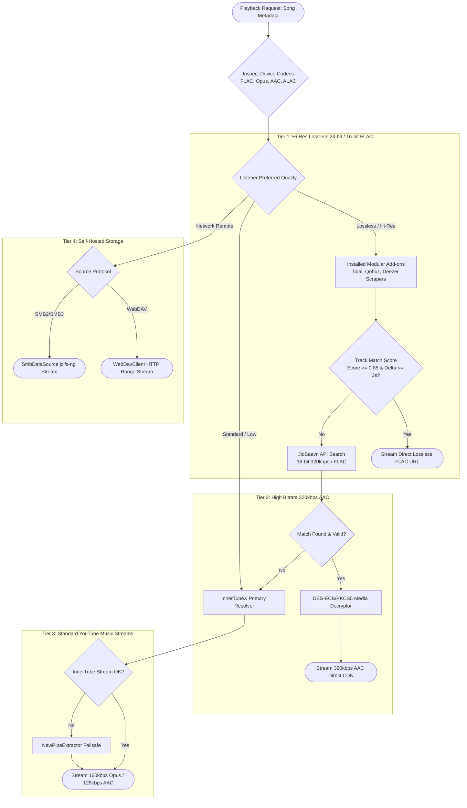
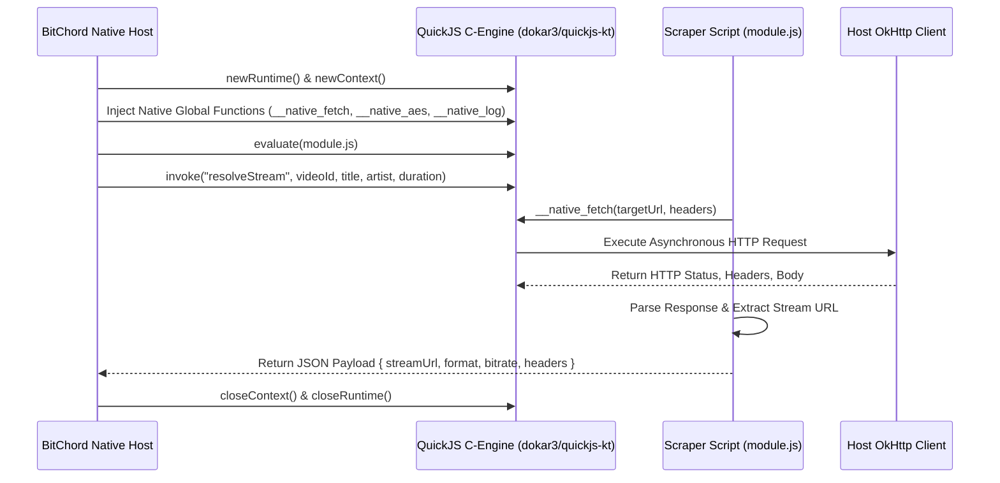
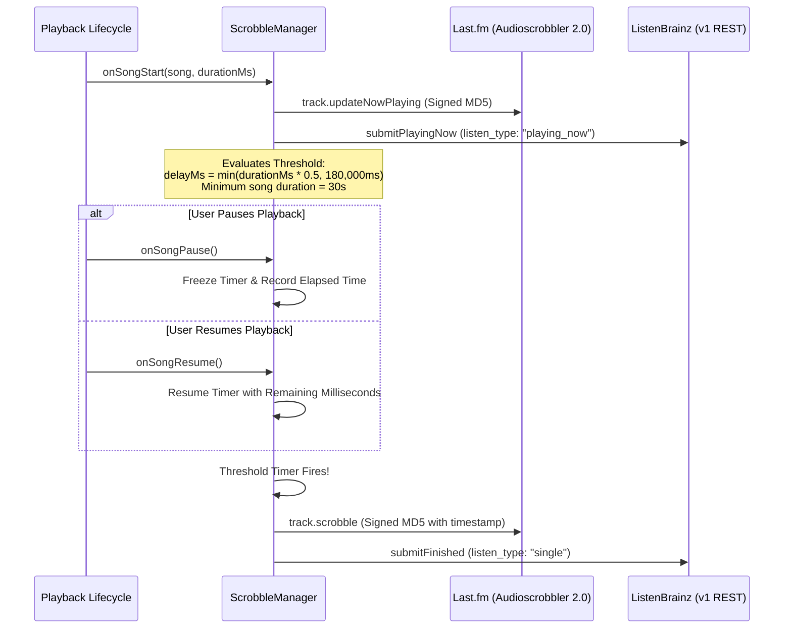

# Data Sources, Add-on Extensions, Canvas Video Loops & Remote Network Storage

This specification details the multi-source routing engine, track matching and verification algorithms, third-party Add-on architecture, sandboxed QuickJS runtime, Canvas vertical video loop scraping (Spotify & Apple Music), scrobbling synchronization protocols (Last.fm & ListenBrainz), and remote network streaming protocols (WebDAV & SMB2/3) in [BitChord](file:///c:/Users/nikhil/Desktop/projects/music-mobile/BitChord).

---

## 1. Unified Multi-Source Routing & Cascading Engine

While YouTube Music acts as the primary metadata, discovery, and playlist catalog, BitChord decouples song discovery from audio delivery. The [`SourceResolver`](file:///c:/Users/nikhil/Desktop/projects/music-mobile/BitChord/app/src/main/java/com/music/bitchord/data/sources/SourceResolver.kt) engine routes playback requests through a priority-weighted source cascading pipeline based on device codec support, network conditions, and listener audio tier preferences.



### Audio Quality Tiers & Target Codecs

| Quality Tier | Target Container / Codec | Target Bitrate / Sample Rate | Primary Provider | Fallback Provider |
|---|---|---|---|---|
| **HI_RES_LOSSLESS** | FLAC / ALAC | 24-bit 96kHz / 192kHz (up to 9216 kbps) | Modular Add-ons (Qobuz/Tidal) | JioSaavn Lossless |
| **LOSSLESS** | FLAC | 16-bit 44.1kHz / 48kHz (1411 kbps) | Modular Add-ons / JioSaavn | InnerTube Opus |
| **HIGH** | MP4 (AAC) / WebM (Opus) | 320 kbps AAC / 160 kbps Opus | JioSaavn 320kbps | InnerTube Format 251 |
| **MEDIUM** | WebM (Opus) | 128 kbps – 160 kbps Opus | InnerTube Format 251 | InnerTube Format 140 (AAC 128k) |
| **LOW (Data Saver)**| WebM (Opus) / MP4 (AAC) | 48 kbps – 70 kbps Opus | InnerTube Format 249/250 | InnerTube Format 599 |

---

## 2. Track Matching & Verification Algorithm (`TrackMatcher.kt`)

When resolving a song discovered on YouTube Music across third-party providers (e.g. JioSaavn, Tidal, Qobuz), strict heuristics are enforced to prevent false-positive matches (such as karaoke covers, acoustic live cuts, or fan remixes).

### Mathematical Scoring Formulation

The composite match score $S_{\text{match}} \in [0.0, 1.0]$ is computed as:

$$S_{\text{match}} = w_{\text{title}} \cdot \text{Sim}_{\text{Lev}}(\hat{T}_{\text{src}}, \hat{T}_{\text{cand}}) + w_{\text{artist}} \cdot \text{Sim}_{\text{Jaccard}}(A_{\text{src}}, A_{\text{cand}}) - P_{\text{duration}}$$

Where:
- $w_{\text{title}} = 0.60$, $w_{\text{artist}} = 0.40$.
- $\hat{T}$: Cleaned, normalized title strings.
- $A$: Tokenized set of primary and featured artist strings.
- $P_{\text{duration}}$: Steep duration delta penalty function:

$$P_{\text{duration}}(\Delta t) = \begin{cases} 
0.0 & \text{if } |\Delta t| \le 1500\text{ ms} \\
\frac{|\Delta t| - 1500}{1500} \cdot 0.25 & \text{if } 1500\text{ ms} < |\Delta t| \le 3000\text{ ms} \\
1.0 & \text{if } |\Delta t| > 3000\text{ ms} \quad (\text{Immediate Rejection})
\end{cases}$$

### Title Normalization Rules (Regex Cleaning Pipeline)

1. **Remove Parenthetical Fluff**:
   `(?i)\((?:official\s+(?:audio|video|music\s+video|lyric\s+video)|visualizer|hd|4k|remastered|remaster)\)`
2. **Remove Featured Artist Tags**:
   `(?i)\s*(?:feat\.|ft\.|featuring)\s+[^()\[\]]+`
3. **Strip Audio Descriptors**:
   `(?i)\[(?:explicit|clean|audio|video|lyrics)\]`
4. **Alphanumeric Character Normalization**:
   Lowercase and strip all punctuation: `[^a-z0-9\s]`.

### Production Kotlin Implementation:

```kotlin
package com.music.bitchord.data.sources

import java.util.Locale
import kotlin.math.abs
import kotlin.math.max

object TrackMatcher {

    private val TITLE_CLEANUP_REGEX = Regex(
        """(?i)\((?:official\s+(?:audio|video|music\s+video|lyric\s+video)|visualizer|hd|4k|remastered|remaster)\)|\[(?:explicit|clean|audio|video|lyrics)\]|\s*(?:feat\.|ft\.|featuring)\s+[^()\[\]]+"""
    )
    private val PUNCTUATION_REGEX = Regex("""[^a-z0-9\s]""")

    fun normalizeTitle(title: String): String {
        return title
            .replace(TITLE_CLEANUP_REGEX, "")
            .lowercase(Locale.ROOT)
            .replace(PUNCTUATION_REGEX, "")
            .replace(Regex("""\s+"""), " ")
            .trim()
    }

    fun levenshteinDistance(s1: String, s2: String): Int {
        val dp = IntArray(s2.length + 1) { it }
        for (i in 1..s1.length) {
            var prev = dp[0]
            dp[0] = i
            for (j in 1..s2.length) {
                val temp = dp[j]
                dp[j] = if (s1[i - 1] == s2[j - 1]) {
                    prev
                } else {
                    1 + minOf(dp[j - 1], dp[j], prev)
                }
                prev = temp
            }
        }
        return dp[s2.length]
    }

    fun stringSimilarity(s1: String, s2: String): Float {
        if (s1 == s2) return 1.0f
        val maxLen = max(s1.length, s2.length)
        if (maxLen == 0) return 1.0f
        val dist = levenshteinDistance(s1, s2)
        return 1.0f - (dist.toFloat() / maxLen.toFloat())
    }

    fun evaluateMatch(
        sourceTitle: String,
        sourceArtist: String,
        sourceDurationMs: Long,
        candTitle: String,
        candArtist: String,
        candDurationMs: Long
    ): Boolean {
        val deltaMs = abs(sourceDurationMs - candDurationMs)
        // Hard cutoff: >3 seconds difference rejects immediately
        if (deltaMs > 3000L) return false

        val normSrcTitle = normalizeTitle(sourceTitle)
        val normCandTitle = normalizeTitle(candTitle)
        val titleSim = stringSimilarity(normSrcTitle, normCandTitle)
        if (titleSim < 0.70f) return false

        val normSrcArtist = normalizeTitle(sourceArtist)
        val normCandArtist = normalizeTitle(candArtist)
        val artistSim = stringSimilarity(normSrcArtist, normCandArtist)

        val durationPenalty = if (deltaMs <= 1500L) 0.0f else ((deltaMs - 1500L) / 1500f) * 0.25f
        val finalScore = (0.60f * titleSim) + (0.40f * artistSim) - durationPenalty

        return finalScore >= 0.82f
    }
}
```

---

## 3. Sandboxed QuickJS Module & Add-on Plugin Framework

To support modular third-party scrapers (e.g., Tidal, Soundcloud, Bandcamp) without recompiling Android binaries or distributing insecure DEX files, BitChord executes external scrapers inside an embedded **QuickJS 2023** runtime.

### QuickJS Sandbox Execution Architecture



### Injected Native Host Bridge API

The QuickJS context is injected with sandboxed native APIs:

```javascript
// Global environment exposed to scrapers:
declare function __native_fetch(
    url: string, 
    options?: { method?: string, headers?: Record<string, string>, body?: string }
): Promise<{ status: number, headers: Record<string, string>, body: string }>;

declare function __native_aes_decrypt(
    cipherTextHex: string, 
    keyHex: string, 
    ivHex: string, 
    algorithm: "AES/CBC/PKCS5Padding" | "AES/CTR/NoPadding"
): string;

declare function __native_sha256(data: string): string;
declare function __native_log(level: "DEBUG" | "WARN" | "ERROR", message: string): void;
```

### Production Host Bridge Implementation (`QuickJsExecutor.kt`):

```kotlin
package com.music.bitchord.data.sources.module

import com.dokar.quickjs.quickJs
import com.music.bitchord.data.Http
import kotlinx.coroutines.Dispatchers
import kotlinx.coroutines.withContext
import okhttp3.MediaType.Companion.toMediaType
import okhttp3.Request
import okhttp3.RequestBody.Companion.toRequestBody
import org.json.JSONObject

class QuickJsExecutor {

    suspend fun executeScraper(
        scriptJs: String,
        functionName: String,
        vararg args: Any
    ): String = withContext(Dispatchers.Default) {
        quickJs {
            // 1. Injected __native_fetch
            defineAsyncFunction("__native_fetch") { params ->
                val url = params.getOrNull(0) as? String ?: return@defineAsyncFunction "{}"
                val options = params.getOrNull(1) as? Map<*, *>
                val method = (options?.get("method") as? String)?.uppercase() ?: "GET"
                val headers = options?.get("headers") as? Map<*, *>
                val bodyText = options?.get("body") as? String

                val reqBuilder = Request.Builder().url(url)
                headers?.forEach { (k, v) ->
                    if (k is String && v is String) reqBuilder.header(k, v)
                }

                if (method == "POST" || method == "PUT") {
                    val reqBody = (bodyText ?: "").toRequestBody("application/json".toMediaType())
                    reqBuilder.method(method, reqBody)
                } else {
                    reqBuilder.method(method, null)
                }

                val response = Http.client.newCall(reqBuilder.build()).execute()
                val respBody = response.body?.string().orEmpty()

                val jsonResult = JSONObject()
                jsonResult.put("status", response.code)
                jsonResult.put("body", respBody)
                jsonResult.toString()
            }

            // 2. Injected __native_log
            defineFunction("__native_log") { params ->
                val level = params.getOrNull(0) as? String ?: "DEBUG"
                val msg = params.getOrNull(1) as? String ?: ""
                android.util.Log.println(
                    when (level) {
                        "WARN" -> android.util.Log.WARN
                        "ERROR" -> android.util.Log.ERROR
                        else -> android.util.Log.DEBUG
                    },
                    "QuickJS-Scraper",
                    msg
                )
                null
            }

            // Evaluate the sandboxed scraper script
            evaluate<Any?>(scriptJs)
            // Invoke the target extraction function
            val result = invoke<String>(functionName, *args)
            result
        }
    }
}
```

---

## 4. Canvas Vertical Video Loop Extraction (Spotify & Apple Music)

BitChord delivers immersive, full-bleed vertical video canvases (3–8 second looping clips) behind playback controls. It supports both Spotify Canvas (reverse-engineered Protobuf over HTTP) and Apple Music Animated Artwork (HLS/MP4 streams).

### 4.1 Spotify Canvas Extraction Pipeline (`SpotifyCanvas.kt`)

Spotify does not expose a public Canvas API. Canvases are served from `spclient.wg.spotify.com/canvaz-cache/v0/canvases` using binary Protocol Buffers.

#### Token Minting Protocol (`SpotifyToken.kt`):
1. **Access Token (`sp_dc`)**: The listener configures their personal Spotify web cookie (`sp_dc`). BitChord calls `https://open.spotify.com/get_access_token?reason=transport&productType=web_player`, extracting the bearer token `accessToken`.
2. **Client Token (`Client-Token`)**: Spotify gates endpoints against automated tools without a matching client token. BitChord calls `https://clienttoken.spotify.com/v1/clienttoken` with an anonymous device identifier payload to mint a short-lived `Client-Token` header.

#### Protobuf Wire Format Specification:

**Request Schema (`CanvasRequest`)**:
```protobuf
syntax = "proto3";

message CanvasRequest {
  message Track {
    string track_uri = 1; // Format: "spotify:track:6rqhFgbbKwnb9MLmUQDhG6"
  }
  repeated Track tracks = 1;
}
```

**Response Schema (`CanvasResponse`)**:
```protobuf
syntax = "proto3";

message CanvasResponse {
  message Canvas {
    string id = 1;
    string canvas_url = 2; // Direct CDN URL to *.cnvs.mp4
    string track_uri = 5;
    string artist_name = 6;
    string canvas_uri = 7;
  }
  repeated Canvas canvases = 1;
}
```

#### Production Hand-Rolled Binary Protobuf Decoder:

To eliminate large `protoc` build-time dependencies, BitChord hand-rolls the minimal binary decoding loop using Google's lightweight `CodedInputStream`:

```kotlin
package com.music.bitchord.data.canvas

import com.google.protobuf.CodedInputStream
import com.google.protobuf.CodedOutputStream
import com.google.protobuf.WireFormat
import java.io.ByteArrayOutputStream

object SpotifyProtobufCodec {

    fun encodeCanvasRequest(trackUri: String): ByteArray {
        val trackBuffer = ByteArrayOutputStream()
        val trackOut = CodedOutputStream.newInstance(trackBuffer)
        trackOut.writeString(1, trackUri)
        trackOut.flush()
        val trackBytes = trackBuffer.toByteArray()

        val reqBuffer = ByteArrayOutputStream()
        val reqOut = CodedOutputStream.newInstance(reqBuffer)
        reqOut.writeByteArray(1, trackBytes)
        reqOut.flush()
        return reqBuffer.toByteArray()
    }

    data class CanvasHit(val trackUri: String?, val canvasUrl: String)

    fun decodeCanvasResponse(bytes: ByteArray): List<CanvasHit> {
        val hits = mutableListOf<CanvasHit>()
        val input = CodedInputStream.newInstance(bytes)

        while (!input.isAtEnd) {
            val tag = input.readTag()
            val fieldNumber = WireFormat.getTagFieldNumber(tag)
            val wireType = WireFormat.getTagWireType(tag)

            if (fieldNumber == 1 && wireType == WireFormat.WIRETYPE_LENGTH_DELIMITED) {
                // Read nested Canvas message
                val length = input.readRawVarint32()
                val oldLimit = input.pushLimit(length)
                var foundUri: String? = null
                var foundUrl: String? = null

                while (!input.isAtEnd) {
                    val innerTag = input.readTag()
                    val innerField = WireFormat.getTagFieldNumber(innerTag)
                    when (innerField) {
                        2 -> foundUrl = input.readString()
                        5 -> foundUri = input.readString()
                        else -> input.skipField(innerTag)
                    }
                }
                input.popLimit(oldLimit)

                if (foundUrl != null) {
                    hits.add(CanvasHit(foundUri, foundUrl))
                }
            } else {
                input.skipField(tag)
            }
        }
        return hits
    }
}
```

### 4.2 Apple Music Animated Artwork Extraction (`AppleMusicCanvas.kt`)

Apple Music serves animated album art and motion canvases via their Web Player API:
1. Search catalog using `https://api.music.apple.com/v1/catalog/{storefront}/search?types=albums,songs&term={query}`.
2. Inspect the returned attributes for `editorialVideo` or `animatedArtwork`:
   - `motionSquareVideo1x1`: 1:1 animated artwork video for now playing album square.
   - `motionTallVideo3x4` / `motionTallVideo9x16`: 9:16 vertical full-bleed canvases.
3. The video payload provides an HLS `.m3u8` manifest or direct `.mp4` CDN link. BitChord forwards the stream to an isolated loop ExoPlayer running behind Compose AGSL backdrop shaders.

---

## 5. Scrobbling Synchronization Protocols (Last.fm & ListenBrainz)

BitChord tracks real-time listening history and syncs metadata to **Last.fm** (Audioscrobbler 2.0 API) and **ListenBrainz** (v1 JSON API).



### 5.1 Last.fm Audioscrobbler 2.0 Authentication & MD5 Signing

Every authenticated POST request to `https://ws.audioscrobbler.com/2.0/` requires an `api_sig` parameter.

#### Signature Algorithm:
1. Collect all parameters (excluding `format`).
2. Sort parameters lexicographically by parameter name in UTF-8 order.
3. Concatenate each parameter name and its value with no delimiters.
4. Append the shared API secret string.
5. Compute the MD5 hexadecimal hash (32 lowercase hex characters).

$$\text{api\_sig} = \text{MD5}\left(\sum_{k \in \text{sorted}(K)} (k + V_k) + \text{Secret}\right)$$

#### Production Request Construction:

```kotlin
package com.music.bitchord.data.scrobbling

import java.security.MessageDigest
import java.util.Locale

object LastFmProtocol {

    fun generateApiSig(params: Map<String, String>, secret: String): String {
        val sortedParams = params.toSortedMap()
        val payload = StringBuilder()
        for ((k, v) in sortedParams) {
            payload.append(k).append(v)
        }
        payload.append(secret)
        
        val md = MessageDigest.getInstance("MD5")
        val digest = md.digest(payload.toString().toByteArray(Charsets.UTF_8))
        return digest.joinToString("") { "%02x".format(Locale.ROOT, it) }
    }

    fun buildScrobblePayload(
        artist: String,
        track: String,
        album: String?,
        timestamp: Long,
        sessionKey: String,
        apiKey: String,
        secret: String
    ): Map<String, String> {
        val params = mutableMapOf(
            "method" to "track.scrobble",
            "api_key" to apiKey,
            "sk" to sessionKey,
            "artist[0]" to artist,
            "track[0]" to track,
            "timestamp[0]" to timestamp.toString()
        )
        if (!album.isNullOrBlank()) {
            params["album[0]"] = album
        }
        val sig = generateApiSig(params, secret)
        params["api_sig"] = sig
        params["format"] = "json"
        return params
    }
}
```

### 5.2 ListenBrainz v1 REST API Specification

- **Endpoint**: `https://api.listenbrainz.org/1/submit-listens`
- **Authentication**: `Authorization: Token {listenbrainz_user_token}`
- **Header**: `Content-Type: application/json`

#### Scrobble JSON Schema (`listen_type: "single"`):
```json
{
  "listen_type": "single",
  "payload": [
    {
      "listened_at": 1727712345,
      "track_metadata": {
        "artist_name": "Hans Zimmer",
        "track_name": "Time",
        "release_name": "Inception (Music from the Motion Picture)",
        "additional_info": {
          "duration_ms": 275000,
          "submission_client": "BitChord",
          "media_player": "BitChord Android",
          "submission_client_version": "1.0.0"
        }
      }
    }
  ]
}
```

---

## 6. Remote Network Storage (WebDAV & SMB2/3)

BitChord allows streaming uncompressed FLAC, WAV, and MP3 collections directly from private NAS servers (Synology, TrueNAS, Nextcloud, ownCloud).

### 6.1 WebDAV Protocol Implementation (`WebDavClient.kt`)

WebDAV streaming is executed over standard HTTP with RFC 4918 extensions:

1. **Directory Discovery (`PROPFIND`)**:
   - BitChord sends `Depth: 1` headers to prevent recursive server timeouts on large libraries.
   - Extracts `<d:displayname>`, `<d:resourcetype>`, and `<d:getcontenttype>`.
2. **Atomic Uploads**:
   - When uploading tracks or backups, BitChord sets `If-None-Match: *` to prevent overwriting existing remote files atomically.
   - Creates directories dynamically via `MKCOL`.
3. **Non-Buffering Streaming Source**:
   - To prevent Out-Of-Memory (OOM) crashes when uploading or streaming 100MB+ FLAC tracks, streams are piped using non-buffering Okio sinks in `8192`-byte increments.

#### PROPFIND Request Payload:
```xml
<?xml version="1.0" encoding="utf-8"?>
<d:propfind xmlns:d="DAV:">
  <d:prop>
    <d:displayname/>
    <d:resourcetype/>
    <d:getcontenttype/>
  </d:prop>
</d:propfind>
```

#### Media3 Random-Access WebDAV DataSource:
Media3's `OkHttpDataSource` handles HTTP `Range: bytes=start-end` requests transparently, allowing zero-latency seeking in multi-gigabyte remote files without downloading the entire track.

### 6.2 SMB2 / SMB3 Protocol Implementation (`SmbClient.kt`)

For local home networks, BitChord implements an SMB client using `jcifs-ng`:

1. **Authentication**: Supports NTLMv2 and Kerberos authentication.
2. **Custom `SmbDataSource`**: Wraps `jcifs.smb.SmbFile` and `jcifs.smb.SmbRandomAccessFile` inside an AndroidX Media3 `DataSource`:
   ```kotlin
   package com.music.bitchord.data.smb

   import androidx.media3.datasource.BaseDataSource
   import androidx.media3.datasource.DataSpec
   import jcifs.CIFSContext
   import jcifs.smb.SmbFile
   import jcifs.smb.SmbRandomAccessFile

   class SmbDataSource(
       private val cifsContext: CIFSContext
   ) : BaseDataSource(true) {

       private var smbFile: SmbFile? = null
       private var randomAccessFile: SmbRandomAccessFile? = null
       private var bytesRemaining: Long = 0L

       override fun open(dataSpec: DataSpec): Long {
           transferInitializing(dataSpec)
           val file = SmbFile(dataSpec.uri.toString(), cifsContext)
           smbFile = file
           val raf = SmbRandomAccessFile(file, "r")
           randomAccessFile = raf

           raf.seek(dataSpec.position)
           bytesRemaining = if (dataSpec.length != -1L) {
               dataSpec.length
           } else {
               file.length() - dataSpec.position
           }
           transferStarted(dataSpec)
           return bytesRemaining
       }

       override fun read(buffer: ByteArray, offset: Int, length: Int): Int {
           if (bytesRemaining == 0L) return -1
           val bytesToRead = minOf(length.toLong(), bytesRemaining).toInt()
           val bytesRead = randomAccessFile?.read(buffer, offset, bytesToRead) ?: -1
           if (bytesRead > 0) {
               bytesRemaining -= bytesRead
               bytesTransferred(bytesRead)
           }
           return bytesRead
       }

       override fun getUri() = smbFile?.url?.let { android.net.Uri.parse(it) }

       override fun close() {
           randomAccessFile?.close()
           randomAccessFile = null
           smbFile = null
           transferEnded()
       }
   }
   ```
