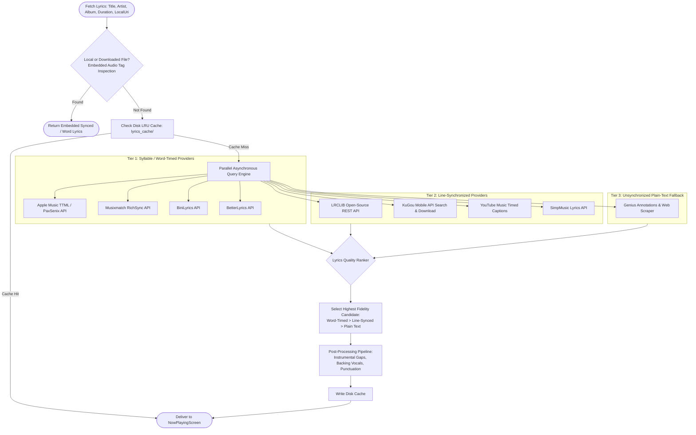
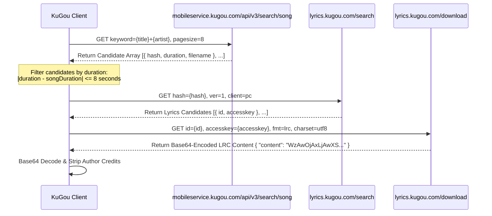
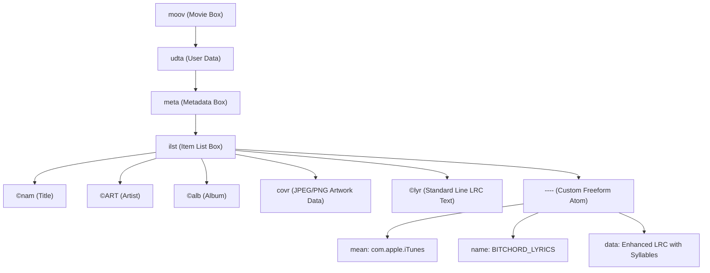

# Lyrics Aggregation, Syllable Synchronization & Audio Container Tagging Engine

This specification details the multi-provider lyrics cascading architecture, Timed Text Markup Language (TTML) syllable-level parsing engine, Musixmatch HMAC-SHA256 authenticated API, KuGou mobile search and KRC/LRC download protocols, LRCLIB integration, Enhanced LRC (`<mm:ss.xx>`) word-by-word timestamps, and offline container tagging implementations (MP4/M4A, WebM/Matroska, FLAC) in [BitChord](file:///c:/Users/nikhil/Desktop/projects/music-mobile/BitChord).

---

## 1. Multi-Provider Cascading Architecture (`LyricsRepository.kt`)

Obtaining accurate, syllable-synchronized lyrics across global music catalogs requires querying multiple independent providers in parallel with fallback cascades.



### Supported Providers Specification Matrix

| Provider | Precision Level | Wire Protocol | Authentication / Signing | Fallback Order |
|---|---|---|---|---|
| **Apple Music / PaxSenix** | Syllable-Level | TTML (XML over HTTPS) | Bearer Token / Anonymous Public Gateway | 1 |
| **Musixmatch** | Syllable (RichSync) / Line (MXM) | JSON over HTTPS | HMAC-SHA256 with UTC date & dynamic secret | 2 |
| **BiniLyrics** | Syllable-Level | JSON over HTTPS | Public REST | 3 |
| **BetterLyrics** | Syllable-Level | JSON over HTTPS | Public REST | 4 |
| **LRCLIB** | Line-Level | JSON over HTTPS | Public Open-Source REST (`lrclib.net`) | 5 |
| **KuGou** | Line-Level / Syllable | JSON + Base64 LRC | Triple unauthenticated mobile REST | 6 |
| **YouTube Music** | Line-Level | InnerTube Proto-JSON | Standard Visitor Cookie / Session | 7 |
| **Genius** | Unsynchronized Text | HTML Scrape / JSON | Public Web Gateway | 8 |
| **Embedded File Tags** | Syllable / Line / Plain | File I/O Binary Parse | Local Storage (ID3v2, MP4 atoms, Vorbis) | 0 (Pre-network) |

---

## 2. Timed Text Markup Language (TTML) Syllable Parser (`TtmlLyrics.kt`)

Apple Music and PaxSenix lyrics are formatted in Timed Text Markup Language (TTML). A document represents a hierarchy of paragraphs (`<p>`) containing syllables wrapped in spans (`<span>`).

### 2.1 The Syllable-Span Boundary Trick

In TTML, syllables belonging to the same word are encoded as **adjacent spans with no intermediate whitespace**:
```xml
<p begin="00:00:27.395" end="00:00:28.960" ttm:agent="v1">
  <span begin="00:00:27.395" end="00:00:27.549">I </span>
  <span begin="00:00:27.549" end="00:00:27.650">been </span>
  <span begin="00:00:27.650" end="00:00:27.800">wait</span>
  <span begin="00:00:27.800" end="00:00:28.150">ing</span>
</p>
```
In the snippet above, `"wait"` and `"ing"` form the single word `"waiting"`. Whitespace inside or between span boundaries serves as the exclusive token delimiter.

### 2.2 Background Vocals & Oppositional Duets

TTML encodes backing or answering vocals through distinct semantic roles:
- `<span ttm:role="x-bg">`: Backing vocals sung concurrently with the main vocal. BitChord extracts these into `LyricLine.background` so they do not interrupt or delay the lead vocal sweep.
- `ttm:agent="v1"` vs `ttm:agent="v2"`: Duet singers. BitChord analyzes agent declarations to assign dual-sided screen alignments (`Alignment.START` for Voice 1, `Alignment.END` for Voice 2).

### 2.3 Hardened DOM Parsing Implementation:

```kotlin
package com.music.bitchord.data.lyrics

import org.w3c.dom.Element
import org.xml.sax.InputSource
import java.io.StringReader
import javax.xml.XMLConstants
import javax.xml.parsers.DocumentBuilderFactory

object TtmlLyrics {

    fun parse(ttml: String): List<LyricLine> = runCatching {
        val factory = DocumentBuilderFactory.newInstance().apply {
            isNamespaceAware = false
            // Defend against XML External Entity (XXE) and billion-laughs attacks
            runCatching { setFeature("http://apache.org/xml/features/disallow-doctype-decl", true) }
            runCatching { setFeature("http://xml.org/sax/features/external-general-entities", false) }
            runCatching { setFeature("http://xml.org/sax/features/external-parameter-entities", false) }
            runCatching { setFeature(XMLConstants.FEATURE_SECURE_PROCESSING, true) }
            runCatching { isExpandEntityReferences = false }
        }

        val doc = factory.newDocumentBuilder().parse(InputSource(StringReader(ttml)))
        val paragraphs = doc.getElementsByTagName("p")
        val lines = ArrayList<LyricLine>(paragraphs.length)

        for (i in 0 until paragraphs.length) {
            val p = paragraphs.item(i) as? Element ?: continue
            val lineStartMs = parseTimestampMs(p.getAttribute("begin"))
            val lineEndMs = parseTimestampMs(p.getAttribute("end"))
            val agent = p.getAttribute("ttm:agent").takeIf { it.isNotBlank() }

            val spans = p.getElementsByTagName("span")
            val words = ArrayList<LyricWord>()
            val currentWordText = StringBuilder()
            var currentWordStart = -1L
            var currentWordEnd = -1L

            for (j in 0 until spans.length) {
                val span = spans.item(j) as? Element ?: continue
                val role = span.getAttribute("ttm:role")
                if (role == "x-translation" || role == "x-roman") continue // Skip translations

                val spanStart = parseTimestampMs(span.getAttribute("begin"))
                val spanEnd = parseTimestampMs(span.getAttribute("end"))
                val text = span.textContent ?: ""

                if (currentWordStart == -1L) currentWordStart = spanStart
                currentWordText.append(text)
                currentWordEnd = spanEnd

                // If span ends with whitespace or is followed by whitespace, flush word
                if (text.endsWith(" ") || text.endsWith("\n") || text.endsWith("\t")) {
                    val cleanText = currentWordText.toString().trim()
                    if (cleanText.isNotEmpty()) {
                        words.add(LyricWord(cleanText, currentWordStart, currentWordEnd))
                    }
                    currentWordText.setLength(0)
                    currentWordStart = -1L
                }
            }

            // Flush remaining word buffer
            val remaining = currentWordText.toString().trim()
            if (remaining.isNotEmpty()) {
                words.add(LyricWord(remaining, currentWordStart, currentWordEnd))
            }

            val fullLineText = words.joinToString(" ") { it.text }
            if (fullLineText.isNotBlank()) {
                lines.add(
                    LyricLine(
                        startMs = lineStartMs,
                        endMs = lineEndMs,
                        text = fullLineText,
                        words = if (words.isNotEmpty()) words else null,
                        agent = agent
                    )
                )
            }
        }

        lines.sortBy { it.startMs }
        injectInstrumentalGaps(lines)
    }.getOrDefault(emptyList())

    fun parseTimestampMs(raw: String): Long {
        if (raw.isBlank()) return 0L
        val trimmed = raw.trim()
        // Format: "hh:mm:ss.sss" or "mm:ss.sss"
        val parts = trimmed.split(":")
        return when (parts.size) {
            3 -> {
                val h = parts[0].toLongOrNull() ?: 0L
                val m = parts[1].toLongOrNull() ?: 0L
                val s = parts[2].toDoubleOrNull() ?: 0.0
                (h * 3600000L) + (m * 60000L) + (s * 1000.0).toLong()
            }
            2 -> {
                val m = parts[0].toLongOrNull() ?: 0L
                val s = parts[1].toDoubleOrNull() ?: 0.0
                (m * 60000L) + (s * 1000.0).toLong()
            }
            1 -> {
                // Plain seconds: "27.395"
                (parts[0].toDoubleOrNull()?.times(1000.0))?.toLong() ?: 0L
            }
            else -> 0L
        }
    }

    private fun injectInstrumentalGaps(lines: MutableList<LyricLine>): List<LyricLine> {
        val result = mutableListOf<LyricLine>()
        for (i in 0 until lines.size) {
            result.add(lines[i])
            if (i < lines.size - 1) {
                val gap = lines[i + 1].startMs - lines[i].endMs
                // Gaps exceeding 7 seconds indicate an instrumental break
                if (gap >= 7000L) {
                    result.add(
                        LyricLine(
                            startMs = lines[i].endMs + 500L,
                            endMs = lines[i + 1].startMs - 500L,
                            text = "♪ Instrumental Break ♪",
                            isInstrumental = true
                        )
                    )
                }
            }
        }
        return result
    }
}
```

---

## 3. Musixmatch RichSync & HMAC-SHA256 Signing Protocol (`Musixmatch.kt`)

Musixmatch serves word-level synchronized lyrics (`richsync`) and line-synchronized lyrics (`mxm` subtitle). All calls to `https://apic.musixmatch.com/ws/1.1/` must be authenticated and cryptographically signed.

### 3.1 HMAC-SHA256 Signature Math

The signature authenticates the URL query parameters against a rolling daily secret:

$$\text{Signature} = \text{Base64}\left(\text{HMAC-SHA256}_{K_{\text{secret}}}\left(\text{URL}_{\text{norm}} + \text{Date}_{\text{UTC}}(\text{"yyyyMMdd"})\right)\right)$$

Where:
- $\text{URL}_{\text{norm}}$: The full URL with query parameters, with `%20` or literal spaces rewritten to `+`.
- $\text{Date}_{\text{UTC}}$: The current UTC date in `yyyyMMdd` format (e.g. `20260930`).
- $K_{\text{secret}}$: Extracted dynamically from Musixmatch's web client JavaScript bundle, with fallback to hardcoded default: `f09016176ba43a1cfd1031fbd6b3d26c`.

### 3.2 Production Kotlin Signing Implementation:

```kotlin
package com.music.bitchord.data.lyrics

import java.net.URLEncoder
import java.text.SimpleDateFormat
import java.util.Base64
import java.util.Date
import java.util.Locale
import java.util.TimeZone
import javax.crypto.Mac
import javax.crypto.spec.SecretKeySpec

object MusixmatchSigner {

    fun signUrl(rawUrl: String, secret: String): String {
        val normalized = rawUrl.replace("%20", "+").replace(" ", "+")
        val dateUtc = SimpleDateFormat("yyyyMMdd", Locale.US).apply {
            timeZone = TimeZone.getTimeZone("UTC")
        }.format(Date())

        val mac = Mac.getInstance("HmacSHA256")
        mac.init(SecretKeySpec(secret.toByteArray(Charsets.UTF_8), "HmacSHA256"))
        val rawHmac = mac.doFinal("$normalized$dateUtc".toByteArray(Charsets.UTF_8))
        val signature = Base64.getEncoder().encodeToString(rawHmac)
        val encodedSig = URLEncoder.encode(signature, "UTF-8")

        return "$normalized&signature=$encodedSig&signature_protocol=sha256"
    }
}
```

### 3.3 Musixmatch RichSync JSON Schema & Parsing

- **Endpoint**: `https://apic.musixmatch.com/ws/1.1/track.richsync.get?track_id={id}&usertoken={token}`
- **Response Format**:
```json
[
  {
    "ts": 12.45,
    "te": 15.80,
    "l": [
      { "c": "Never ", "o": 0.00 },
      { "c": "gonna ", "o": 0.45 },
      { "c": "give ", "o": 0.90 },
      { "c": "you ", "o": 1.35 },
      { "c": "up", "o": 1.70 }
    ],
    "x": "Never gonna give you up"
  }
]
```
Where `ts` = line start (seconds), `te` = line end (seconds), `c` = word/character chunk, and `o` = syllable start offset from `ts`.

---

## 4. KuGou Mobile API & Base64 LRC Extraction (`KuGou.kt`)

KuGou is a massive Asian music service with extensive synchronization metadata for international, K-Pop, and anime songs. It is accessed via three chained unauthenticated HTTP calls:



---

## 5. LRCLIB Open-Source REST API (`LrcLib.kt`)

LRCLIB is a crowd-sourced, open-source lyrics provider:

### REST API Call Specification:
- **Endpoint**: `https://lrclib.net/api/get`
- **Query Parameters**:
  - `track_name`: Title (cleaned of parentheticals)
  - `artist_name`: Primary artist
  - `album_name`: Album name (optional)
  - `duration`: Track duration in seconds ($\pm 2.0\text{s}$ tolerance)

### Response Payload Schema:
```json
{
  "id": 1420953,
  "trackName": "Starboy",
  "artistName": "The Weeknd",
  "albumName": "Starboy",
  "duration": 230,
  "instrumental": false,
  "plainLyrics": "I'm tryna put you in the worst mood, ah\nP1 cleaner than your church shoes, ah...",
  "syncedLyrics": "[00:15.20] I'm tryna put you in the worst mood, ah\n[00:19.45] P1 cleaner than your church shoes, ah..."
}
```

---

## 6. Enhanced LRC (`<mm:ss.xx>`) Word-Timestamp Format (`EnhancedLrc.kt`)

For offline storage and caching of syllable-synchronized tracks in a lightweight single-line format, BitChord utilizes the **Enhanced LRC (A2) standard**:

### Enhanced LRC Syntax:
```text
[00:15.20] <00:15.20> I'm <00:15.80> tryna <00:16.40> put <00:17.10> you <00:18.00> in <00:18.40> the <00:18.70> worst <00:19.10> mood
[00:19.45] <00:19.45> P1 <00:20.10> cleaner <00:21.00> than <00:21.40> your <00:22.00> church <00:22.80> shoes
```

### Regular Expression Parser:
```kotlin
package com.music.bitchord.data.lyrics

object EnhancedLrcParser {
    private val LINE_REGEX = Regex("""^\[(\d{2}):(\d{2})\.(\d{2,3})\](.*)$""")
    private val WORD_REGEX = Regex("""<(\d{2}):(\d{2})\.(\d{2,3})>([^<]*)""")

    fun parse(lrcText: String): List<LyricLine> {
        val lines = mutableListOf<LyricLine>()
        for (rawLine in lrcText.lines()) {
            val lineMatch = LINE_REGEX.find(rawLine.trim()) ?: continue
            val (min, sec, sub, content) = lineMatch.destructured
            val lineStartMs = (min.toLong() * 60000L) + (sec.toLong() * 1000L) + parseSub(sub)

            val wordMatches = WORD_REGEX.findAll(content).toList()
            val words = mutableListOf<LyricWord>()
            for (k in wordMatches.indices) {
                val (wMin, wSec, wSub, wText) = wordMatches[k].destructured
                val wStartMs = (wMin.toLong() * 60000L) + (wSec.toLong() * 1000L) + parseSub(wSub)
                val wEndMs = if (k < wordMatches.size - 1) {
                    val (nMin, nSec, nSub, _) = wordMatches[k + 1].destructured
                    (nMin.toLong() * 60000L) + (nSec.toLong() * 1000L) + parseSub(nSub)
                } else {
                    wStartMs + 1000L
                }
                words.add(LyricWord(wText.trim(), wStartMs, wEndMs))
            }

            lines.add(
                LyricLine(
                    startMs = lineStartMs,
                    endMs = words.lastOrNull()?.endMs ?: (lineStartMs + 3000L),
                    text = content.replace(Regex("""<\d{2}:\d{2}\.\d{2,3}>"""), "").trim(),
                    words = if (words.isNotEmpty()) words else null
                )
            )
        }
        return lines
    }

    private fun parseSub(sub: String): Long {
        val s = sub.padEnd(3, '0').take(3)
        return s.toLongOrNull() ?: 0L
    }
}
```

---

## 7. Embedded Audio Tag Extraction & Offline Container Writing

When a track is downloaded or played from local storage, BitChord avoids network queries by extracting embedded tags directly from audio containers.

### 7.1 MP4 / M4A ISO Box Walker (`EmbeddedLyrics.kt` & `Mp4Tagger.kt`)

Metadata in MP4 files is structured inside the nested box path: `moov/udta/meta/ilst`.



#### Production Box Walker:
1. Walk top-level boxes until `moov` is located.
2. Read box length: 32-bit unsigned integer (or 64-bit if `size == 1`).
3. Search `ilst` for either:
   - `©lyr`: Type-indicator 1 (UTF-8 string payload).
   - `----` with `BITCHORD_LYRICS` name atom: Preserves millisecond-accurate syllable synchronization offline.

### 7.2 FLAC Little-Endian Vorbis Comment Extraction

In FLAC containers, metadata is stored in the `VORBIS_COMMENT` block (Metadata Block Type 4):
- Header: 1 byte flags (`flags & 0x7F == 4`) + 3 bytes length.
- Vendor String: 32-bit little-endian length followed by UTF-8 vendor string.
- Comment Count: 32-bit little-endian integer $N$.
- Comments: $N$ fields, each prefixed by a 32-bit little-endian length.
- BitChord searches for `BITCHORD_LYRICS=` (Enhanced LRC) or standard `LYRICS=`.

### 7.3 WebM / Matroska EBML Tag Extraction

For WebM files carrying Opus streams:
- Inspect EBML ID: `0x1A45DFA3` (`EBMLHeader`).
- Seek to `Tags` element (`0x1254C367`).
- Extract `SimpleTag` (`0x67C8`):
  - `TagName` (`0x45A3`): `"LYRICS"` or `"BITCHORD_LYRICS"`
  - `TagString` (`0x4487`): UTF-8 LRC string.
