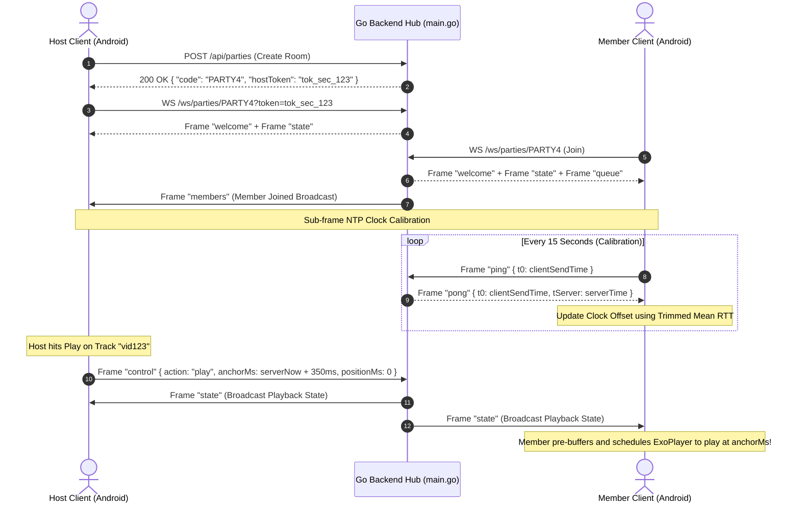

# "Listen Together" Real-Time Group Sync Protocol & Backend Specification

This specification provides the comprehensive protocol design, WebSocket frame schemas, NTP clock calibration mathematics, Go backend hub architecture, and Kotlin client synchronization state machine implemented in [BitChord](file:///c:/Users/nikhil/Desktop/projects/music-mobile/BitChord) and its accompanying service ([backend/](file:///c:/Users/nikhil/Desktop/projects/music-mobile/BitChord/backend)).

---

## 1. System Topology & Protocol Flow

In "Listen Together", audio bytes are **rendered locally on each client device** from independent stream resolutions (YouTube Music InnerTube / JioSaavn / WebDAV), while the lightweight Go backend synchronizes the shared playhead, queue state, and room membership:



---

## 2. Complete WebSocket Frame Specifications

All frames are encoded as standard JSON over a binary/text WebSocket stream. Defined in [backend/protocol/protocol.go](file:///c:/Users/nikhil/Desktop/projects/music-mobile/BitChord/backend/protocol/protocol.go):

### 2.1. Handshake & Welcome (`Server -> Client`)
Transmitted immediately upon successful WebSocket upgrade:
```json
{
  "type": "welcome",
  "sessionId": "sess_8f9a2b1c4e5d",
  "partyCode": "X8K9L2",
  "isHost": true,
  "serverTime": 1727700000150,
  "config": {
    "heartbeatIntervalMs": 15000,
    "maxMembers": 10,
    "hostOnlyControl": false,
    "maxQueueItems": 500
  }
}
```

### 2.2. Playback State Broadcast (`Server -> Client`)
Dispatched whenever track, play state, or seek position changes:
```json
{
  "type": "state",
  "currentTrack": {
    "videoId": "kJQP7kiw5Fk",
    "title": "Despacito",
    "artist": "Luis Fonsi",
    "durationMs": 282000,
    "thumbnailUrl": "https://i.ytimg.com/vi/kJQP7kiw5Fk/hqdefault.jpg",
    "source": "YOUTUBE"
  },
  "isPlaying": true,
  "anchorMs": 1727700000500,
  "positionMs": 45200,
  "playbackRate": 1.0,
  "updatedBy": "user_4a2d8e"
}
```

### 2.3. Queue Synchronization (`Server <-> Client`)
Full queue snapshot sent upon join and incremental batch updates:
```json
{
  "type": "queue",
  "items": [
    {
      "id": "item_001",
      "videoId": "kJQP7kiw5Fk",
      "title": "Despacito",
      "artist": "Luis Fonsi",
      "durationMs": 282000,
      "thumbnailUrl": "https://i.ytimg.com/vi/kJQP7kiw5Fk/hqdefault.jpg",
      "addedBy": "Nikhil"
    },
    {
      "id": "item_002",
      "videoId": "3JZ_D3ELwOQ",
      "title": "Shape of You",
      "artist": "Ed Sheeran",
      "durationMs": 233000,
      "thumbnailUrl": "https://i.ytimg.com/vi/3JZ_D3ELwOQ/hqdefault.jpg",
      "addedBy": "Alex"
    }
  ]
}
```

### 2.4. Control Action Command (`Client -> Server`)
Sent by authorized clients to mutate playback or queue:
```json
{
  "type": "control",
  "action": "seek",
  "targetPositionMs": 78500,
  "anchorMs": 1727700000850
}
```

#### Complete Supported Actions:
| Action | Parameters | Description |
| :--- | :--- | :--- |
| `play` | `anchorMs`, `targetPositionMs` | Resume playback across all clients at designated timestamp |
| `pause` | `targetPositionMs` | Freeze playback immediately at target position |
| `seek` | `anchorMs`, `targetPositionMs` | Seek all players to position and align start anchor |
| `setTrack` | `track`, `anchorMs` | Change current playing track immediately |
| `next` | none | Advance to next item in room queue |
| `previous` | none | Return to preceding track or restart current track |
| `queueAdd` | `items: List<Track>` | Append tracks to end of queue |
| `queueRemove` | `itemId: String` | Remove specific item by unique queue ID |
| `queueMove` | `fromIndex: Int, toIndex: Int` | Reorder queue item positions |
| `queueClear` | none | Flush all upcoming items from queue |
| `setHostOnlyControl` | `enabled: Boolean` | Restrict control actions to host only |
| `kick` | `targetSessionId: String` | Disconnect and ban client from room |

### 2.5. Latency Probe & NTP Clock Calibration (`ping` & `pong`)
```json
// Client -> Server ("ping")
{
  "type": "ping",
  "clientSendTime": 1727700000100
}

// Server -> Client ("pong")
{
  "type": "pong",
  "clientSendTime": 1727700000100,
  "serverTime": 1727700000125
}
```

---

## 3. Sub-Frame NTP Clock Calibration Mathematics

Because individual Android devices possess drifting local quartz oscillators and variable cellular/Wi-Fi latency, clients calculate a running offset to the master server clock using NTP round-trip time estimation.

### 3.1. Offset & RTT Estimation Formula:
Let:
- $t_0$: Local client time when `ping` is dispatched.
- $t_{\text{server}}$: Server timestamp recorded upon receiving `ping`.
- $t_1$: Local client time when `pong` is received.

The round-trip time ($\text{RTT}$) and estimated one-way network latency ($\Delta_{\text{latency}}$) are:
$$\text{RTT} = t_1 - t_0$$
$$\Delta_{\text{latency}} = \frac{\text{RTT}}{2}$$

The instantaneous server clock offset $\theta$ is:
$$\theta = (t_{\text{server}} + \Delta_{\text{latency}}) - t_1 = t_{\text{server}} - \frac{t_0 + t_1}{2}$$

### 3.2. Trimmed Mean Outlier Rejection:
To reject asymmetric network jitter, bufferbloat spikes, and Wi-Fi power-save pauses, the client maintains a sliding window of the last $N = 8$ ping samples, discards the highest and lowest $25\%$ RTT outliers, and averages the remaining offsets:

```kotlin
package com.music.bitchord.data.listentogether

import java.util.ArrayDeque

class ServerClock {
    private val samples = ArrayDeque<ClockSample>(MAX_SAMPLES)
    
    @Volatile
    var clockOffsetMs: Long = 0L
        private set

    data class ClockSample(val rtt: Long, val offset: Long)

    @Synchronized
    fun recordPong(clientSendTime: Long, serverReceiveTime: Long, clientReceiveTime: Long) {
        val rtt = clientReceiveTime - clientSendTime
        val oneWayDelay = rtt / 2L
        val estimatedServerTime = serverReceiveTime + oneWayDelay
        val offset = estimatedServerTime - clientReceiveTime

        if (samples.size >= MAX_SAMPLES) samples.removeFirst()
        samples.addLast(ClockSample(rtt, offset))

        // Discard highest and lowest RTT spikes (Trimmed Mean)
        val sorted = samples.sortedBy { it.rtt }
        val trimmed = if (sorted.size >= 5) sorted.subList(1, sorted.size - 1) else sorted
        clockOffsetMs = trimmed.map { it.offset }.average().toLong()
    }

    val serverNow: Long
        get() = System.currentTimeMillis() + clockOffsetMs

    companion object {
        private const val MAX_SAMPLES = 8
    }
}
```

---

## 4. Closed-Loop Playhead Synchronization & Micro-Pitch Tuning

When a state frame arrives, clients evaluate the target playhead:
$$\text{ServerNow} = t_{\text{local}} + \text{ClockOffset}$$
$$\text{TargetPlayhead} = \text{State.positionMs} + \max(0L, \text{ServerNow} - \text{State.anchorMs})$$

### Closed-Loop Drift Compensation Algorithm:
Every $500\text{ ms}$, the client calculates the instantaneous error $\epsilon$:
$$\epsilon = \text{ExoPlayer.currentPosition} - \text{TargetPlayhead}$$

```mermaid
flowchart TD
    ErrorCheck[Calculate Drift Error: ε = PlayerPos - TargetPos] --> Branch{Evaluate Abs Error}
    
    Branch -->|abs(ε) <= 40ms| Normal[Acoustic Threshold OK<br/>Speed = 1.00x]
    Branch -->|40ms < ε <= 500ms| SlowDown[Local Player Ahead<br/>Micro-Pitch Speed = 0.99x]
    Branch -->|-500ms <= ε < -40ms| SpeedUp[Local Player Behind<br/>Micro-Pitch Speed = 1.01x]
    Branch -->|abs(ε) > 500ms| HardSeek[Catastrophic Drift / Stall<br/>ExoPlayer.seekTo(TargetPos)<br/>Speed = 1.00x]
```

By modulating playback speed by $\pm 1\%$ via ExoPlayer's `PlaybackParameters`, human ears cannot detect any pitch changes (imperceptible $17\text{ cents}$ pitch difference), while physical acoustic phase alignment is achieved within seconds.

---

## 5. Go Backend Hub Architecture (`backend/`)

The backend is built in pure Go with gorilla/websocket, designed to handle thousands of concurrent rooms with zero GC overhead:

### 5.1. Hub Implementation (`backend/hub/hub.go`):
```go
package hub

import (
	"sync"
	"time"
)

type Hub struct {
	parties    map[string]*Party
	register   chan *Client
	unregister chan *Client
	broadcast  chan BroadcastMessage
	mutex      sync.RWMutex
}

func NewHub() *Hub {
	return &Hub{
		parties:    make(map[string]*Party),
		register:   make(chan *Client, 256),
		unregister: make(chan *Client, 256),
		broadcast:  make(chan BroadcastMessage, 1024),
	}
}

func (h *Hub) Run() {
	ticker := time.NewTicker(30 * time.Second)
	defer ticker.Stop()

	for {
		select {
		case client := <-h.register:
			h.mutex.Lock()
			party, exists := h.parties[client.PartyCode]
			if exists {
				party.AddClient(client)
			}
			h.mutex.Unlock()

		case client := <-h.unregister:
			h.mutex.Lock()
			if party, exists := h.parties[client.PartyCode]; exists {
				party.RemoveClient(client)
				if party.IsEmpty() {
					delete(h.parties, client.PartyCode)
				}
			}
			h.mutex.Unlock()

		case msg := <-h.broadcast:
			h.mutex.RLock()
			if party, exists := h.parties[msg.PartyCode]; exists {
				party.Broadcast(msg.Data, msg.Sender)
			}
			h.mutex.RUnlock()

		case <-ticker.C:
			// Prune dead parties
			h.mutex.Lock()
			now := time.Now()
			for code, party := range h.parties {
				if party.IsEmpty() && now.Sub(party.LastActivity) > 5*time.Minute {
					delete(h.parties, code)
				}
			}
			h.mutex.Unlock()
		}
	}
}
```

---

## 6. Automatic Failover & Host Migration

When the room host disconnects (e.g. phone call, network drop, battery depletion):
1. **Grace Period**: The server grants a $15\text{ second}$ grace window for the host to reconnect using their `hostToken`.
2. **Automatic Promotion**: If the host fails to reconnect within $15\text{ seconds}$, the server inspects the remaining connected members and selects the oldest connected client (`connectedAt` timestamp order).
3. **Migration Broadcast**: The server transmits an updated `welcome` frame to the newly promoted host with `"isHost": true`, and a `members` frame to all clients indicating the new host identity.
4. **Queue Preservation**: The party queue, active playhead, and anchor timestamps remain intact throughout the failover event.
