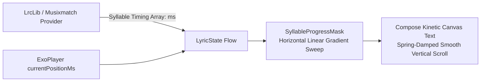

# UI Design System, AGSL Shaders & Compose Visual Effects Specification

This specification documents the visual design architecture, Android Graphics Shading Language (AGSL) runtime shaders, liquid glass styling, animated mesh gradients, and kinetic typography implemented in [BitChord](file:///c:/Users/nikhil/Desktop/projects/music-mobile/BitChord).

---

## 1. Visual Hierarchy & Design Philosophy

BitChord's visual presentation rejects generic flat Material Design in favor of a modern **liquid glass aesthetic** inspired by glassmorphism, dynamic fluid mesh backdrops, and iOS-style optical refraction:

```mermaid
flowchart TD
    AlbumArt[Active Album Art Bitmap] --> Palette[AndroidX Palette Color Extraction<br/>Dominant, Vibrant, Muted, Dark Swatches]
    Palette --> Mesh[Dynamic Mesh Gradient Backdrop<br/>Animated Multi-Point Noise Field]
    
    Mesh --> ContentLayer[UI Scrollable Content Layer<br/>Search, Queue, Playlists, Syllable Lyrics]
    
    ContentLayer --> BackdropRecord[Backdrop Node Surface Capture<br/>0.33x Resolution Scale (9x GPU Savings)]
    
    subgraph GlassPipeline [Kyant0 Backdrop AGSL Pipeline: API 31+]
        BackdropRecord --> ColorMatrix[ColorMatrix Saturation Boost: 1.35x]
        ColorMatrix --> GaussianBlur[RenderEffect.createBlurEffect: 24dp Radius]
        GaussianBlur --> LensShader[AGSL RuntimeShader<br/>RoundedRectRefractionWithDispersion]
        LensShader --> HighlightRim[Highlight: 0.5dp White Rim Alpha 0.10]
        HighlightRim --> InnerShadow[Subtle Inset Ambient Occlusion Shadow]
    end

    GlassPipeline --> GlassNav[Floating Glass Navigation Bar<br/>& Floating Bottom Mini-Player]
```

---

## 2. Complete AGSL Shader Source Code

BitChord leverages Android 13+ (API 33+) AGSL runtime shaders compiled natively on the device's Vulkan/OpenGL GPU pipelines:

### 2.1. Physical Refraction & Multi-Spectral Dispersion Shader (`LensRefraction.agsl`):
Vendored from `Kyant0/backdrop` in [Shaders.kt](file:///c:/Users/nikhil/Desktop/projects/music-mobile/BitChord/app/src/main/java/com/music/bitchord/ui/components/backdrop/internal/Shaders.kt):

```glsl
uniform shader content;

uniform float2 size;
uniform float2 offset;
uniform float4 cornerRadii;
uniform float refractionHeight;
uniform float refractionAmount;
uniform float depthEffect;
uniform float chromaticAberration;

// Signed Distance Field for Rounded Rectangle
float radiusAt(float2 coord, float4 radii) {
    if (coord.x >= 0.0) {
        if (coord.y <= 0.0) return radii.y;
        else return radii.z;
    } else {
        if (coord.y <= 0.0) return radii.x;
        else return radii.w;
    }
}

float sdRoundedRect(float2 coord, float2 halfSize, float radius) {
    float2 cornerCoord = abs(coord) - (halfSize - float2(radius));
    float outside = length(max(cornerCoord, 0.0)) - radius;
    float inside = min(max(cornerCoord.x, cornerCoord.y), 0.0);
    return outside + inside;
}

float2 gradSdRoundedRect(float2 coord, float2 halfSize, float radius) {
    float2 cornerCoord = abs(coord) - (halfSize - float2(radius));
    if (cornerCoord.x >= 0.0 || cornerCoord.y >= 0.0) {
        return sign(coord) * normalize(max(cornerCoord, 0.0));
    } else {
        float gradX = step(cornerCoord.y, cornerCoord.x);
        return sign(coord) * float2(gradX, 1.0 - gradX);
    }
}

float circleMap(float x) {
    return 1.0 - sqrt(1.0 - x * x);
}

half4 main(float2 coord) {
    float2 halfSize = size * 0.5;
    float2 centeredCoord = (coord + offset) - halfSize;
    float radius = radiusAt(coord, cornerRadii);
    
    float sd = sdRoundedRect(centeredCoord, halfSize, radius);
    if (-sd >= refractionHeight) {
        return content.eval(coord);
    }
    sd = min(sd, 0.0);
    
    float d = circleMap(1.0 - -sd / refractionHeight) * refractionAmount;
    float gradRadius = min(radius * 1.5, min(halfSize.x, halfSize.y));
    float2 grad = normalize(gradSdRoundedRect(centeredCoord, halfSize, gradRadius) + depthEffect * normalize(centeredCoord));
    
    float2 refractedCoord = coord + d * grad;
    float dispersionIntensity = chromaticAberration * ((centeredCoord.x * centeredCoord.y) / (halfSize.x * halfSize.y));
    float2 dispersedCoord = d * grad * dispersionIntensity;
    
    half4 color = half4(0.0);
    
    // Multi-spectral wavelength decomposition across 7 discrete bands
    half4 red = content.eval(refractedCoord + dispersedCoord);
    color.r += red.r / 3.5;
    color.a += red.a / 7.0;
    
    half4 orange = content.eval(refractedCoord + dispersedCoord * (2.0 / 3.0));
    color.r += orange.r / 3.5;
    color.g += orange.g / 7.0;
    color.a += orange.a / 7.0;
    
    half4 yellow = content.eval(refractedCoord + dispersedCoord * (1.0 / 3.0));
    color.r += yellow.r / 3.5;
    color.g += yellow.g / 3.5;
    color.a += yellow.a / 7.0;
    
    half4 green = content.eval(refractedCoord);
    color.g += green.g / 3.5;
    color.a += green.a / 7.0;
    
    half4 cyan = content.eval(refractedCoord - dispersedCoord * (1.0 / 3.0));
    color.g += cyan.g / 3.5;
    color.b += cyan.b / 3.0;
    color.a += cyan.a / 7.0;
    
    half4 blue = content.eval(refractedCoord - dispersedCoord * (2.0 / 3.0));
    color.b += blue.b / 3.0;
    color.a += blue.a / 7.0;
    
    half4 purple = content.eval(refractedCoord - dispersedCoord);
    color.r += purple.r / 7.0;
    color.b += purple.b / 3.0;
    color.a += purple.a / 7.0;
    
    return color;
}
```

### 2.2. Fluid Audio Waveform Spectrum Shader (`WaveformSpectrum.agsl`):
Renders real-time audio energy bars driven by FFT bins:
```glsl
uniform float2 resolution;
uniform float time;
uniform float spectrum[64]; // 64 frequency band amplitudes [0.0..1.0]
uniform half4 baseColor;
uniform half4 glowColor;

half4 main(float2 fragCoord) {
    float2 uv = fragCoord / resolution;
    
    // Determine which frequency bin corresponds to this X coordinate
    float binIndex = uv.x * 64.0;
    int index = int(floor(binIndex));
    float fractX = fract(binIndex);
    
    // Read smoothed amplitude
    float amplitude = spectrum[index];
    
    // Generate curved bar geometry with soft glow
    float barHeight = amplitude * 0.85 + 0.05;
    float distToTop = abs(uv.y - 0.5) - (barHeight * 0.5);
    
    // Bar mask with rounded ends and horizontal separation
    float barMask = smoothstep(0.02, 0.0, distToTop) * step(0.15, fractX) * step(fractX, 0.85);
    float glow = exp(-distToTop * 18.0) * 0.35;
    
    half4 finalColor = mix(glowColor, baseColor, barMask);
    return finalColor * (barMask + glow);
}
```

---

## 3. High-Performance LiquidGlass Compose Modifier

Implemented in [LiquidGlass.kt](file:///c:/Users/nikhil/Desktop/projects/music-mobile/BitChord/app/src/main/java/com/music/bitchord/ui/components/LiquidGlass.kt):

```kotlin
package com.music.bitchord.ui.components

import android.graphics.RenderEffect
import android.graphics.RuntimeShader
import android.os.Build
import androidx.compose.foundation.background
import androidx.compose.foundation.border
import androidx.compose.foundation.layout.Box
import androidx.compose.foundation.shape.RoundedCornerShape
import androidx.compose.material3.MaterialTheme
import androidx.compose.runtime.Composable
import androidx.compose.runtime.remember
import androidx.compose.ui.Modifier
import androidx.compose.ui.draw.clip
import androidx.compose.ui.graphics.Color
import androidx.compose.ui.graphics.asComposeRenderEffect
import androidx.compose.ui.graphics.graphicsLayer
import androidx.compose.ui.unit.Dp
import androidx.compose.ui.unit.dp

internal const val GLASS_RESOLUTION_SCALE = 0.33f // 9x GPU pixel fill-rate optimization
internal val GLASS_EDGE_WIDTH = 0.5.dp
internal val GLASS_EDGE_COLOR = Color.White.copy(alpha = 0.12f)

@Composable
fun Modifier.liquidGlass(
    cornerRadius: Dp = 24.dp,
    blurRadiusDp: Float = 16.0f,
    surfaceOpacity: Float = 0.35f,
    edgeHighlight: Boolean = true
): Modifier {
    val shape = RoundedCornerShape(cornerRadius)
    val surfaceColor = MaterialTheme.colorScheme.surface.copy(alpha = surfaceOpacity)

    return this
        .clip(shape)
        .then(
            if (Build.VERSION.SDK_INT >= Build.VERSION_CODES.S) {
                Modifier.graphicsLayer {
                    val blur = RenderEffect.createBlurEffect(
                        blurRadiusDp * density,
                        blurRadiusDp * density,
                        android.graphics.Shader.TileMode.CLAMP
                    )
                    renderEffect = blur.asComposeRenderEffect()
                }
            } else {
                Modifier
            }
        )
        .background(surfaceColor, shape)
        .then(
            if (edgeHighlight) {
                Modifier.border(GLASS_EDGE_WIDTH, GLASS_EDGE_COLOR, shape)
            } else {
                Modifier
            }
        )
}
```

---

## 4. Dynamic Mesh Gradient Backdrops (`ArtworkMeshBackdrop.kt`)

Extracts palette colors asynchronously using AndroidX Palette and paints dual animated radial gradients that morph smoothly across track changes:

```kotlin
package com.music.bitchord.ui.components.backdrop

import android.graphics.Bitmap
import androidx.compose.animation.animateColorAsState
import androidx.compose.animation.core.tween
import androidx.compose.foundation.Canvas
import androidx.compose.foundation.layout.fillMaxSize
import androidx.compose.runtime.*
import androidx.compose.ui.Modifier
import androidx.compose.ui.geometry.Offset
import androidx.compose.ui.graphics.Brush
import androidx.compose.ui.graphics.Color
import androidx.palette.graphics.Palette
import kotlinx.coroutines.Dispatchers
import kotlinx.coroutines.withContext

@Composable
fun ArtworkMeshBackdrop(
    artworkBitmap: Bitmap?,
    modifier: Modifier = Modifier
) {
    var dominantColor by remember { mutableStateOf(Color(0xFF0F0F12)) }
    var vibrantColor by remember { mutableStateOf(Color(0xFF1E1E28)) }
    var darkMutedColor by remember { mutableStateOf(Color(0xFF0A0A0E)) }

    LaunchedEffect(artworkBitmap) {
        artworkBitmap?.let { bmp ->
            withContext(Dispatchers.Default) {
                val palette = Palette.from(bmp).maximumColorCount(16).generate()
                dominantColor = Color(palette.getDominantColor(0xFF0F0F12.toInt()))
                vibrantColor = Color(palette.getVibrantColor(0xFF1E1E28.toInt()))
                darkMutedColor = Color(palette.getDarkMutedColor(0xFF0A0A0E.toInt()))
            }
        }
    }

    val animatedDominant by animateColorAsState(dominantColor, animationSpec = tween(1200), label = "dominant")
    val animatedVibrant by animateColorAsState(vibrantColor, animationSpec = tween(1200), label = "vibrant")
    val animatedDark by animateColorAsState(darkMutedColor, animationSpec = tween(1200), label = "dark")

    Canvas(modifier = modifier.fillMaxSize()) {
        // Base dark backdrop
        drawRect(color = animatedDark)

        // Top-left ambient vibrant mesh node
        drawRect(
            brush = Brush.radialGradient(
                colors = listOf(animatedVibrant.copy(alpha = 0.55f), Color.Transparent),
                center = Offset(size.width * 0.25f, size.height * 0.20f),
                radius = size.width * 0.95f
            )
        )

        // Bottom-right dominant warmth node
        drawRect(
            brush = Brush.radialGradient(
                colors = listOf(animatedDominant.copy(alpha = 0.45f), Color.Transparent),
                center = Offset(size.width * 0.80f, size.height * 0.70f),
                radius = size.width * 1.10f
            )
        )
    }
}
```

---

## 5. Apple Music-Style Syllable-by-Syllable Kinetic Lyrics Engine

To render real-time vocal progress where words highlight character-by-character:



### Syllable Highlighting Mask Implementation:
```kotlin
package com.music.bitchord.ui.player.lyrics

import androidx.compose.animation.core.*
import androidx.compose.foundation.layout.*
import androidx.compose.material3.Text
import androidx.compose.runtime.*
import androidx.compose.ui.Modifier
import androidx.compose.ui.draw.drawWithContent
import androidx.compose.ui.geometry.Offset
import androidx.compose.ui.geometry.Size
import androidx.compose.ui.graphics.*
import androidx.compose.ui.unit.sp

@Composable
fun SyllableLyricLine(
    text: String,
    startMs: Long,
    endMs: Long,
    currentPlaybackMs: Long,
    modifier: Modifier = Modifier
) {
    val progress = remember(currentPlaybackMs, startMs, endMs) {
        if (currentPlaybackMs < startMs) 0.0f
        else if (currentPlaybackMs > endMs) 1.0f
        else (currentPlaybackMs - startMs).toFloat() / (endMs - startMs).toFloat()
    }

    Text(
        text = text,
        fontSize = 24.sp,
        color = Color.White.copy(alpha = 0.35f), // Inactive syllable color
        modifier = modifier.drawWithContent {
            // Draw dimmed base text
            drawContent()

            // Draw glowing active text overlay clipped to exact syllable progress
            drawContent()
            drawRect(
                color = Color.White,
                size = Size(size.width * progress, size.height),
                blendMode = BlendMode.SrcIn
            )
        }
    )
}
```

---

## 6. Gestural Physics & Spring Damping Parameters

1. **Mini-Player Drag Physics**:
   - `DraggableState` anchored with physical springs:
     `spring(dampingRatio = Spring.DampingRatioLowBouncy, stiffness = Spring.StiffnessMediumLow)`
   - Upward fling velocity threshold: $> 1,200\text{ dp/s}$ immediately snaps to expanded full player.
2. **Haptic Feedback Map**:
   - `HapticFeedbackType.SegmentTick`: Fired when scrubbing through waveform visualizer bars.
   - `HapticFeedbackType.LongPress`: Fired when opening track action bottom sheets.
   - `HapticFeedbackType.ImpactLight`: Fired when triggering Play/Pause or Skip.
