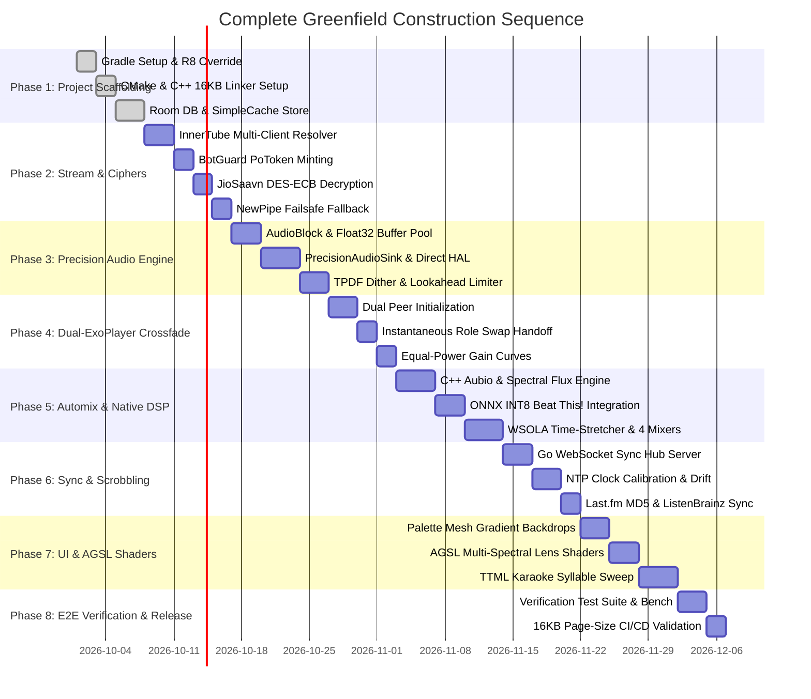

# Greenfield Implementation Roadmap, Scaffolding Guide & Build Blueprint

This guide provides an end-to-end, production-ready engineering blueprint for scaffolding and bootstrapping a custom, high-fidelity music streaming client from scratch based on the reverse-engineered architecture of [BitChord](file:///c:/Users/nikhil/Desktop/projects/music-mobile/BitChord).

---

## 1. Gradle Scaffolding & Build Configuration

Building a modern Android audio client running Jetpack Compose, Media3 1.11+, ONNX neural runtimes, C++ native DSP, and multi-source scrapers requires specific compiler flags and workaround tasks.

### 1.1 Root `settings.gradle.kts`
```kotlin
pluginManagement {
    repositories {
        google()
        mavenCentral()
        gradlePluginPortal()
    }
}
dependencyResolutionManagement {
    repositoriesMode.set(RepositoriesMode.FAIL_ON_PROJECT_REPOS)
    repositories {
        google()
        mavenCentral()
        maven { url = java.net.URI("https://jitpack.io") }
    }
}
rootProject.name = "BitChordClient"
include(":app")
```

### 1.2 Root `build.gradle.kts` (Crucial R8 D8/R8 Override)
```kotlin
buildscript {
    repositories {
        google()
        mavenCentral()
    }
    dependencies {
        /*
         * CRITICAL COMPILER OVERRIDE:
         * Android Gradle Plugin (AGP) 8.10.x bundles R8 8.10.9, which miscompiles large
         * Compose methods (such as NowPlayingScreen with 36+ parameters and >5,500 dex
         * instructions). Register allocation in debug dexing emits const/16 over a register
         * holding an object reference, throwing a runtime VerifyError on ART.
         *
         * Overriding to R8 8.13.23 fixes the register-allocation bug and adds support for
         * Kotlin 2.3+ @Metadata annotations.
         */
        classpath("com.android.tools:r8:8.13.23")
    }
}

plugins {
    id("com.android.application") version "8.10.1" apply false
    id("org.jetbrains.kotlin.android") version "2.3.20" apply false
    id("org.jetbrains.kotlin.plugin.compose") version "2.3.20" apply false
    id("org.jetbrains.kotlin.plugin.serialization") version "2.3.20" apply false
    id("com.google.devtools.ksp") version "2.3.20-1.0.29" apply false
}
```

### 1.3 Gradle Version Catalog (`gradle/libs.versions.toml`)
```toml
[versions]
agp = "8.10.1"
kotlin = "2.3.20"
media3 = "1.11.0"
compose-bom = "2024.12.01"
compose-foundation = "1.10.0"
coil = "3.0.4"
haze = "1.3.1"
ktor = "3.5.2"
onnx = "1.28.0"
quickjs = "1.0.14"
smbj = "0.15.0"
room = "2.6.1"
ksp = "2.3.20-1.0.29"
newpipe = "v0.26.3"

[libraries]
# AndroidX Media3 Audio Core
media3-exoplayer = { module = "androidx.media3:media3-exoplayer", version.ref = "media3" }
media3-session = { module = "androidx.media3:media3-session", version.ref = "media3" }
media3-common = { module = "androidx.media3:media3-common", version.ref = "media3" }
media3-datasource-okhttp = { module = "androidx.media3:media3-datasource-okhttp", version.ref = "media3" }
media3-exoplayer-hls = { module = "androidx.media3:media3-exoplayer-hls", version.ref = "media3" }
media3-exoplayer-dash = { module = "androidx.media3:media3-exoplayer-dash", version.ref = "media3" }

# Compose UI & Foundation
compose-bom = { module = "androidx.compose:compose-bom", version.ref = "compose-bom" }
compose-ui = { module = "androidx.compose.ui:ui" }
compose-ui-graphics = { module = "androidx.compose.ui:ui-graphics" }
compose-material3 = { module = "androidx.compose.material3:material3" }
compose-foundation = { module = "androidx.compose.foundation:foundation", version.ref = "compose-foundation" }
navigation-compose = { module = "androidx.navigation:navigation-compose", version = "2.8.5" }

# Visual Effects & Blurs
haze = { module = "dev.chrisbanes.haze:haze", version.ref = "haze" }
haze-materials = { module = "dev.chrisbanes.haze:haze-materials", version.ref = "haze" }
coil-compose = { module = "io.coil-kt.coil3:coil-compose", version.ref = "coil" }
coil-okhttp = { module = "io.coil-kt.coil3:coil-network-okhttp", version.ref = "coil" }
palette = { module = "androidx.palette:palette-ktx", version = "1.0.0" }

# Network & Serialization
ktor-client-core = { module = "io.ktor:ktor-client-core", version.ref = "ktor" }
ktor-client-okhttp = { module = "io.ktor:ktor-client-okhttp", version.ref = "ktor" }
ktor-client-websockets = { module = "io.ktor:ktor-client-websockets", version.ref = "ktor" }
kotlinx-serialization-json = { module = "org.jetbrains.kotlinx:kotlinx-serialization-json", version = "1.11.0" }
okhttp = { module = "com.squareup.okhttp3:okhttp", version = "4.12.0" }

# Native, Scripting & ML
onnxruntime = { module = "com.microsoft.onnxruntime:onnxruntime-android", version.ref = "onnx" }
quickjs-android = { module = "io.github.dokar3:quickjs-kt-android", version.ref = "quickjs" }
smbj = { module = "com.hierynomus:smbj", version.ref = "smbj" }

# Persistence
room-runtime = { module = "androidx.room:room-runtime", version.ref = "room" }
room-ktx = { module = "androidx.room:room-ktx", version.ref = "room" }
room-compiler = { module = "androidx.room:room-compiler", version.ref = "room" }

# Stream Extraction
innertubex = { module = "com.github.MetrolistGroup.innertubex:innertubex-android", version = "v0.7.0" }
```

### 1.4 App-Level `build.gradle.kts` (with NewPipe Stripping & 16KB Alignment)
```kotlin
plugins {
    id("com.android.application")
    id("org.jetbrains.kotlin.android")
    id("org.jetbrains.kotlin.plugin.compose")
    id("org.jetbrains.kotlin.plugin.serialization")
    id("com.google.devtools.ksp")
}

android {
    namespace = "com.music.client"
    compileSdk = 35

    defaultConfig {
        applicationId = "com.music.client"
        minSdk = 26
        targetSdk = 35
        versionCode = 1
        versionName = "1.0.0"

        testInstrumentationRunner = "androidx.test.runner.AndroidJUnitRunner"

        externalNativeBuild {
            cmake {
                cppFlags += listOf("-std=c++20", "-O3", "-fvisibility=hidden")
                // Enforce 16KB page alignment for Android 15+ kernel compatibility
                arguments += "-DCMAKE_SHARED_LINKER_FLAGS=-Wl,-z,max-page-size=16384"
            }
        }

        ndk {
            abiFilters += listOf("arm64-v8a", "x86_64")
        }
    }

    externalNativeBuild {
        cmake {
            path = file("src/main/cpp/CMakeLists.txt")
            version = "3.22.1"
        }
    }

    buildTypes {
        release {
            isMinifyEnabled = true
            proguardFiles(
                getDefaultProguardFile("proguard-android-optimize.txt"),
                "proguard-rules.pro"
            )
        }
    }

    compileOptions {
        sourceCompatibility = JavaVersion.VERSION_17
        targetCompatibility = JavaVersion.VERSION_17
    }

    buildFeatures {
        compose = true
        buildConfig = true
    }
}

/*
 * Custom Gradle Task: Strip duplicate Utils.class from NewPipeExtractor to avoid
 * D8 dex merger duplicate class collision.
 */
val newPipeExtractorRaw: Configuration by configurations.creating {
    isTransitive = false
    isCanBeConsumed = false
}
dependencies {
    newPipeExtractorRaw("com.github.TeamNewPipe:NewPipeExtractor:v0.26.3")
}
val newPipeExtractorStripped = tasks.register<Jar>("stripNewPipeExtractorUtils") {
    archiveFileName.set("NewPipeExtractor-v0.26.3-noutils.jar")
    destinationDirectory.set(layout.buildDirectory.dir("stripped-libs"))
    from(provider { newPipeExtractorRaw.map { zipTree(it) } }) {
        exclude("org/schabi/newpipe/extractor/utils/Utils.class")
        exclude("org/schabi/newpipe/extractor/utils/Utils$*.class")
    }
}

dependencies {
    implementation(files(newPipeExtractorStripped))
    // Standard version catalog dependencies...
}
```

---

## 2. Native C++ CMake Configuration (`CMakeLists.txt`)

The C++ DSP analyzer handles raw PCM autocorrelation, onset detection, Log-Mel spectrogram generation, and WSOLA time-stretching:

```cmake
cmake_minimum_required(VERSION 3.22.1)
project(client_analysis LANGUAGES CXX)

set(CMAKE_CXX_STANDARD 20)
set(CMAKE_CXX_STANDARD_REQUIRED ON)

add_library(client_analysis SHARED
    native/analyzer/audio_analysis.cpp
    native/analyzer/tempo_analysis.cpp
    native/analyzer/resampler.cpp
    native/analyzer/mel_spectrogram.cpp
    native/analyzer/vocal_spectrogram.cpp
    jni/analysis_jni.cpp
    jni/mel_jni.cpp
    jni/vocal_jni.cpp
)

target_include_directories(client_analysis PRIVATE
    ${CMAKE_CURRENT_SOURCE_DIR}
    ${CMAKE_CURRENT_SOURCE_DIR}/native
)

# -ffast-math is intentionally DISABLED to preserve IEEE 754 precision
target_compile_options(client_analysis PRIVATE -O3 -fvisibility=hidden)

find_library(log-lib log)
target_link_libraries(client_analysis ${log-lib})

# 16KB Page Alignment for Android 15 Compatibility
target_link_options(client_analysis PRIVATE "-Wl,-z,max-page-size=16384")
```

---

## 3. Complete Project Directory Layout

```
BitChordClient/
├── app/
│   ├── src/
│   │   ├── main/
│   │   │   ├── cpp/
│   │   │   │   ├── CMakeLists.txt
│   │   │   │   ├── jni/
│   │   │   │   │   ├── analysis_jni.cpp
│   │   │   │   │   └── mel_jni.cpp
│   │   │   │   └── native/analyzer/
│   │   │   │       ├── audio_analysis.cpp / .h
│   │   │   │       ├── tempo_analysis.cpp / .h
│   │   │   │       └── mel_spectrogram.cpp / .h
│   │   │   ├── assets/
│   │   │   │   ├── po_token.html
│   │   │   │   ├── beat_this_int8.onnx
│   │   │   │   └── vocals_umxhq_int8.onnx
│   │   │   ├── java/com/music/client/
│   │   │   │   ├── auth/ (AuthStore.kt, GoogleAccountManager.kt)
│   │   │   │   ├── data/
│   │   │   │   │   ├── innertube/ (InnerTubeXResolver.kt, PoTokenGenerator.kt)
│   │   │   │   │   ├── sources/ (SourceResolver.kt, TrackMatcher.kt, QuickJsExecutor.kt)
│   │   │   │   │   ├── canvas/ (SpotifyCanvas.kt, AppleMusicCanvas.kt)
│   │   │   │   │   ├── lyrics/ (TtmlLyrics.kt, Musixmatch.kt, KuGou.kt, LrcLib.kt)
│   │   │   │   │   ├── listentogether/ (ListenTogether.kt, ServerClock.kt)
│   │   │   │   │   ├── scrobbling/ (LastFM.kt, ListenBrainzManager.kt, ScrobbleManager.kt)
│   │   │   │   │   ├── webdav/ (WebDavClient.kt)
│   │   │   │   │   ├── smb/ (SmbClient.kt, SmbDataSource.kt)
│   │   │   │   │   └── db/ (AppDatabase.kt, TrackDao.kt, SimpleCacheManager.kt)
│   │   │   │   ├── playback/
│   │   │   │   │   ├── PlaybackService.kt
│   │   │   │   │   ├── CrossfadeController.kt
│   │   │   │   │   ├── audio/ (PrecisionAudioSink.kt, AudioBlock.kt, PcmBoundary.kt, DspChain.kt)
│   │   │   │   │   └── smart/ (TransitionPlanner.kt, SmartAnalysisJni.kt)
│   │   │   │   └── ui/
│   │   │   │       ├── MainActivity.kt
│   │   │   │       ├── MainViewModel.kt
│   │   │   │       ├── components/ (LiquidGlass.kt, MiniPlayer.kt, SyllableLyrics.kt)
│   │   │   │       ├── backdrop/ (LensRefractionShader.kt, WaveformSpectrumShader.kt)
│   │   │   │       └── player/ (NowPlayingScreen.kt, QueueSheet.kt)
│   │   │   └── AndroidManifest.xml
│   │   └── test/java/com/music/client/ (Unit verification tests)
├── backend/ (External Go Listen Together Hub)
│   ├── go.mod
│   ├── main.go
│   ├── party/party.go
│   └── protocol/protocol.go
└── .github/workflows/android.yml (Continuous Integration & 16KB Verification)
```

---

## 4. Phased Step-by-Step Implementation Roadmap



---

## 5. Comprehensive Automated Verification Suite

To guarantee stability before deployment, execute the following unit and integration tests:

### 5.1 Equal-Power Crossfade Law Verification
```kotlin
package com.music.client.test

import org.junit.Assert.assertEquals
import org.junit.Test
import kotlin.math.PI
import kotlin.math.cos
import kotlin.math.sin

class CrossfadeMathTest {
    @Test
    fun verifyEqualPowerSinCosSum() {
        val steps = 1000
        for (i in 0..steps) {
            val fraction = i.toDouble() / steps
            val inGain = sin(fraction * (PI / 2.0))
            val outGain = cos(fraction * (PI / 2.0))
            val totalPower = (inGain * inGain) + (outGain * outGain)
            // Total energy must be exactly 1.0 (0 dB dip)
            assertEquals(1.0, totalPower, 1e-6)
        }
    }
}
```

### 5.2 TPDF Dither Unbiased Zero-Mean Test
```kotlin
package com.music.client.test

import com.music.client.playback.audio.AudioBlock
import com.music.client.playback.audio.PcmBoundary
import org.junit.Assert.assertTrue
import org.junit.Test
import java.nio.ByteBuffer
import kotlin.math.abs

class DitherBiasTest {
    @Test
    fun verifyTpdfDitherUnbiasedMean() {
        val block = AudioBlock(channels = 2, maxFrames = 4096)
        block.clear() // Zero PCM input (pure silence)

        val outputBuffer = ByteBuffer.allocate(block.sampleCount * 2)
        PcmBoundary.encodeToPcm16WithDither(block, outputBuffer)
        outputBuffer.flip()

        var sum = 0L
        while (outputBuffer.remaining() >= 2) {
            sum += outputBuffer.short
        }
        val meanDither = sum.toDouble() / block.sampleCount
        // Mean dither DC offset must be statistically zero (< 0.25 LSB)
        assertTrue("Dither introduced DC offset bias: $meanDither", abs(meanDither) < 0.25)
    }
}
```

### 5.3 16KB Page Alignment Verification Script
Android 15 requires all native shared libraries (`.so`) to be aligned to 16KB boundaries. Run the following command in terminal:
```bash
# Verify 16KB ELF alignment
readelf -l app/build/intermediates/stripped_native_libs/release/out/lib/arm64-v8a/libclient_analysis.so | grep -B 1 -A 4 LOAD
```
**Expected Output**:
`Align` must report `0x4000` (16,384 bytes). If it reports `0x1000` (4,096 bytes), the linker flag `-Wl,-z,max-page-size=16384` was omitted.

---

## 6. GitHub Actions CI/CD Pipeline (`.github/workflows/android.yml`)

```yaml
name: Android Production Build & 16KB Verification

on:
  push:
    branches: [ main ]
  pull_request:
    branches: [ main ]

jobs:
  build:
    runs-on: ubuntu-latest
    steps:
      - name: Checkout Code
        uses: actions/checkout@v4

      - name: Set up JDK 17
        uses: actions/setup-java@v4
        with:
          java-version: '17'
          distribution: 'temurin'

      - name: Set up Android NDK 26.1.10909125
        uses: nttld/setup-ndk@v1
        with:
          ndk-version: r26b

      - name: Grant Execute Permission to Gradlew
        run: chmod +x gradlew

      - name: Run Unit Verification Tests
        run: ./gradlew testReleaseUnitTest

      - name: Build Release APK
        run: ./gradlew assembleRelease

      - name: Verify 16KB Native Page Alignment
        run: |
          SO_FILE=$(find app/build -name "libclient_analysis.so" | head -n 1)
          ALIGN=$(readelf -l "$SO_FILE" | grep -A 1 "LOAD" | grep -o "0x[0-9a-f]*" | tail -n 1)
          echo "Native Library Alignment: $ALIGN"
          if [ "$ALIGN" != "0x4000" ] && [ "$ALIGN" != "0x10000" ]; then
            echo "ERROR: Shared library is not 16KB aligned!"
            exit 1
          fi
```
